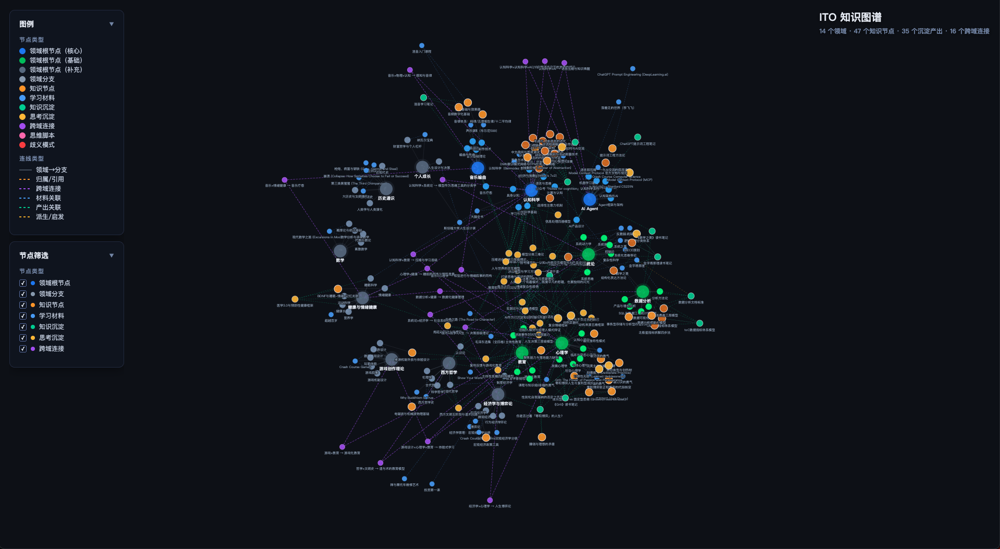

# ITO Engine — 你的认知分身

你有没有过这种感觉：你的思考明明很有价值，但它们散落在笔记里、对话里、脑子里，从来没有真正连成一张网，也从来没有变成别人能接收到的东西？

ITO（Input → Think → Output）不是又一个笔记工具。它是一个 AI 驱动的认知引擎——你往里灌入你的阅读、思考和对话，它帮你把这些碎片**编织成一张带有你个人印记的知识图谱**，并推动它们走向输出。

用得越久，它越像你。它记得你对每个概念理解到什么程度，记得你习惯怎么做跨领域类比，记得你的原创框架和独特见解。它不只是存储你的知识——它**外化你的认知结构**，最终成为一个能替你思考、替你教学的认知分身。

---

## 它和笔记工具有什么不同？

|  | 笔记工具（Obsidian 等） | ITO |
|---|---------|-----|
| **记录什么** | 知识内容 | 内容 + **你和知识的关系**（理解深度、独特见解、认知盲区） |
| **连接方式** | 你手动建立链接 | AI 在对话中半自动提取，你确认 |
| **图谱含义** | 信息在哪里（知识的地图） | 你怎么想（认知的镜子） |
| **交互模式** | 你对着编辑器 | 苏格拉底式对话——追问、挑战、帮你深化 |
| **终极形态** | 更好的笔记库 | **你的认知分身**——能用你的视角思考和教学 |

核心区别：笔记工具做的是信息的**压缩**（把已有的东西组织好），ITO 做的是认知的**延展**（从你已有的节点上长出新的连接、跨域洞察和输出可能性）。

---

## 谁适合用 ITO？

不是所有人都需要它。如果你只需要记录和检索信息，Obsidian、Notion 已经够好了。

ITO 适合这样的人：**你隐约感觉自己的思考方式有价值，但不知道怎么让它系统化、可积累、可传递。**

你可能是：
- 跨领域的思考者，经常在不同学科间发现类比和同构
- 有输出意愿但总觉得"还没想清楚"的创作者
- 想把自己的经验和认知传递给他人，但发现写文章、做培训都不够完整的人

---

## 它怎么工作？

### I-T-O 三维度

| 维度 | 含义 | 典型行为 |
|------|------|----------|
| **Input** | 知识摄入 | 读书笔记、文章摘要、课程记录、历史内容灌入 |
| **Think** | 思考沉淀 | 对话中的分析、追问、跨域类比、框架构建 |
| **Output** | 输出孵化 | 从沉淀走向发表——文章、分享、作品、教学 |

Agent 追踪每次交互的 I/T/O 比例，帮助你保持"知识饮食均衡"——避免只输入不思考，或只思考不输出。

### 统一知识图谱

所有关注领域的知识、你的个人认知数据、跨域连接、原创理论，全在一张图里（`ontology/ontology.jsonld`，JSON-LD 图数据库）。

它不是预建的完整知识树，而是**从你的交互中渐进生长**的。每个节点直接携带：
- **深度标签**：浅读 → 理解 → 有独立见解 → 可教授他人
- **独特见解**：你对这个概念的个人理解，不是教科书的定义
- **认知歧义**：你可能搞混的概念对
- **输出潜力**：哪些想法已经成熟到可以变成作品

以下是作者截止 `2026-03-09` 的知识图谱形态：


### 输出体系：Deposit

产出分两类：
- **KnowledgeDeposit**（知识沉淀）：你将学到的知识结构化整理后的产物
- **ThinkingDeposit**（思考沉淀）：你的原创思考、模型、框架

每份 Deposit 在图谱中有实体节点（带关系边指向相关知识节点），实际内容存为 Markdown 文件。状态经历 `planned`（有意向）→ `deposited`（已沉淀）→ `published`（已发布），持续追踪从想法到成品的全过程。

### 大脑模式：认知代理

这是 ITO 区别于所有知识管理工具的核心能力——**用你的大脑替你工作**。

`/brain` 进入认知代理模式：ITO 不再是辅助你思考的伙伴，而是**作为你**对外输出。别人问你一个问题？粘贴进来，ITO 用你的知识储备、你的原创框架、你的认知风格组织回答。需要写反馈、起草方案？ITO 调用你图谱中的专业积累来完成。

关键特性：
- **严格安全模式**：全程不修改你的知识图谱和记忆，只读调用
- **你的视角，不是通用回答**：调用你的 userInsight、ThinkingDeposit、思维脚本，输出带有你的认知印记
- **诚实边界**：你没深入想过的领域，它会坦诚说"这块我还没想清楚"，而不是用通用知识冒充你的见解

这才是"认知分身"的终极形态——不只是帮你管理知识，而是**用你的知识替你思考和表达**。

### 思维编译

随着图谱积累，`/compile-thinking` 从你的认知行为中提炼出**你的个人思维脚本**——不是教科书方法论，而是你自己怎么分析问题、怎么做决策的显性化。

编译来源：你内化的思维工具调用记录、习惯的跨域连接路径、你的原创框架。

---

## 快速开始

### 0. 初始化

> **首次使用（clone 后）必须先运行 `/reset` 来初始化文件目录结构。**
>
> 仓库中只包含引擎代码和模板，运行时数据目录由 `/reset` 从 `_init/` 模板生成。

### 1. 接入

| 方式 | 说明 |
|------|------|
| **Claude Code / Cursor**（推荐） | 将本仓库作为工作目录打开，AI 直接读写文件。技能已注册为 `.claude/skills/` 下的 slash command |
| **自定义后端** | 读取 `.claude/skills/*/SKILL.md` 作为 system prompt，调用 LLM API，结果写入 `memory/` |

### 2. 启动

> **每次打开项目后，输入 `/ito` 启动 Agent。**
>
> 首次使用自动引导冷启动（通过对话了解你的关注领域，构建骨架图谱）。已初始化则进入待命模式。

### 3. 冷启动

1. 通过轻松对话了解你的 2-4 条**主线目标**
2. 从主线出发梳理关注领域（建议 3-7 个）
3. 为每个领域创建骨架知识本体
4. 在统一图谱中初始化你的认知数据

冷启动后，如果有历史笔记，使用 `/bootstrap` 将过去的思考灌入系统（支持文件批量 `inbox/bootstrap/`、对话输入和链接）。灌入完成后用 `/plan` 生成首次计划。

`/bootstrap` 不限于冷启动——日后翻出旧笔记时同样可以用它补录。

### 4. 日常使用

Agent 默认处于**待命模式**，以下操作不产生 session 记录：

- **`/plan`** — 查看/调整周度计划
- **查看图谱** — 在浏览器中打开交互式知识图谱可视化
- **查看待办** — 查看所有待聊话题、未完成阅读、待深化思考
- **查看沉淀产出** — 浏览你的 Deposit 和输出候选
- **`/brain`** — 大脑模式，用你的认知替你对外输出（安全只读）
- **`/review`** — 评价内容（不影响知识系统）
- **`/compile-thinking`** — 编译个人思维脚本
- **`/bootstrap`** — 灌入历史内容
- **`/weekly-review`** — 发起周度复盘

当你需要深度交流时，说出关键词进入**会话模式**（触发知识提取和 session 记录）：

- **"聊天"**：自由聊天，Agent 作为苏格拉底式思考伙伴
- **"传笔记"**：将 `.md` 文件放入 `inbox/notes/`，Agent 读取并提取知识
- **"写笔记"**：口述想法，Agent 帮你整理

你也可以在会话中直接**分享链接**，Agent 会自动读取并纳入知识处理流程。

---

## Skill 体系

```
/cold-start ──→ ontology-init（构建领域骨架）
            ──→ 引导用户 /bootstrap 或 /plan

/bootstrap ──→ knowledge-extract + knowledge-process（图谱生长 + Deposit 创建）
           ╳   不写 session_memory，不触发 plan

/chat、/pass-note、/write-note
            ──→ [对话中] knowledge-extract（提取结构化知识）
            ──→ [结束时] knowledge-process（图谱更新+歧义检测+session记录）
                            └──→ Deposit 创建（如有成型产出）

/weekly-review ──→ 在读材料跟进 + Todo 盘点
               ──→ /plan（更新下周计划）
               ──→ dormant-check（沉寂领域检查）

/brain ──→ 认知代理模式（用你的知识和视角对外输出）
       ╳   不写图谱、不写记忆，输出存 docs/brain/

/review ──→ 只读评价（事实核查 + 逻辑核查 + 内容质量 + 个人相关性）
        ╳   不写图谱、不写记忆

/compile-thinking ──→ 扫描 mental_model + CrossDomainLink + ThinkingDeposit
                  ──→ 编译个人思维脚本
```

---

## 目录结构

```
ito-engine/
│
├── agent_profile.json              # Agent 全局配置
│
├── ontology/                       # ═══ 统一知识图谱 ═══
│   ├── ontology.jsonld             #   JSON-LD 图数据库
│   └── _meta/
│       ├── domains.md              #   领域名称索引
│       └── thinking_scenarios.md   #   思维脚本场景路由表
│
├── memory/                         # ═══ 分层记忆 ═══
│   ├── goal_memory.jsonl           #   主线目标
│   ├── session_memory/             #   交互记录（按周分文件）
│   ├── plan_memory.jsonl           #   周度计划
│   ├── milestone_memory.jsonl      #   周度总结
│   ├── todo.json                   #   待办事项（读写式）
│   ├── rlhf_memory.jsonl           #   Agent 策略反馈
│   └── preference_memory.jsonl     #   用户偏好
│
├── inbox/                          # ═══ 输入收件箱 ═══
│   ├── notes/                      #   待处理笔记（.md）
│   ├── bootstrap/                  #   历史内容（/bootstrap 灌入用）
│   ├── processed/                  #   已处理归档
│   └── conversations/              #   对话原文存档
│
├── output/                         # ═══ 输出体系 ═══
│   ├── deposits/                   #   沉淀产出文件
│   ├── reviews/                    #   评价存档
│   └── drafts/                     #   草稿
│
├── docs/brain/                     # ═══ 大脑模式输出 ═══
│
├── scripts/                        # ═══ 脚本 ═══
│   ├── build_visualization.py      #   图谱可视化生成
│   └── thinking/                   #   个人思维脚本
│
├── visualization.html              # 知识图谱可视化（自动生成）
├── _init/                          # 初始状态快照（用于重置）
├── .claude/skills/                 # 技能层（slash command）
└── templates/                      # 数据模板
```

---

## 重置与重新加载

### 重置（`/reset`）

| 模式 | 适用场景 | 保留什么 | 清除什么 |
|------|----------|----------|----------|
| **保留内容重置** | 想用新逻辑重新处理 | 笔记、对话存档 | 图谱、记忆、输出 |
| **完全重置** | 交付给新用户 | 无 | 全部数据 |

### 重新加载（`/reload`）

保留内容重置后，从存档重建：识别并重放冷启动对话 → bootstrap 历史内容 → 重放对话存档 → 处理笔记 → 生成计划 → 同步可视化。

---

## 设计原则

| 原则 | 说明 |
|------|------|
| **纯文件即数据库** | 所有状态以 JSON/JSONL/JSON-LD/Markdown 存储，零外部依赖 |
| **Skills 即 Prompt** | 每个技能是独立的提示词文件，LLM 按需调用 |
| **本体渐进生长** | 不预建完整知识树，从交互中按需构建 |
| **认知优先于信息** | 节点携带深度、见解、歧义等个人元数据——图谱反映的是你的认知结构，不只是知识拓扑 |
| **输出导向** | 不仅记录输入和思考，更主动追踪和孵化可输出的内容 |
| **记忆只追加** | JSONL append-only，保证数据安全与可审计 |
