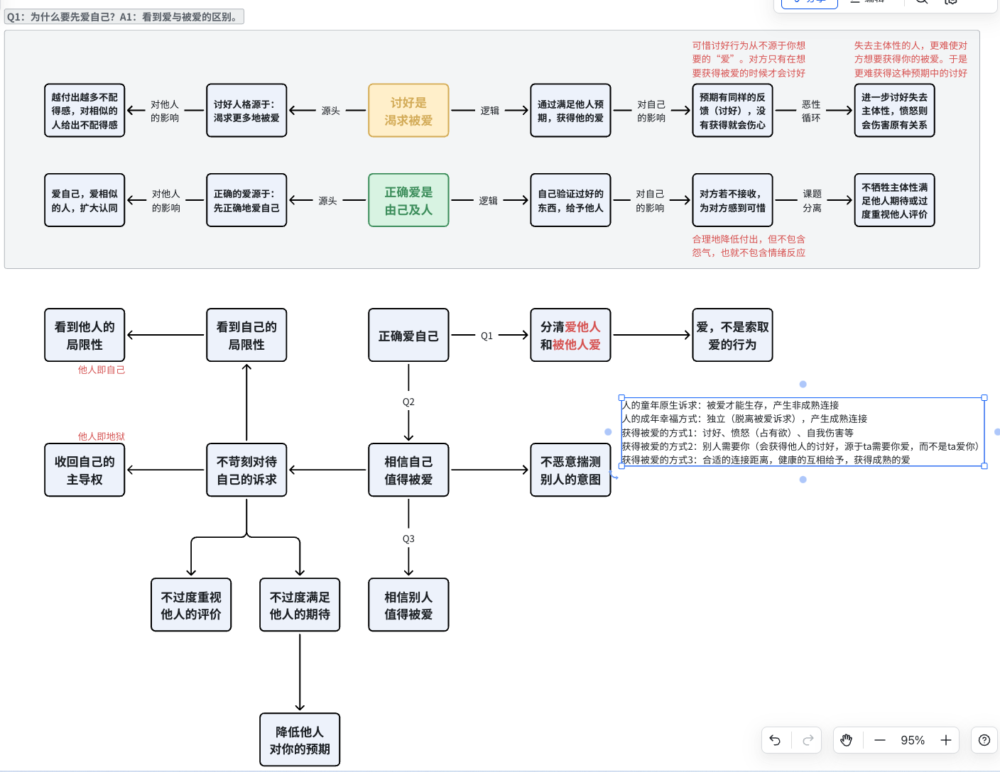

20250625
关于拖延。其实为什么会突然聊到拖延，因为今天在讨论sleepi的事情，意识到除了焦虑型和生理敏感型的睡眠问题，以及外因导致的睡眠问题；像宇航、富贵这些拖延和自制力其实都不属于睡眠问题，不如说是宏观的拖延问题。拖延问题也是表象，我试图拆解了一下拖延的动因，会是非常多元的一个博弈关系。
首先是驱动力。我分为四类：问题驱动、目标驱动、他人期待、从众意识。简单来说就是【自我在后面推、自我在前面拉、他人在后面推、他人在后面拉】。当这个力超过了某个阈值，就不会拖延了。通常一个拖延行为是来源于：目标不够清晰（比如事情自己不够喜欢）、问题不够大（比如不想做的事没到ddl，或是身体还挺好所以不愿运动）、或是孤身一人在前行。
然后是阻碍力。我分为客观和主观，主观指人自己本身的生理和精神健康程度（比如没睡好的人或者情绪问题没有被解决的人很可能没精力做任何行动），客观指要做的事情本身的难度和卡点。它们会形成这个被推/拉的对象的重量和摩擦力。
邹烨说还有一个钩子。我感觉钩子其实就是一些对驱动力和阻碍力进行改变的东西，可能是被动发生的，但也可以是分析后主动发生的。比如分析完拖延的源头之后，进行规划和拆解目标，能够化解事情的难度，也就降低了摩擦力。再比如积极运动来提升精神力可以降低对象重量；向外寻求帮助或是主动学习并剖析风险可以提升推力；加入社群或是去做自己认可的事情可以提升拉力。总之钩子就是那个可以改变静态现状的东西，并带来正向反馈循环。

工作的事情
因为sleepi由心骋接手了，所以我们最近在聊产品方向。周二开会的时候心骋提到我们可以考虑CBT-I并面向真正需要失眠认知行为疗法的高驱动力用户解决问题。所以开始调研这个方面。
调研之后发现，CBT-I是一个8加减2周的疗程解决方案。按它的价值观，问题被解决的人不应该再关注睡眠；反而焦虑型睡眠问题从一开始就是源于“过度关注睡眠”导致的。所以它不推崇过度关注睡眠监测产品和深度睡眠等阶段数据，也不建议患者花很多钱（即注意力）在改善睡眠的其他硬件产品上，并且认为患者应该避免接触会导致睡眠焦虑的健康知识。
我们也分析了市面上睡眠监测产品本身，和源于科技控/数据监测的价值观的典型用户群体（宇航、周进等）。这类产品在这里其实是在对“安慰剂效应”负责，提供的是安全感而非解决方案。比如之前有一天中午，亮亮说“午睡睡久了进入深度睡眠了，感觉好好休息了一下”。而无论是“深度睡眠算法的准度”还是“小睡长达2小时对睡眠的健康性”，都是未经验证，甚至从当下科学角度来说其实都是不被推荐的。但是看数据的人会感觉有安全感和被满足。
所以这里出现了一个明显的目标岔路，我要通过安慰剂效应满足用户还是用科学手段帮助有睡眠问题的人，这面向的会是两个不同的群体，对应的工具生命周期也会完全不同，前者生命周期可以是很长期的数据监测过程，后者生命周期基本就是2个月以内。对应的商业化思路也会不同。
从长期的角度来说可以都要，本身是不矛盾的。但是资源有限的启动期我们如果想要快速验证的话，一次只能做一件事情，也只能面向一类用户。不能什么都要。

---
另外，如果从大健康领域看待用户睡眠的话，规律性、时长、睡眠效率这三个指标就足够了；是非常不建议用户去关注目前市面上睡眠监测产品最突出的“深度睡眠”概念的。所以对应的睡眠数据是足以通过手动的睡眠日志就完成记录的。另外CBT-I要生效的话，每天还需要额外填写一份睡眠卫生自查表；所以从工作量而言，患者本身的投入度就是极高的，睡眠监测带来的优势可能会小于戴手表睡觉带来的劣势。
在大健康领域，睡眠数据是人脑+表格可以手动记录和处理的简单数据，除了睡眠阶段（而世界睡眠协会专门提醒，穿戴设备的睡眠阶段分级与真实的“深度睡眠”不是同一个概念，要避免过度解读单晚数据），其他数据都是在足够关注度下可以被处理的。我们看看领域内的其他三个主题：情绪、运动、营养。这三个领域的数据维度和睡眠相比都是爆炸级的，对应的数据监测才是真正需要技术的辅助才能完成的动作。
- 运动也是以心率和空间移动为主要参考指标，观测人的静息心率、一区到五区的每日心率分布情况，来判断用户的运动情况和运动带来的效果，给出可能的建议；从大健康领域如果能够结合血糖的升降，以及体脂变化（有氧代谢能力）、瘦体重、最大摄氧量、肌肉力量和质量，会带来非常多维度的分析视角，而这种数据量不是人脑能够直观处理的。
- 营养内包含的信息量是最庞大的。从宏量元素（各类脂肪、各类蛋白质、各类碳水与糖、酒精，以及它们跟能量卡路里的关系），到微量元素、维生素、微生物群、纤维、植物化合物和激素；食物和药物的摄入所包含的信息量也是人无法处理的。从指标检测角度，不同时间段的血糖能够帮助找到合适的食物组合，长期的瘦体重（肌肉含量）变化、血脂数据也能给用户带来很有效的健康饮食建议。
- 情绪到目前为止还没有很好的监测手段，目前可能更多涉及到的是压力水平，生理指标上心率、hrv、血糖等指标可以作为参考。包括睡后的心率、hrv、血糖指标，也可以综合判断一个人偏长期的压力水平。日记也许可以成为一个AI情绪判断的切入点。
- 最后讲睡眠。如果只是在关注睡眠而非健康，大家也很明显并不知道睡眠的心率有什么用，因此纯粹的关注睡眠质量，规律性、时长、睡眠效率就够用了，这都是人脑就可以处理和记录的信息。

20250618
从9号开始的状态，大概被小红书影响了一周。
一直在思考和输出，忘记做自我关怀了。
9号在别人的评论区获得巨大流量之后，10号11号都在持续吃流量的兴奋中，多了50多个关注。
12号去亮亮公司那边开会的时候也分享了，并在当天晚上做了方案开始收集团队睡眠日志。这个时候精神已经开始有点顶不住了。有意识地开始远离小红书。
13号晚上低烧，意识到身体也开始顶不住了。其实一切才刚刚发生到第5天。
于是开始躺平玩游戏和休息。其实也没有开始做自我关怀哈哈哈。
14号烨烨去了LadyBoss线下最后聊合作方式和报价，当天晚上回来就被包包一个10点半的会搞得有点烦躁，报价是纯项目方案费3w两个人分，但晚上又在说业务细节要和多少多少人聊；很明显有过强的沟通预期，又期待直接给一个到底的方案再开始做（根本不是共创的逻辑，也不是产品正确迭代的逻辑，也不是数字化逐步扩散的逻辑），其实能感受到预算包可能根本包不住她们期待的结果，所以根本不可能在会上聊清楚。最后萱婷说给一个预算范围内的边界再来合作，所以大家后续准备是烨烨和花先就边界达成一个共识，然后跟萱婷对，最后在跟包包再对一次。
15号烨烨早上又搞了这个边界的文档发给花，下午到晚上她都自己跑出去商圈过单人生活，还自己看了电影很开心的样子。但是萱婷那边直接和包包沟通完，又和花私聊了她们的想法，就是阿花这边继续推进，但数字化暂缓。没有给邹烨任何答复，就这样过去了。我跟花说这些信息应该公事公办，而不是突然又私聊然后他还来私下传达消息。
16号孙奕单约邹烨说聊一下LB后续，也没专门约我。整件事都挺恶心的。孙给邹烨的口径则是：LB和我们的合作整个暂缓。之前其实阿花那边在ToC的端口也是他和邹烨一起做的，现在却给到两边不同的口径，也不明面上说清楚，不管怎么说都很恶心这种合作方式。烨烨也不舒服，我们决定暂时不合作了。
我在15号早上来姨妈，从14号起到16号，3天都在玩游戏。17号开始尝试看书，还是《超越百岁》。
昨天（17号）本来准备舒舒服服睡个觉，结果家里出现了巨型飞天小强，还好有猫猫在。最后又晚睡了。
今天来做自我关怀吧，把心里的东西都卸掉。

于细节处的自我觉察，深入习惯中的自我关怀

20250610
其实是基于昨天和烨聊天的思考，然后半夜产生了新的思考：宏大的悲怆感是基因留给牺牲意识的通道
为什么有人明明很善良，却会让你觉得“虚伪”？
想聊聊最近关于【爱他人】和【爱自己】的思考。
如果一个人【爱别人】高于【爱自己】，表达出来的感觉类似于“我就是想要对别人好让大家开心，而且我会因此感到开心”，这种“爱”更多是一种对社会预期的承接而非发自内心的东西。它有点像世俗意义的成功或者金钱，不是能够让人从内在感到幸福或升华的东西，但会让人更容易获得他人的认可，并由此感到被世界认可并与世界产生连接。
ta们会对陌生人很好，也会对亲近的人很好，但是会有一些难言的委屈感，并驱使自己在某些社交场合无意识地表达出来；这种不自洽或者说不一致性会被敏感的人感知到，产生一种“虚伪”感。但ta们很可能没有骗任何人，只是骗了自己。
ta会有非常强烈的自我价值观，还会要求与自己有身份认同的人（离“我”更近的人）践行与ta一致的价值观。就像唐僧对孙悟空的要求，就像传统家庭中无私奉献的母亲对儿媳的要求。这反而会比普通人距离“无我”更远，显得是一种伪善。这个被身份认同的群体，往大了说可以变成是地球上的所有人（这也是为什么很多文学作品的大反派其实是无私到失心疯的角色），往小了说可能仅仅是对自己偏执的要求。
但西方哲学曾经探讨过一个问题：今天的我和昨天的我是不是同一个人？如果一个人把一种“无私”的价值观毫无理由地硬生生刻在自己脑中，也就是要求明天的自己、未来每一分钟的那个自己，都必须按今天的我的价值观来生活。他对未来的自己是否是无私的呢？

而一个人如果是先【爱自己】的同时还能够【爱别人】，更容易是“我喜欢做一件事，而且这件事如果对别人也有帮助我就更高兴了”。他们有明确的主轴和边界，又能够在自己的成长和深入中惠及更多的人，更加自洽，内在的一致性也更强，不会委屈也不会欺骗自己。
可是既然基因追求内在的一致性，也有为了延续下去而天生存在的自利或者自私的属性，为什么世界上又存在英雄主义和奉献精神这样的东西呢？

不知道你是否体验过一种「宏大的悲怆感」，尤其是在读这类诗的时候：

20250609
周六周日两天都和家人一起吃饭，聊了两次不同的话题。
周六是在聊湃湃工作上的困扰，她近期接了很多杂活，没有价值感；工作压力又大。所以我给她的建议是先想想自己想要的是什么，未来想成为什么样的人，然后再考虑自己现在把重点放在哪里。
听起来她其实挺想成为自己领导那样的人，但是自己和领导的关系又因为领导管理问题疏远了。领导是一个和大家关系被疏远的人，谁和她近就会被分配更多更杂的事情（我会想到杨旭和刘洁两个女性老师，都在管理位做过这样的错事。）
所以湃湃是想要成为一个好的管理者，那么就要学会处理人的事情。所以我讲了谭总跟我说的“防御性沟通”的故事，讲了我自己做领导初期的故事，又讲了女性领导的优势（学习的地方）和劣势（可以作为镜子）。

周日是和弟弟湃湃吃完饭，聊了一些结婚相关的话题。在乐和妈妈的关系上，意外地用上了“负向循环”的概念，就是因为乐乐给妈妈的安全感降低，导致妈妈更多寄托在钱财上；而这会让乐更不理解更觉得妈妈变得自私了；乐这样的想法表现在行为上，又把妈妈推的更远，安全感更低，更加守财。所以负向循环会自动滚下去，需要人主动切断这个循环。
周日晚有个gap了一年多的妹妹在小红书找到我想聊聊，我和她约定今天陪她聊聊。她似乎陷入了“我找不到好工作是因为gap--我越是gap时间长越找不到好工作”的负向循环，眼睛只能看到眼前的东西；可能人生并不是那么短，她才27岁。所以最后破局点也是“你有想做的事情和想要的未来吗，可以先去想象和描绘它，再倒过来看自己现在要怎么做”。其实人生应该有一个小小目标，我每过一天离这个目标能进一步；而不要陷入我每过一天都离某个我的关注点远一些（像是gap和工作的关系一样），那精神真的会崩溃掉。

下午和烨烨聊人的“真实”和“假”的感觉，聊“为什么我觉得所有人应该最重视的是自己，否则就是假”。
1. 为什么真实的人以自己为先。因为价值观也是一个人的一部分。从最极端的角度来说，一个在理论上真正无我的人，应该是能够认可并愿意践行任何人的价值观的人，而不是坚定于自我的价值观的。而一个坚定的以别人为先并认为自己能够从中获得快乐的人（ta的逻辑顺序甚至不是我能够从一件事获得快乐同时这件事还能带给别人帮助），ta会有非常强烈的自我价值观，他还会要求与他有身份认同的人践行与他一致的价值观。就像唐僧对孙悟空的要求，就像传统家庭中无私奉献的母亲对儿媳的要求。这反而会显得是一种伪善。这个被身份认同的群体，往大了说可以是地球上的所有人（这也是为什么有的文学作品的大boss是一个无私到失心疯的人），往小了说可以是对自己偏执的要求。
2. 西方哲学曾经探讨过一个问题：今天的我和昨天的我是不是同一个人？那么如果一个人把一种“无私”的价值观毫无理由地硬生生刻在自己脑中，也就是要求明天的自己，未来每一分钟的那个自己，都必须按今天的我的价值观来生活。他对未来的自己是否是善良的呢？
3. 【为天地立心，为生民立命，为往圣继绝学，为万世开太平。】烨烨说自己也会被这句话感动，也会向往，这看起来“以他人为先”是合理的。
4. 在我看来，这也是一种对自我认同群体作出牺牲要求的人。在男性是英雄主义，在女性是自我奉献，都是大我牺牲小我的典范。对社会，当然是为了大我牺牲小我的人能够给社会带来进步和更多好处。这一点从反脆弱都能看出来，群体的反脆弱性源于个体的脆弱性，即个体的牺牲。但是我更加愿意相信的是螺旋上升的发展规律。当一个群体对大我推崇到了顶峰，对小我的关注就可能会成为推动世界发展最重要的事情。
5. 但为什么我们会为此感动，因为它用很大的刺激挑动了我们F的神经。先看岳阳楼记的“先天下之忧而忧”，如果这是一句简单的教化语录，大家可能都不会有所感觉。但如果在岳阳楼记这个背景下，你知道作者的仕途经历，看到他站在风雨飘摇的楼顶，心有所求的背影，你强烈地感受到他的内心抒发的英雄主义的自我牺牲的情感，并产生了共鸣。前面那段更是艺术，它不需要背景信息和视觉刻画，短短四句，把自己放在人类维度之外，历史长河之中，回望过去指向未来，这样宏大的英雄主义，从视觉听觉的内心情绪感观中强烈地引起共鸣。所有人都会受到这样或那样的感召，这些都来源于情感共鸣而不是逻辑或是理性的正确性。
6. 人类具备这些共鸣的能力和爱人的能力，敬畏的能力；令人讨厌的人不是不具备这些，只是因为他们的身份认同和他人认知的圈定区域不同。就像我很讨厌cc，他也有他被感召的英雄主义，可能是那些已经往生的写书人，也可能是很厉害的老板们，他是真诚的。但同时他又利用很多无辜的人去完成他的英雄主义，所以我们会觉得他不真实，是一个伪善的人。伪善，不是说你没有情感没有共鸣，你也一定有，但是你自己为了达成什么，而说服了自己内心的另一部分“这条捷径是必须走的”，于是在某些事情上蒙蔽了内心的真实感受，以扭曲的方式伤害世界（男性更多伤害他人即非身份认同群体，女性更多伤害自己即身份认同群体，但这些人都是世界的一部分）。于是这让人觉得假。因为假究其根本，不是如何对待他人，而是如何对待自己的心
7. 不承认小我的大我是一种虚伪，不承认大我的小我是一种无知。小我之上能有大我，我觉得是最好的

最后是今天一直在小红书回评论。有一个人发了一篇内容爆了，内容是这样的：
- 标题图片：“为什么我接受不了别人用比较差的态度对待我”
- 标题：“到底是矫情还是敏感还是什么原因”
- 内容：“我想解决这个问题，而不是在面对公交司机不耐烦地说“没到点上不了车”，在工作场合被人说“你把道具摆成那样像灵堂一样”，在其他任何这样的时刻感到尴尬、沮丧、委屈、难过，和一切负面情绪。到底是为什么我形成了这样的习惯，我又怎么才能改掉它？”
下面有的人说他主体性太强，有的人说他主体性太弱。
于是我回了这一段：
看到评论里有人说是主体性太强，有人说主体性太弱，其实都没错，我感觉核心问题是每个人在说的“主体性”是什么意思。
其实我觉得你的困扰很接近课题分离这个概念。就是一个人面对社会的时候会有很强的“被接纳”和“被爱”的诉求，这是每个人童年都会有的诉求，因为我们小的时候需要被爱才能在世界上活下来，所以我们对他人的情绪敏感。从这个层面，会有人给你解读为“你的主体性太弱了”。
而成年后，我们要掌握另一个视角，就是“看到他人”，看到他人的诉求和情绪，给予他人“爱”。如果我们看不到，我们就会觉得恶意都是冲着我们本身来的，而不是由于他们自己的情绪困扰或者工作习惯。所以在这个层面，会有人解读为“你的主体性太强了”。
加上这一段：
我会害怕别人凶我，是因为我童年期被凶的时候有强烈的不被爱的危机感，然后这种不安全感被内化成为了一种反射性的习惯，导致我成年之后依然受到困扰。可能你也是这样
所以长大之后，我们可以一方面尝试切断“被凶”和“不被爱”之间的联系，因为这个是我们在自己的经历和感受上建立起来的，其实不是真正有联系的关系。
另一方面就是去感受他人的状态和心境，让对方的行为被正确解读为对方的课题，而不要加在自己身上
作者把我置顶了，然后给我带来了比我自己任何文章都大的流量和关注。
中间还有一些评论我也给了回复：
疑问1：我其实不明白 对方如果带着恶意 我还要站在他角度体谅他 满足他的情绪 给予他人爱 凭啥呢
回复1：因为理解他人动机这件事不是为了对方，而是为了自己哦。是因为你感受到恶意会让你难受，所以才要找到能够在这种事情里与自己相处的方式，不要用别人的问题惩罚自己（难受这种情绪是伤害身体的）。但是理解恶意并不代表你要去满足他的情绪哦，他的情绪是他自己的课题

疑问2：我没能力“看见他人”，觉得他们都是带着恶意的。比如我的水杯放那好久没用，里面还有一点茶水，都有味道了，我婆婆看到了就给洗了，而她的洗不是好好洗，就是把脏水扔点，用水冲一下杯子。我知道后把她吼了一通，一是她碰我的东西没有经过我的同意，很不尊重我，哪怕是打着“为我好”的目的，二，她随便冲了水杯也不跟我说声，我看到水杯洗，打算直接接水喝，结果闻到水杯里有味道，就痛斥她想洗杯子也不用心洗干净。           我没办法看见她这么做哪里是为我好，我只能看到她在我家随便动我家的东西，很没有边界感，很不尊重人
回复2：看见他人是指看见“导致她这样做的原因”，不是真的要去相信她是为你好呢～
比如你说的这件事，是因为上一代人对边界感的理解与我们这一代不同，她们对干净与脏的标准也与我们这一代不同。但是由于年龄原因，她们会更固执，更不愿意接受别人的生活方式。
“看见他人”是为了理解“她的恶意不是指向我的”，为了和自己更好相处，不要因为别人惩罚自己的身体，每一次生气对身体都是伤害
对方：我细细地思考了您说的话，好像有点明白了，我婆婆没有仔细洗我的水杯，是她对卫生的标准跟我不一样，她洗水杯的目的不是为了让我用洗不干净的水杯喝水（不知道我说的清不清楚）。至于她不经过我的同意就动我家的东西，不是她故意想动，是在她的意识里，甚至或许没有边界这个概念。我可以从这两方面去和她沟通或者提醒她。
我：是的宝宝，不要惩罚自己，也不需要怀疑自己性格不好。婆媳关系真的是一个很难的社会问题，你已经很棒了！

疑问3：我也是这种情况，看了评论区大部分楼主的评论还是非常符合的，但是我唯一不同的一点就是很多评论或者视频都会把问题归咎于是小时候受到的原生家庭的伤害，童年没有被好好的接纳和对待，但是我却恰恰相反，因为我是独生女所以基本上家里都会很宠我，除了童年有几年可能有父爱的缺失，我也可能想过也许是这个原因，但是我很快就否定了因为我不管去到哪里干什么都是会想家的，因为感觉只有家里才是我的避风港所以我也会非常的恋家，反而感觉对我来说外界都是不可测人心险恶的地方，包括在学校和同学舍友相处都是唯唯诺诺，不敢反驳，不敢拒绝也怕被别人拒绝怕被别人讨厌，越长大越感觉家里人对我越是好在外界遭受的天大委屈越是让我感觉心里极度失衡
回复3：父母有没有给你传递过一些外界险恶的观念呀
对方：也会，就是有时候聊天的时候会说
对方：我总感觉怕被别人反驳看不起和不好好对待是我一直都很恐惧的东西，我内心不想也不愿意接受是因为我还是从内心里没有接纳过自己是这样吗，我甚至有时候会看别人的脸色，虽然我做人也没有很圆滑但是我会内耗，别人对我不好我会内耗，我对别人做这个事如果不好即使我不是有意的但是我会更加内耗，我感觉我过了这么多年一直都在内耗之中了，有时候我甚至有人当我面给我话听给我摆脸色我都不知道怎么办只是回头一味的内耗不敢反驳，她为什么不喜欢我为什么这么对我[哭惹R]
我：爸爸妈妈应该是因为你是女孩子，给了你一些过度保护，却没有意识到要让你独立成长起来，父母的保护会让你感觉别人都没有爸爸妈妈对你好。用不恰当的比喻，就像人总是和AI交朋友（AI没有主体性，它只会一味的讨好你；父母在你身边的时候也不会把眼睛放在自己身上，只是一味地给你好东西），就会失去和有主体性的他人相处的能力。你可以试着不带这种“外界险恶”的念头去真正与世界相处并产生连接。
对方：对对对，是这样的所以我有的时候就特别希望一种理想化的状态就是我身边的人和朋友都能像ai和客服那样对待我
对方：但是我问题就是我在和外人建立交往的时候自己也是活成了ai的样子和他们相处[哭惹R]
我：这里的误区是，你以为能够通过讨好让大家像父母一样爱你。但其实不是的，社会上人与人之间就是有边界有距离，人与人也有爱，但是不会像亲子关系那么浓烈。然后因为感受不到他人对你有这么强的爱，你会以为是自己做的不够好。
对方：我也在读被讨厌的勇气了，感觉是有帮助的就是不知道如何去突破，慢慢改进[哭惹R]我觉得我应该要让自己变得更坚强一点
以及有一个女生来私信我，说自己反思自己总是害怕旁人的恶意，问我这是为什么。聊了一会感觉是很正常的戒备，不知道为什么要反复去反思自己，好像对自己过于严苛了。所以问她为什么要反思，是什么诉求。
她的回答：反思源于两点：第一，我发现周围人能力很强情商很高，人际交往处理事情都很好，我比她们差，所以完成一个事后，我通过反思找到优缺点去进步。第二，面对他人无故的恶意，我不是总害怕么，我想反思我到底害怕什么，我能不能找到解决办法不害怕。
第一点，通过反思，是有一点进步的。第二点，我到现在也没有很好的办法[捂脸R]

我的回复：第一点很好呢，对成长诉求。
严苛的点在于，我感觉你不是从“探索自己真正想要什么”出发去进行成长反思的，而是从“我为什么没有别人做得好”出发去反思的，这会是一种自我压迫而不是自我展开。每个人都是独一无二的自我，都有自己面对世界的方式
第二点就是受到这种影响，你对自己的态度像是一个妈妈在对小孩说：你到底在害怕什么？为什么这么担小？这会让自己更加封闭内心难以思考
我感觉你没有接纳这种害怕，害怕不奇怪，也不懦弱，它就是人类天生的自我保护机制

她的回复：你的话我很感动，尤其那句自我压迫不是自我展开……你的话我好像懂了但也好想没有全懂，我会好好想想。谢谢你听我唠叨，耽误你好多时间。谢谢。[玫瑰R]

20250605
昨天决定试行【每天4小时工作制】，早上8点工作到12点，然后早起早睡，12点之后就是自由时间嘎！这样看书什么的时间也放在下午和晚上。
但是昨天实在起太早了，5点半醒来。
6月以来的生活都还挺好的，很充实，就是身体的疲惫还没有缓过来。昨晚去拉筋体能，今天早上浑身疼，但睡眠质量嘎嘎好。人还是要运动所以说。
有一段时间没有写日记了，又攒了一些思考没有整理，现在来做。

 
【关于误解与沟通】
这两天我反复思考了两件事。
第一件是关于“误解”。我发现自己非常不愿意让任何对我的误解存在，一旦出现，就想立刻解决掉。起初，我认为这是因为我“没有勇气被误解”，正如《能断金刚》作者所启示的那样，这种心态导致我不敢充分表达，也难以做出让别人清晰理解的表达。
然而，这种“不接受被误解”并急于解开的心态，常常使我陷入与人争吵的境地。我知道一个道理——就像我曾对烨烨说她和亮亮之间的误解一样——只要人与人之间持续交流，误解最终总能解开。这个道理我懂，却难以付诸实践。我羡慕那些能让误解“飞一会儿”，待其自然化解的人。
这种对“坏东西”（在我看来）的不容忍，不愿让它们存在片刻的执念，似乎是我许多困扰的根源。但细想，误解本身的存在，如果放在持续交流的关系中，并不会造成实质性的长远影响，因为它终将被澄清。而如果我们因此停止了交流，那么误解是否还“存在”于这段关系中呢？从我的角度看，关系结束了，误解对我也就不再有意义了。
【关于付出与收获】
这引出了“给予才能获得”的思考。小时候，大学时，有同学会收到朋友寄来的一箱零食，我见了总很羡慕，心想自己怎么没有这样的朋友。但事实是，想要拥有这样的友情互动，或许应该由自己先开始——先寄一些东西给对方，未来才可能收获这样的往来。这个零食的例子，对我来说，比之前想到的某些例子（比如“两个老公的例子”）可能更有启发性。
【关于潜能与信任】
我想说的第二件事，是关于佛法中常提到的“人的潜能”。佛法似乎在说，人的潜能是无穷的，当你能触摸到“金刚世界”，就能超越凡俗（不再是“草履虫”）。起初，我对将爱因斯坦等人作为例子来阐述这种超越感到有些不适。
但后来我理解到，其核心在于“相信所有人的潜能”。佛法讲，每个人都拥有这种无限潜能。基于此，我们应该相信自己种下的“好种子”（善行）一定会开花结果。也就是说，我们对他人付出善意、做出好的行为，也要相信他人同样有能力做出积极的回应和行为。