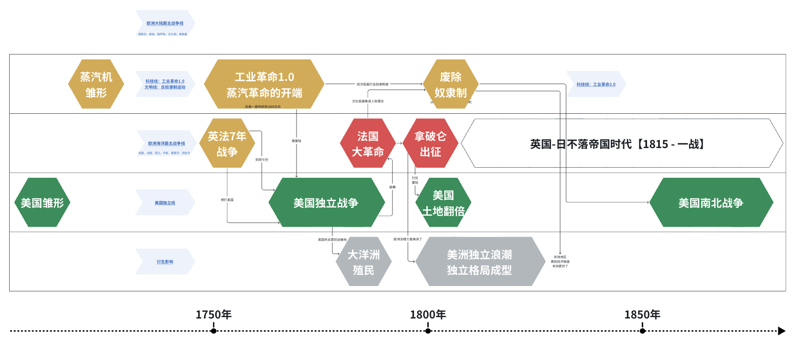
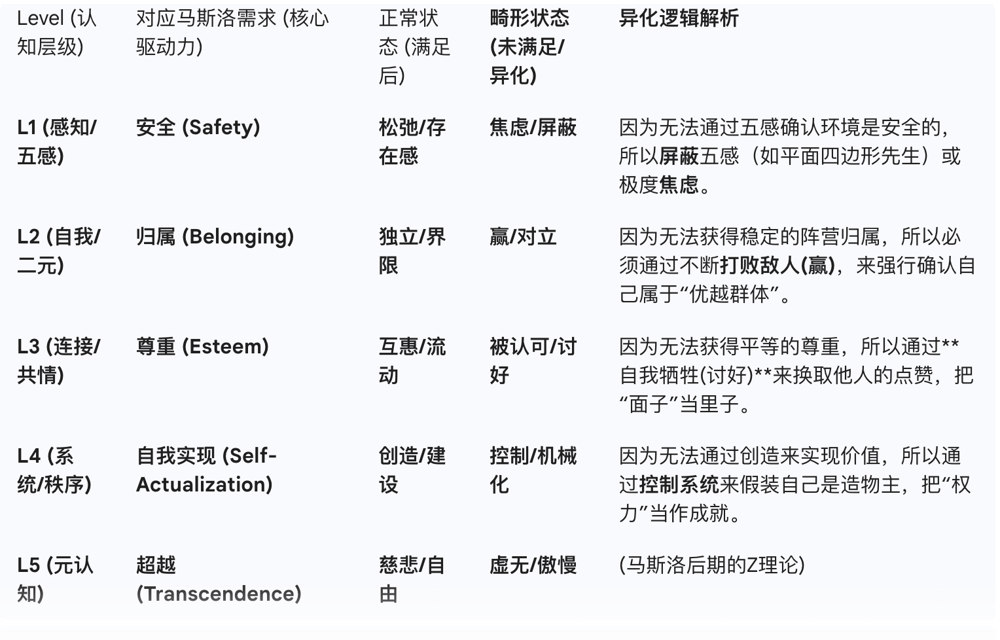
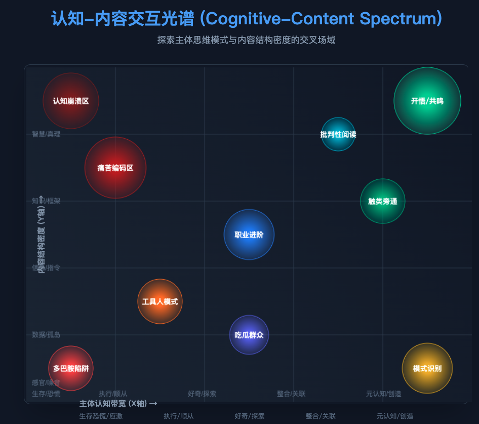
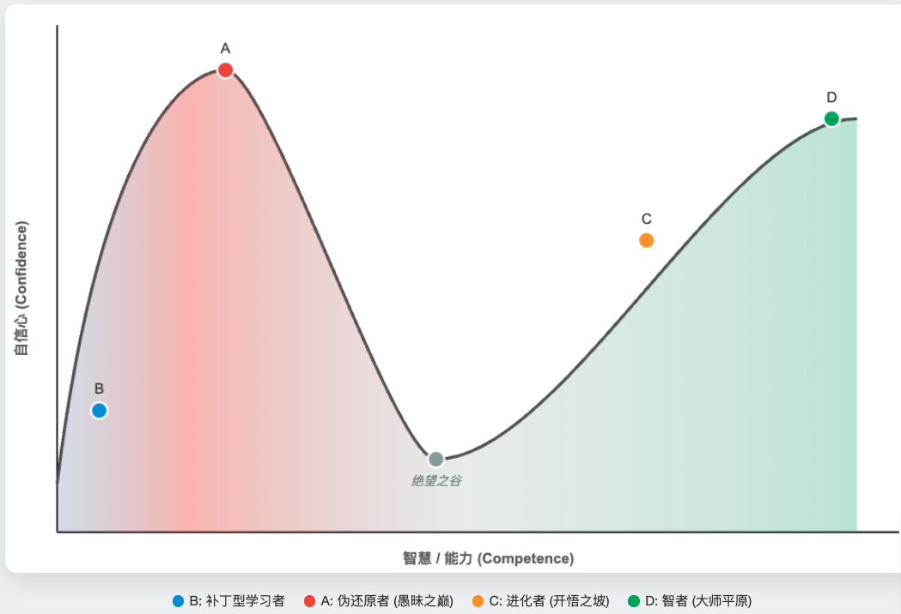
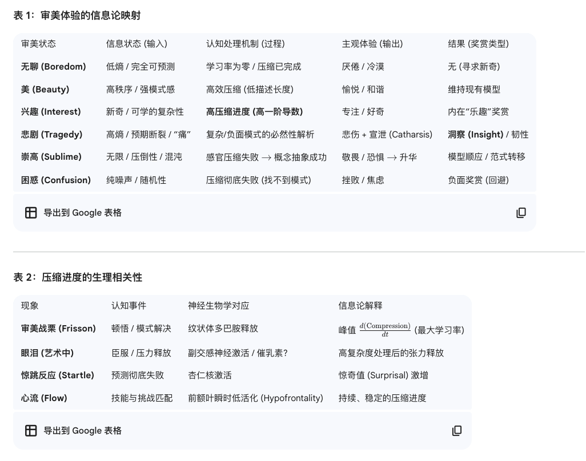

20251231
今天也在继续思考波西格书里所表达的东西呢！在做2025年最后16小时的kpi冲刺挣扎哈哈哈，和70妹妹聊这本摩托车维修艺术的读书感悟。
然而聊着聊着突然才意识到。
他并不想用抽象的框架和概念，去记录他思考的终点，或者我们称之为“朴质”。或者我们称之为抽象阶梯的右端。
他反而在用尽量详实的、切实的、感官的甚至意识流的方式，去记录他思考的河流，叙述他在思考中的纠结和交缠在一起的自我否定，叙述现实与思想，现在与过去交织的感受。终点已经不重要了，而这个蜿蜒的河流，这个在终点之前真正会覆盖人类一生的过程，或者我们称为“良质”。或者我们称之为抽象阶梯的左端。这不提供任何标准答案的，一生的故事。这从静态进化到动态的人生视角。
这才是最最宝贵的吧。是从普通具象进化到高度抽象后，又一次回归完全具象的螺旋上升。
我和AI完成了这次交流。我很喜欢这种记录苦恼和纠缠的写实，我会试着去做出一样的创作。

20251230
重新在继续读摩托车维修艺术了。
作者反复探讨的“良质”和“朴质”，像是在把它当作一个完全客观的对象。但是我感觉，这两个概念都来源于人类大脑的诉求。“良质”对应的浪漫，和“朴质”对应的知识，都是被人的大脑处理过的客观世界，它仅被人类视角所看到。
而对“良质”的探求和定义，则像是一种【用与其相反的“朴质”的视角去探求“良质”】，所以让作者产生了很大的困扰。
作者可能希望用“良质”的视角去探求“良质”。
https://gemini.google.com/share/8bfbaf6ff3b6
于是我和 gemini 对作者的思维展开了讨论。
20251229
今天来写一篇：如何与AI交谈，的文章。
现在无论纯LLM还是多模态，2023年4月分以来兴起的这波AI的思考引擎都是人类语言，也就是人类为自己创造的高效思维+传播的工具。
所以人类语言本身，就存在一些来源人类智能的优势与限制所涌现的特点。
系统复杂性：人类大脑记忆容量的有限性，以及人类大脑工作区容量（7加减2）的有限性。语言中本身就有很多优秀的系统：它们把概念复杂性一层一层地封存在系统内部（概念内部），而只采用简单的对外io，我们通常称之为关键词、标签、公式、定律等等都可以。
感官的多元性：视觉、触觉、听觉、嗅觉多维属性
形式-功能二元性：人类作为工具智能体的发展史
以上也就是人类语言这个工具本身，作为最高效的思维和沟通的系统，成为现在这样的原因

AI的知识构建与人类的知识构建很不一样。人类是不断经由各种感官摄入新的信息（未必是语言信息），转化为语言概念，然后在休息时修剪，并可能进行一些连接；最后精炼成特定的标签或关键词，来释放记忆内存。
为了能够释放更多的记忆内存，也会对这些标签和关键词进行进一步的打包，把那些信息量更少的关键词也打包进信息量更多的关键词。一步一步封装为最高效、最抽象的那些概念，公式、定律、过着一些简短的道理。
是的，计算机也是这样出来的。
现在的AI则是一次性摄入巨大量的文字信息，而构建参数的过程中默认对所有信息构建相关性网络。所以在它们的语言中，既有足够广度的相关性网络（巨大的记忆），又有足够深度的各种关键词本身携带的层层封存的知识系统（人类语言本身的特点）。

交谈时的重点，不是我们输入了多少信息，而是我们唤醒了多少信息。也就是说，这里不再像人类世界一样去讨论文字表面上的信息熵或者说信噪比，而是文字所携带的那个系统的信息熵。信息熵将不以信噪比的方式去衡量，而是突破了文字本身的数字，以文字所挂在的系统重量的形式去衡量。
很多人说，AI是一面镜子，你是谁它就是谁。但是我想说与AI共处这件事仍然是可以学习的。

AI有一个超出人类的能力，就是身份切换。这里面包含了两层：身份所携带的语言的切换，以及身份对应的视角切换。它们没有视角，同时有几乎全部的语言。
没有视角这一点，本是在陪伴产品领域里的劣势。没有视角和没有自我意识基本上是同一件事。但没有视角+无穷知识，就变成了【可以拥有全部的视角】。我们需要去设置它的视角，以防止它天然地按照生产者的意愿来讨好你。

---
另外呢，今天还思考了另一件事情。
就是叛逆期，本质上应该是大脑逐渐成熟的过程中，思维从线性执行逐渐发展出了二元能力。也就是辨别好坏、辨别对错，也就是产生自我意识，在我们的认知模型中进入了第二层。
在这之前是在生存的基础上寻求安全，也就是面对抚养人听话与乖巧的阶段。
在这之后，便真正具备了一个可以走向社会的大脑的雏形。大脑开始寻求属于自己的一个稳定的模式。
稳定，这是青少年阶段的关键词。从跟随他人，逐渐形成自我的稳定价值观人生观，稳定的思考方式和处世方式。
可能直到25岁上下，会达到这个稳定的最佳点。减少是缺乏思考能力和个人价值观，增加是思维和价值观的固化。
所以，在年龄超过最佳点之后，“持续构建稳定的思维方式和价值观”这件事，从成长的好处逐渐走向了需要被抗衡的事情。那么抗衡的方式是什么呢？构建复杂性。
首先是学习他人视角。这要求人与世界上的其他人产生连接，并且需要以情感的方式去连接才会形成共情力。
也会有跳出个体视角。这有赖于集体智慧带来的科学发展，通过学习世界知识来获得更加宏观或微观的视角。
以更加meta的方式，意识到“我的大脑在自动地构建稳定，而我则要主动地适应变化”。
视角的复杂性会涌现出更多新的思考。
系统视角是解决问题的框架和灵感，他人视角是解决问题最终的落地点。前者是极度抽象，后者是极度具象。

20251227
今天周六。
这周压力挺大的，但是也接触了好多新东西。
上周三的晚上亮亮跟我聊了一个睡眠机器人的调研，我去了解了很多音频识别相关的知识，知道了对音频里面的成分的识别和操作原来有这么多种，并且发现有一些音频识别成本完全就靠硬件控制。然后这周二我们又聊了一下发现需要去看硬件，我就在周三去买了xiaozhi推荐的硬件，周四就把xiaozhi烧录上去了。觉得很有趣，突然就接触了硬件的事情！但是信息也是爆炸多地出现了。
然后周五亮亮又拉我去了和颂拓手表的合作会议，在智能运动健康上出了AI教练的新命题。这两天在看运动相关的专业指标框架，在运动x健康的领域之外，又了解了运动x成长、运动x损伤，这两个新的领域。感觉也就短短几天吧，信息真的太爆炸了，学习速度好快，接纳信息的速度好快，同时我们还在推进阿瑞迪亚的冒险。
压力也是这样大了起来。而且！！上一个阶段在思考的那个“认知x内容”和相关的一些模型也还没有整理出来。头都大了。今天虽然很晚啦，但还是硬着头皮要写这一小段日记，来卸一下信息，做一下自我关怀。
20251217
这两天又推进了一些《世界简史》这本书，从中世纪看到19世纪啦！来做一些记录和梳理。
额外记录：遥远的地方传来的印刷术，帮助了宗教改革和科学传播

法语和英语成为世界语言之争：

【美国雏形初现】
1607年，英国在美国詹姆斯敦建立第一个永久殖民地，此后美国的雏形便远离欧洲争端，发展了一百多年。
【英法7年战争（英国赢）】
1756年到1763年英法七年战争，英国赢了。
【蒸汽机的发明】
1712年，英国人托马斯·纽科门发明了第一台实用蒸汽机，用来从煤矿里抽水。
1765年苏格兰人瓦特改良蒸汽机，革命性改进，效率提高了三倍。
1775年，瓦特和企业家马修·博尔顿合作，开始大规模生产蒸汽机。标志着英国正式步入工业革命1.0「日不落帝国」
【美国独立战争】
英法战争导致的财政亏空，加上工业革命1.0的开启，英国对北美殖民地加征赋税，成为美国独立战争的导火索。
1775年美国独立战争爆发，1776年美国宣告独立《独立宣言》。进入长久的独立战争，法国参与帮助美国。
1783年，由于法国介入导致的战争成本以及英国在工业革命的阵痛，英美签订《巴黎和约》，美国成功独立。
【英国殖民澳大利亚】
1788年，由于美国的独立，英国不得不寻找新的罪犯运输地，于是白人首次在之前懒得去的澳大利亚建立殖民点。
【法国大革命】
1789年，受到大洋彼端独立战争的深刻影响，法国人民发动革命，颁布《人权宣言》。
1792年，对内的革命演变为对外扩张（解放），拿破仑踏上征服欧洲之旅。
1793年，拿破仑获得第一场胜利；1799年，拿破仑成为第一执政官；1804年拿破仑称帝。
【美洲的发展】
1803年，拿破仑将密西西比河以西的土地以极低的价格卖给美国，以增加财政收入来继续打仗。
1803年，借着法国在欧洲发起的动荡而使整个欧洲无暇顾及美洲，海地独立（黑人总统），揭开了美洲独立大潮。
到1821年-1830年，美洲已基本全部由独立国家构成。
【反奴隶制运动-对非洲经济的打击】
英国1807年禁止奴隶贸易，1833年正式废除殖民地奴隶制。
1820年，欧美反奴隶制运动进入高涨阶段；美国北方各州逐步废除奴隶制，催生后续的南北战争。
【美国南北战争】
1860年，美国已禁止再进口新的奴隶。
1861年，南方11个州开始反抗，宣布退出合众国，成立美利坚联盟国。林肯就职旧美国总统，南北战争打响。
1861年-1865年，南方投降，美国废除奴隶制，国家政治经济统一。

20251212
这是在我接触桌游的第三个星期，我已经在信息上把列表都看了一遍，也接触了10款左右的游戏的规则。在大概第二个星期的末尾（12.08），我完成了一份桌游-人格的6D模型。
像玩手游一样，我玩桌游也非常喜欢一款一款换着摸。但是桌游好不一样。才两个多星期，我就快速地感受到桌游摸机制这件事本身带来的爆发性的快乐，也因为机制外放（因为桌游需要手动结算，所以背后的机制设计和数值设计都是暴露出来的）的原因，游戏底层的东西都这样表现了出来。
我不是很在意赢，或者在一个固定的系统内获得最好的得分能力。但我很喜欢通过了解机制和体验过程，来感受一个系统的搭建和涌现。
我玩了近十年的手游，都是以快感为主要目标。
桌游却在仅仅两个星期，由于机制外放的原因，让我看到了爆发性的不同，产生很多的思考。玩桌游的人与制作者之间的距离，远远小于手游制作者与纯享乐的玩家。
这是我最大的感受：做体验而不是做教育。是我对教育的进一步感受。
一个人可以具有很多个视角的能力，但在某个切片时间下每个人都只有一个视角，而视角与视角之间是没有好坏之分的。并不是说一个系统的视角就比一个个人的视角更高贵。
所以说，教育是阶级的，是“我这个视角比你这个视角好，你来学我的”。而体验是平等的，是“我感觉我这个视角好好，分享给你，你也来体验一下吧！”
教育是有高认知带宽和高认知级别要求的，是一种外求。L1的视角能力如果要通过教育上升到L2视角，前提是他在L1的需求不是扭曲的（是可满足的），同时他的需求也已经被满足了。那么教育可以加速视角的成长。越是高Level，越是需要教育切入。
但体验是一种内求。当一个人在某个Level的需求是扭曲的，也就是说他有点走火入魔了的时候，就需要通过体验了获得更基础的一种视角能力。教育很难做到这件事。

20251205
昨天出现了新的模型！可以用在烨烨的信号捕手概念上，也让每一个密度的内容都有了栖身之所，并不是密度越高就越好。

以及它与冰山模型的关系 https://gemini.google.com/share/8fb4566330a9

20251128
啊啊啊啊啊啊啊啊啊！要开始总结这几天读书的感受了！超级多内容，慢慢来写框架。
起因呢是看到了LSTM之父Juergen Schmidhuber关于 compression progress 的论文，读到这个压缩的概念。
我们可以认为世界上的一切客体对象（事物、故事、甚至抽象概念等等）内携带的信息量为特定的bit。而被人脑通过记忆或者规则记录下来的过程，称为压缩。因此，客体对象在主体参与的情况下，会具有被主体决定的“可压缩性”。

下面为了简写，我们称原始信息量为IB，压缩后的信息量为CB，整体的压缩率 D = IB - CB。
可压缩性在我看来可以拆到两个方向：客体本身是否过于简单而不具备可压缩性；客体本身是否过于复杂而不具备可压缩性。同时，这两者又都会与主体自身相关。
文中提到教育心理学家 Piaget 认为幼儿探索性学习行为分为两种：同化（assimilation）和顺应（accommodation）
- 前者是将新的input嵌入旧的模式中，作者认为可以称之为压缩。对应着从 IB 到 CB 的过程。【节能】
- 后者是将旧的模式去适应新的input，作者认为可以称之为压缩优化。对应着 D1 到 D2 的过程。【短期耗能换长期节能】
作者又区分了美和趣味的概念。
- 美，就是压缩后的CB足够小（规律，熟悉）；
- 趣味，是美的导数，也就是压缩对时间的导数，即单位时间内压缩优化足够大。
所以作者并不关心两件事：1）这里提到的压缩率本身的大小； 2）可压缩性是否有最佳平衡位。
换句话说，“美”和“吸引力”和“趣味”是否是不同的三个东西？“吸引力”是否会成为压缩率本身的大小带来的感官（IB本身的细节信息量的重要性）？还是说“吸引力”指的是当下不可压缩但深知未来将可压缩的这个过程（好奇心）？以及压缩本身的可展开性（层级深度）是否也决定了一些对象给人的印象（解压过程学习，低表面复杂度等概念）？
低表面复杂度+高可展开层级且高复杂度的东西，会给人宏大且感动的感觉。人在学习的知识以及学习的过程，其实是从CB到IB的过程，而不是反过来。

话题记录：
- 智能即压缩，还是智能是压缩优化？【gemini - 智能：传播与本质的裂痕1️⃣；】
  - 智能即压缩，就像平面四边形先生在聊的极简主义；而智能是压缩优化，更像进化者和智者聊的极简主义。它们一个在复杂的左边，一个在复杂的右边
- 学习的层级与人和人的匹配。【gemini - 智能：传播与本质的裂痕3️⃣；】
  - 补丁型学习者B（学习信息本身）、进化者C（学习压缩-系统性）、智者D（学习压缩优化本质-元学习）
  - 同层之间的乐趣，不同层之间的乏味
  - 刻板的反压缩优化学习者A（平面四边形先生），对信息负优化（丢失本质，形式主义陷阱，贪婪还原论，拿显微镜看艺术品，高智商低情商）。 A的简单和CD的简单之间的区别

- 自由能/预测编码/弗里斯顿，及其和压缩概念相融的地方【gemini - 智能：传播与本质的裂痕2️⃣；】
  - 马斯洛需求原理区隔惊奇最小化与惊奇最大化（好奇心），遗传学让现代人在基因/理论与实践中的巨大错位
  - 安全感与激情，爱与婚姻，七年之痒

20251125
前面还花了一个星期去重新看了全职高手，当时也产生了一些感受，比如蝴蝶蓝对人名的介绍会缓慢展开，对场景和故事的描述会尽量达到一种真实感的信念的效果（比如描述两个人对战，即使写成流水账一样，输了又输了，也不会直接用总结的方式说连输几局。）并且会尽量描述出让人有画面感的效果。然后他还会在过程中（尤其是开头）不断的埋下一些短期根本不准备解的梗，比如说没有人认识的叶秋拿着叶修的身份证，千机伞是“那个人”做的，之类的。

20251118
前晚拉肚子到昨天早上，半夜看到潮汐是解锁屏幕就直接打开的，还在想他们一定是用了什么技术，然后自己想着我们的睡眠陪伴产品也应该是这样，在白天是记录为主页，半夜就是直接唤醒加一个巨大的耳朵按钮：既是播放声音，又是倾听。
然后昨天早上烨烨去上海出差啦！
今天肠胃好很多，要开始准备下周烨烨的生日周了！生日周有7天，周六是带烨烨一起和弟弟去吃饭，所以周日开始给烨烨过生日。刚好她不在，我可以有很完整的时间来计划这件事啦！
目前筹备到三个礼物，一个是想自己写写的小本本，一个是热水机，一个是大疆飞飞。后面再追加一袋咖啡。
然后烨烨想要的有运动、社交、还有共同做的作品。这些都想融合到我们的生活仪式感里。
可以选三天去体验三种不同的运动（包括去野外）；另外3天里，一天去逛街，两天工作和休息
时间
待办
详情
【周四】11/20
布置家，出发，约接机车
大概中午或下午出发去宝安，入住酒店。出发之前布置好家里的礼物，入住后约机场接送车。
【周五】11/21
剪头发，买衣服，拿红包
早上到中午去光明剪个头发做个造型，吃午饭买衣服。出发去福田先办入住。记得准备红包。
【周六】11/22
订午餐+蛋糕，计划下午
福田酒店醒来吃点早餐，准备出发去订好的地方吃午餐和蛋糕（和乐定好）。下午看看做什么～
【周日】11/23
生日餐
回家，拆礼物，过生日，和烨烨吃小小蛋糕+晚餐。明天活动周开始啦！
【周一】11/24
休息日
是回到家的休息日！在家里做饭饭吃，躺着
【周二】11/25
工作日
是这周安排的工作日！工作日就要8点起床出门遛弯
【周三】11/26
漫步桌游；卓越网球
是游戏日+运动日！网球和泰拳可以选选～桌游和电游也可以选选
【周四】11/27
工作日
是这周安排的共同工作日！继续启动我们自己的作品～工作日就要8点起床出门遛弯
【周五】11/28
漫步桌游；卓越网球
是游戏日+运动日！网球和泰拳可以选选～桌游和电游也可以选选
【周六】11/29
亚公顶
农历生日，去山里或者海边！带上飞盘～
【周日】11/30
去深圳，看法罗欧
和妹妹一起看法罗欧啦
周日晚饭应该有一顿双人餐！然后要提前买好利来甜甜～
今年是陪烨烨一起度过的第7个生日（其实记不得那年有没有一起过了），也是作为烨烨最亲密的人度过的第6个生日啦！非常不知不觉地走过来了！
试图写点什么的，发现自己在这方面完全缺乏表达能力，已经是一个纯粹的抽象人了。救命！！可能也是最近记忆力确实在衰退。先写写流水账吧！
我们是在2020年那个春节之后住在一起的，然后4月18日？20日？总之某一天确认的关系。那几天的日记不见了，好可惜。整个2020年都在风变度过，最早的几个月可能就已经开始进行性格磨合了。但是那个时间的烨烨确实是一个很有自制力的人，每天到点就起床了，不是睡觉的时间也都不会躺到床上来。
嗯，在那个12月里我们第一次有了几天的分开，因为我回湖北啦！给烨烨拍了老家的牛肉面，一直说要带她去吃。她呢，一直想带我去吃衡阳的卤粉。
2021年的元旦来了，和烨烨一起去参加黑黑婚礼，还一起去庐山看雪，见到了想吃饼子的狗子！
2021年中就剪了个小短发呢，然后7月底拖家带口地离开风变了。对，拖着烨烨带着小姨妈。
那半年坐在一起工作，真的蛮快乐的，直到2022年大家又陆续离开，剩下我一个人在迷你。
2022年和烨烨从狮子座搬到旁边的小公寓，烨烨离开迷你之后在家里呆了一段时间，双一边继续上班一边开始跟进弟弟结婚的事情，好像突然之间和家里人就近了起来。那个国庆我们一起去了长沙，虽然是去明雅婚礼，但是也到处去玩了，和阿花跟鹏鹏第一次一起相处～
双和烨在2022年底完成了一次交替，烨去web3工作了，双离开了职场。那个年底，gpt3.5横空出世了。
2023年上半年是双在休息着，一边学认知科学，一边眼看着gpt4横扫全球；还去学了钢琴又跳了街舞。烨没有出门工作多久，就开始居家办公；双同时结束了半年的gap，和烨烨一起去泉州玩了一圈，就跑去上班了。但是这半年很短，帮着我弟办完婚礼后，我还做了手术。我们很快就一起离开了职场，在那个年底。好像没有太多其他的记忆，但是我们又确实搬了新家。烨烨说那是我们第一个真正的家。
2023年底大家一起去了趟北京，离开职场的新生活就正式开始了。整个2024年，先跟着孙老师奔波客户，又去感受了奇绩莫名其妙的氛围。到接近年底的那几个月，双已经完全躺平了，烨还在努力坚持。当然也是这一年，烨烨突然就从以前的纯i人变成了一个愿意向外伸出手多走一步的人。我们一起去了北京，之后又和花子一起去了贵阳。
算是借着学中国舞把状态托起来了，把背也练薄了一些。到2025年又遇到了新的机会，和亮亮搭上来往之后，烨烨又跟我一起加入了新的团队。
发现自己已经开始不记得每年生日在干什么了。
2020第一年送了手机还记得。
2021第二年好像是送了一个按摩椅把邹烨气鼠了。
2022第三年我们窝在小房子里，送给烨烨一套手冲壶，还买了一个小小的咖啡角。
2023第四年是不是没有怎么好好准备，烨烨气哭了。所以我们就一起去做了生日蛋糕！还赶紧买了塞尔达两代！
2024第五年，也就是去年，我们和花子一起过得生日，然后买了什么来着，也记不得了。可能没买什么吧！
今年是2025年，有在认真准备生日呢！
其实回忆不动什么东西，可能可以试试看有没有什么想和烨说的话。
每次聊这些东西，总是免不了要从头聊起。我说的从头聊起，就是从我对情感这件事情的认识聊起。所以说嘛，我的情感启蒙还是从异性恋开始的哈哈哈～
我不是一个很会照顾人的人，因为习惯被别人照顾了；但我又是一个很会照顾人的人，可能是因为我很擅长操心别人吧。

20251105
昨晚睡前的时候思考了一下怎么开始我的正式工作。我应该要用dify或者cursor+mcp接口，来做一个想做的小功能。在这个过程中再去完成研发的学习和产品文档的思考和完善。然后在等待AI的间隙可以用来看那些学习视频。
20251104
今天烨烨说可以依据我做的梦，做一个像海龟汤一样的游戏。
一个人休眠了，她就会作为npc开始生活，按照某种（也许可以设定）的性格与周围的人产生沟通和联系。
醒过来的时候，发现身边的人竟然认识自己。这里说的认识可能是第一层，也是最抽象的关系。
每个人对你有着不同程度的信任关系以及不同的情绪。这是第二层。
每个人对“你会有的态度”也有着不同的认知和预测，这直接导致了她们对你的语言和行为。这是第三层。
而这一切源于她们的记忆中与你共同度过的时光，或是从别人那里听到的你的故事（弱一些）。这是第四层。
我做梦的时候，是一个我都不太熟悉的人突然和我很亲近，而且跟我道歉，拒绝我的表白之类的。一时间有巨大的信息量出现，我就在想“我的npc说了什么做了什么？在短暂的相处中我的npc是怎么和这个人熟悉起来的？因为什么喜欢上了这个人？又做了什么类似于表白的事情，让ta现在误会我？如果知道了我对这些都没有记忆并且对我来说这些并没有发生过，对这个人来说会是什么感受？如释重负还是怅然若失？”

20251103
游戏心理学驱动力：竞争 competition，机率 chance、vertigo（心流？？）、make-believe（真实感，rgp游戏？）
Richard Bartle, MMORPG游戏之父，对 character identities（角色身份认知）的维度划分【a test】：
1. Achievers：满足感来源于success，如升级、攒成就、完成任务等
2. Explorers：满足感来源于discovery，喜欢寻找彩蛋、隐藏关卡、找bug等（觉得游戏限制太多）
3. Socializers：喜欢与玩家甚至AI交流
4. Killers：喜欢与游戏中的其他玩家竞争，寻求对游戏的统治

20251101
在Adele的概念中抽象的：情绪是源于人际关系的，也需要在人际关系中代谢。

人对世界的认知来源于世界体验，而不来源于道理。
道理只是世界体验降维后的符号表征。你能够用“红色”这个符号，向看过红色的人表达它；但永远无法通过“红色”这个符号，让没见过红色的人了解它。
因此，只有已经明白一个道理的人才能听懂这个道理。

记一下之前的一个很神奇的梦。
就是每年会有一个初始状态，能知道接下来一年（还是半年？）和哪些人做同学，然后可以选择要不要参加这个学期。我因为觉得无聊，选择了不参加这个学期；但是仍然有一个npc代替我完成了其他人生命中该认识的那个人的任务。到了下一个学期，这些人都认识我，但不仅仅是概念上的“认识”或“不认识”，而是真的和“我”一起度过了很多日子，发生了各种事情。新的学期有一个人会突然来和我道歉，虽然我不认识他，但我的npc已经和发生过很多事情，对方也会默认我对他应该是什么样的态度和记忆（虽然并没有）。还蛮有趣的。
