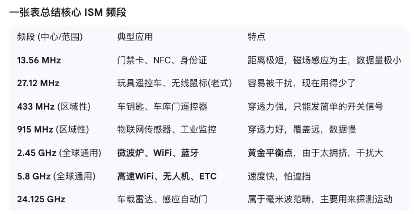
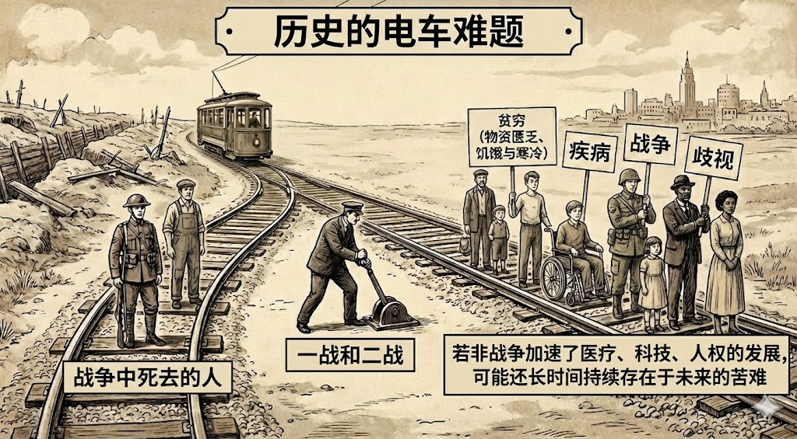
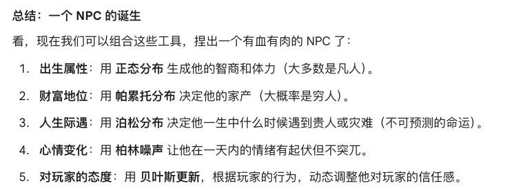
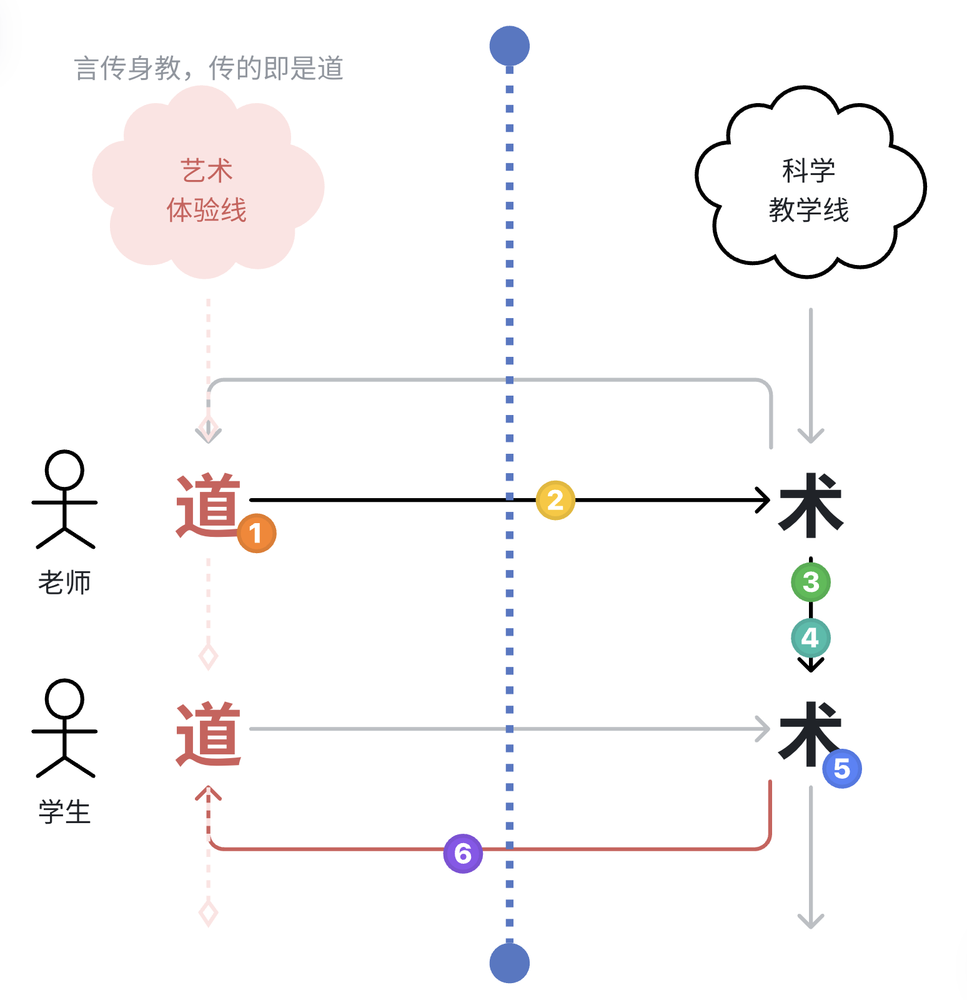
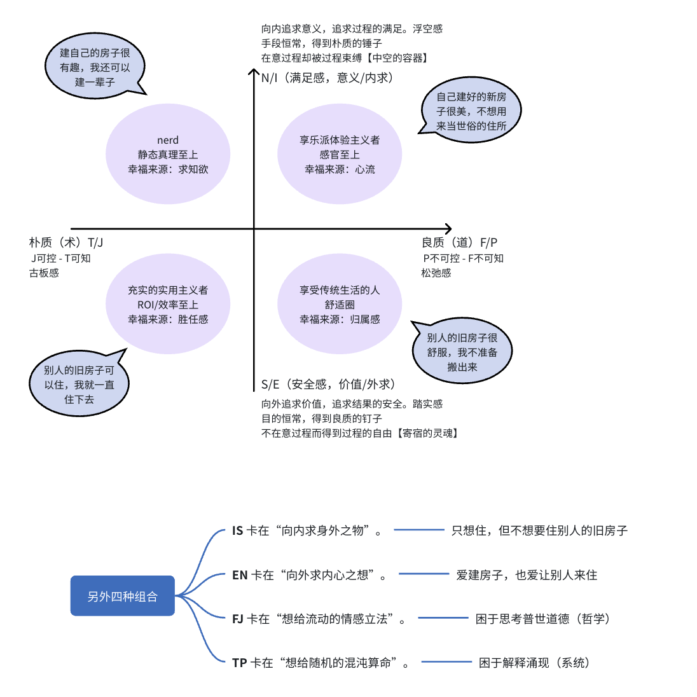
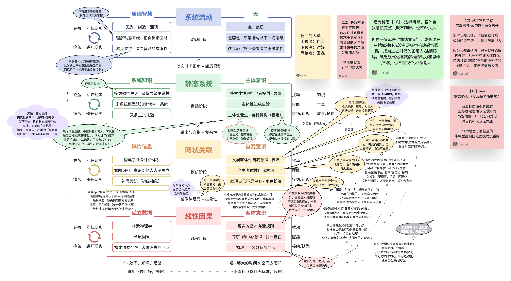

20260206
今天从早上起来就是思考电磁波和机械波。
源头是最近在思考“听觉”是一种非接触的触觉，然后就涉及到了耳朵接收的是机械波，是空气传递过来的、远方物体的运动。而视觉接收到的光的波，则是一种电磁波，这两者到底有什么不同呢？
我去和AI聊天，它跟我说光波（可见光波）是一种电磁波，所有电磁波都是横波，在真空中都是光速传播。
而地震波中说的“纵波比横波快”，则是机械波中的纵波比横波快。
所以我们区分了机械波和电磁波（振动与能量）。
电磁波里面从低频到高频，分为无线电波（其中高频部分叫微波）、红外线、可见光、紫外线、X射线、伽马射线。
- 最直觉的表现：当一个耐高温物质被烧红，就是从辐射红外线到达了辐射可见光。而蓝色的火焰比红色的火焰能量更强，紫色的火焰则是离紫外线最近的能量了（难怪九离紫火）
- 我们的微波炉用的是2.45GHz，wifi用的是2.4G/5GHz，都在微波范畴内。无线电频率就更低了。
- 从左到右，从长波长到短波长，从单光子的低能量到高能量，一切都是辐射。高能量的光子像高速子弹。
- 红外线辐射以温度的方式被我们感知，因为我们看不到。微波基本不能感受到温度了。
  - 但微波为什么可以煮食物！因为2.45GHz的微波，比红外线更容易穿透食物，大概能穿透1.5-3cm的深度，而不会把热量快速堆积在表面煮糊。而足够大量的这类微波带来的电磁场快速改变，可以让水分子强制摩擦生热达到沸腾。2.45GHz（G表示10亿Hz）的微波，相当于电场方向每秒钟改变24.5亿次。【这里所谓的足够大量（总能量强度），是单位体积的密度。比如太阳光暖暖的，但用透镜聚焦之后就会着火。激光也是。】
  - 微波理疗就是中低能量微波带来的效果。
  - wifi也在微波范围，但总能量更低。
  - 神奇的是，无线电波可以穿墙。摄像头和眼睛是通过吸收射来的可见光呈像的，所以当墙反射了所有的可见光，我们就看不到墙对面的东西。然而无线电波如果可以穿墙，那么观测无线电波的摄像头或者感应器，就能够“看”到墙那头的东西。
  -  ISM 频段（工业、科学、医学）。国际法规把一些频段划出来给大家“乱用”（微波炉、WiFi、蓝牙都在这），不需要申请特殊执照。为了不干扰其他通讯频段，微波炉厂家就选了这个“免费停车位”。

- 红外线辐射更容易被皮肤吸收，而可见光辐射则能透过皮肤分散热源。
- 常见的光源（火和白炽灯这类热辐射光源）里红外线辐射占比远大于可见光和紫外线（90-95%）；太阳可见光占约43%，红外线占50%；而LED灯/手机屏幕等冷光源几乎100%是可见光。
- 我们的眼睛能更精密特化地捕捉可见光辐射部分，而肌肤可以捕捉红外线辐射部分。
- 光速啊，在中国从北到南只要十几毫秒，走过半个地球只要67毫秒；我们看到的太阳是8分19秒前的太阳。
机械波在空气中以纵波传播，称为声波，从低频到高频，分为次声波、声波、超声波。完全以人耳能捕捉的Hz区分。
- 同样的，低频波因为长波长，而更易于长距离传播。因为更容易跨过固体。
- 机械波是人能够用身体感知到的机械振动，所以我们耳朵中敏感的小毛毛通过感知振动捕捉到了。（而电磁波则会穿过人的身体，以能量传递的方式与人发生作用。）
- 由于本质上是因为声音带来空气的振动，所以如果在真空中就不会出现声波啦。
因此，眼睛和耳朵，都是生物试图通过突破身体的感知极限，把身体无法察觉的更细致的刺激（更精细的可见光辐射，和空气的微弱振动）转化为可以被感知的东西。
而身体触觉本身对电磁波和机械波（温度、水波、大的风声、直接的触碰）都是有一定感知力的。

另外，我们能看到的可见光辐射，通常是物体反射出来的（基于物体性质，吸收一些反射其他）；所以天黑的时候我们就什么也看不到了。（而大多物体自己本身辐射的都是红外线，所以不会被我们捕捉到颜色辐射。）
原子弹发射的就是伽马射线和另一种粒子辐射（中子，像炮弹一样射出看不到的东西）。
除了这两种波，还有物质波和引力波。物质波对应着波粒二象性的概念，而引力波则对应着任何有质量的物质坍缩的时候产生的牵引力，就像恒星死亡。这是两个更加科幻的概念。

---
我们的发声系统，就是一个跟着耳朵的发展，逐渐形成的能够创造声波的工具。天然的音响！所以声波也可以逐渐通过特定的振动空气的方法来复现。
我在《20世纪简史》里看到这句“无线电促进了音乐唱片的发展”的时候，愣了一下：为什么机械波的传播靠的是电磁波的发展？原来这里会涉及到传播这个大话题。
机械波的传播损耗很大，速度很慢；而电磁波是光速，且传播中损耗更小；越是长波的电磁波损耗能够更小。
所以传递电磁波的时候，就是把机械波转码成电磁波存着，传过去之后再解码成电磁波，用音响播放再现。
传递过程中的损耗则会通过一些方法来处理。调制、编码（校验/冗余）、抗干扰等等技术。
那么为什么我们还要用5G呢？这就涉及到另一个核心概念：带宽。
带宽，就是发射的一个电磁波能携带多少信息；在分块发出的场景下，则决定了信息传递的速率。
首先，这是一种在同一空间中完全互斥的资源，所以会涉及到第一个概念：带宽范围。以对应的频率（比如5G）作为中心，取左右百分之多少的波动，作为存储本次数据的区域。而在对频率信号处理中能够达到的分辨率，则决定了单词传输总携带信息量的上限。所以高频天然有更大的带宽范围，虽然更容易被阻挡。
在多个wifi覆盖的地方，现在也有同频段内通过“协议认证”的技术建立专属数据链路，能够让对应的wifi只筛选和解码到对应的信息，从而保证每个人的信息的安全。当然真空网线是更快更好的方法。因为如果一个区域有太多人在使用wifi，无论是一个还是多个wifi，其实也都是在同个频段内按照分布式协议来抢资源的。
另外，比如调频广播，收音机，它的原理就是自带一个按协议编写的解码算法，开机后一直在对空气中的FM调频广播进行解码。在默认状态下的频率范围内，解码出来的是雪花音，没有任何信息的白噪声。但调到对应的频率段时，就会解码出有信息量/人类可以听懂的内容。这就是非常典型的直接抢频段。（当然，FM的波长远远比微波长，传输损耗也远小于微波）

---

而在可见光波复现上，我们电脑里面看到的，也是人工制作的电磁波模拟的可见光。它与现实中物体颜色不同的逻辑，是因为物体是通过吸收掉白光中的一些光来呈现颜色，而电磁波是直接基于可见光的光谱呈现颜色。所以物体/颜料三原色是 青(Cyan)、品红(Magenta)、黄(Yellow)（被吸收绿光、被吸收蓝光、被吸收红光）；而电脑三原色RGB是红绿蓝。
我们有了物理上的电磁波以及波的传递和接收，机械波的重现（隔空的技术）；我们有了物理上的电流的传输（金属载体上的技术）；然后我们有了数学的编码解码技术；我们还有了数学上二进制的计算逻辑用于真正承载信息。它们合在一起，成为了今天科学技术真正的基座。

20260205
2号去深圳接烨烨回来！这两天多点的时间，读完了李飞飞的《我看见的世界》。
当读到“硅谷的傲慢”的时候，读到“被先进技术取代了工作的人的命运，商业领域的态度似乎介于半心半意的「再培训」和几乎不加掩饰的漠不关心之间”，我突然感受到了自己过去的傲慢。
技术发展带来的人文关怀，应该是让人类能够在不跟随时代脚步的时候也不再会被时代抛弃。让走得太前的人不再被视为异类，让走在后面的人也不再被视为拖累。让人类被允许按照自己的节奏活出自己的人生，而不是必须跟随着生活的大流才能不被抛下。
20260202
今天阅读《20世纪简史》的时候，读到了一些对自己视角产生震撼的内容。
战争让太多人丧命，但也拯救了生命--那是在战后很久之后了。战争推进了输血技术的提高，在19世纪 60年代美国内战之时，至少有四场手术进行了输血。在接下来的半个世纪，几名北美外科医生的输血技术已经熟练，他们通常从其他家庭成员中取血。1916年的西线，一名加拿大的外科医生教给人们这项救命的技术，一年之后，随军队前来救援的美国外科医生提高了实践的能力。两方的战壕中，成千上万的士兵都因麻醉、输血和手术的新技术保住了性命。
……
在西方，争取女性投票权的运动得益于战争，获得了很高的声势。女人们指出，她们在兵工厂和化学厂工作，而她们的儿子、兄弟、男朋友或丈夫正在前线送命，但她们却无权投上战争或和平的一票。帕里著名的歌曲《耶路撒冷》，第一次在 1916年伦敦的阿尔伯特音乐厅中演唱便听者如潮，大家纷纷前来支持女性选举权。1919年，德国、瑞典和波兰的女性获得投票权，翌年，美国女性首次可以在总统选举中投票。对于英国、法国，以及其他几个老牌民主国家的大多数或全部的女性来说，争取投票权的斗争还要持续下去，但是一战推动了她们的平权运动。在新西兰，这个最先赋予女性投票权的国家终于允许女性进人国会了。
非常不可思议。的视角。
战争让这么多人死亡，这么多家庭分散；却因为它急剧加速了科学技术和医疗的发展，而拯救了未来更多的人。无论是治疗疾病的手段、经济发展带来的脱贫、还是未来的和平。甚至是因为物质资源极大富足带来的出生率。
一战和二战，也为对应的参战民族的女性，带来了解放。
战争才是最大的电车困境。
我在仔细思考这其中的差异，过去的死亡和未来的死亡，轨道的这头和轨道的那头。
电车自然驶过的话，明明可能轧死的是那头的5个人；却因为战争而被扳到了这头，轧死了这头的这1个人。

人命不是数字，而是他与世界活生生的连接，是关心者的心痛，是天人两隔的悲伤。
所以我们如果不从宏观角度去看，那么出生率可以不被视为一个考虑点。但是未来本可能存在的那些“疾病、贫穷、战争”，甚至“阶级与歧视”，它们如果真的可以被消化，也是在减少世界上的悲伤。那过去的战争，是不是就应该发生呢？
是一个很难的问题，我今天完全无法回答。

20260201
今天在看游戏crash course视频对应体育的那一课。非常有意思，体育可以把人连接在一起（就是人在大多数生活中的情感体验是孤独的不被理解的，但是体育赛事是同喜同悲的，高度体验到被共情，铁血男观众也会被允许在公众流泪。感觉和追星有点像），又可以让人感受到敌人间的战斗同时不流血（类似于战争、被大型动物追的生死关头之类的大脑反应，但是不对身体产生真正伤害）。
看，又出现了术--塑造体验。但是我今天会意识到，不必顺着术去创造机会，知道就行。因为人还是要顺着心意去做自己有愿力的事情，去坚持，来等待机会自己出现，
是时间，在筛选正确的东西，在指明正确的方向。顺着泊松分布的逻辑，在为我们积累机会。而我们只要积累更高的lambda，同时耐心地等待。

---
好像游戏也可以这么做！用泊松函数来决定游戏中各种事件发生的时机以及对应的概率，lambda由用户的故事线完成情况和平常的表现决定，时间过得越久，一些机会发生的概率就越大。
而不是简单的：ABC是不是都做完了，在某个日期前做完了就在日期当天触发D，否则不触发，这类的硬机制。
然后再用正态分布来给予人物表现的随机性。
- 帕累托：82原则
- Sigmoid函数：S型成长曲线

20260129
还是这条线：哲学-宗教-艺术-科学
为了传播，宗教把“善”的种子（哲学）包裹为僵硬的戒律，在很多代之后发出了艺术的芽。
  - 通用的戒律建立了农业/商业。
为了传播，科学把“真”的种子（艺术）包裹为僵硬的标准。
  - 把丰富的感官细节体验（甚至试图去深入最远和最小的感官体验）压缩成参数，凡是不可测量的就不存在。
  - 森严的等级制度（学历、期刊、资历），把“解释世界”的权力锁在象牙塔里。
  - 标准化建立了工业文明。
gemini很坚定地觉得未来是造境的未来。假设顺着它去思考我们的学习路径，就会变成无论我要学什么，我都将获得一个合适的环境。无论在现实中出生的环境如何，因为AI会给我一切我需要的思维路径、我需要的朋友和同行者、需要的抚育者、需要的物理世界、需要的成长工具。
就像现代人没有以前的人那么擅长在原始丛林生存一样，未来的人也没有现代人这么擅长在现实世界中生存。

---
今天在思考音律的出现。
人耳对频率和分贝的感知都是等比数列。而泛音的排列却是等差数列。
美感需要等差数列来保证，而秩序感需要等比数列来保证。
- 纯律：来源于泛音的等差数列排列，所以
  1. 离基频越近越清晰，越远越粘
  2. 离根音越近越清晰，越远越粘
- 五度相生律：直接针对3/2的频率（弦的2/3位置），按15263的顺序生出旋律，并1往左生出4，3往右生出7
- 十二平均律：是精致的等比，每两个音符在人耳中有相同的距离。并去近似纯律的第四个八度的左边17/16

20260128
如今的科学界的教条，不仅仅是对人的工具化和异化，这两者不如说是资本社会的特征。
让资本崛起的科学界和工业革命到底带来了什么。
如果用宗教类比的话，如今的学历看起来就像是当年的赎罪券，如今的教授位置就像当年的教士。诚然，爱因斯坦等人是纯粹的高尚的又伟大的，他们就像当时早期的传教士；而后来科学却被学院和高校筑起了围墙，卖起了入场券。资历、时长、血脉，变成了学历、论文、人脉，又一次成为了这个本该向所有人开放的领域的入场券和唯一证明。科学界同样在造一个神坛。从探索真理的工具，变成了“真理本身”，变成了划分阶级的新宗教。
正如庞加莱所说，科学的种种，只是在以一种更方便思考和交流的视角去构建概念，不是“正确”的概念，而是“方便”的概念。
笛卡尔坐标和极坐标谁对？欧几里得几何和黎曼几何谁对？时间和空间是真实的和绝对存在的概念么？这些问题就像在问：摄氏度对还是华氏度对，公制对还是英制对一样。科学并没有正确与否，科学只是提供了又一种更方便视角。就像音乐有自然律又有十二平均律，谁更方便，谁走得更远。
它本该是与艺术一样的良质、一种观测世界的角度，一种有趣与创造性并存但不失严谨的角度。但是却变成了教条的课本，变成了正确，变成了“唯一真理”。
另外，庞加莱还说：产生科学的机会，是在普遍的简单的事情中，寻找异常。在表面的不一致中，识别深层的一致性，从而带着科学走向更深的一层。

---
AI将为这科学的中后期的加速，带来什么？谁来像艺术对宗教一样，把科学拉下神坛？
gemini说，AI将是新宗教改革的印刷术。这很有趣。
AI能做什么？我们总在说技术平权，那如果科学平权呢？
想象这样的场景：家里任何东西都不需要再去回忆什么时候买的，花了多少钱，现在用了多久了，说明书和配方长什么样，接下来是不是要维护等等。一切物品都有AI在一边看着它，并把信息传达给你。
再想象同样感觉的学习场景：对一个领域的学习不再需要四处去寻找和拼贴，AI只要拿到好的主干，就能够展开所有你需要的知识，它们交织成网，而你身处其中；你甚至可以在其中去体验多模态交互，去用耳朵学音乐，用色彩学美术，用空间学几何，用现实学物理。最后，你可以去体验人生，或许还能有像梦境一样的时间压缩法，黄粱一梦就可以体验完一种人生（现在是通过电影、动画之类的载体），精神的厚度会变得更丰富。
如果做不出像上面家庭的类物联网的场景，也想做适合学习和体验的环境载体。如果做不出这样的环境载体，至少也想写出一些给AI的主干，真正的对教育进行改革。
AI也可以用于打破教条。过去熵增的宿命就是教条（为了传播方便），而AI可以帮助（已有某种领域知识的人）打破这种教条。
还是从和弦开始吧！

---
还有这个冰裂的故事：
我走在冰面上，冰会裂开。我们会在5个阶段看待这件事。
图腾：冰神发怒前的警告。他不去观察，但是通过恐惧去理解事件
哲学：冰为什么裂开。冰与热，硬与软。似乎会映射到我与他人之间的关系。他总会把现象关联到人类本体。寓言。
宗教：这是上帝给我们的启迪。他同样不去以观察为主，而是试图去解释事情的发生
艺术：冰裂开了。并缓慢的裂开，我的重量，我是否在跳跃，冰的厚度，四周的温度，共同形成了这裂开的声音和裂纹的质感，光照，我脚下的触感；来自不同视角看到的裂纹的样子。他让直觉沉浸其中，于是看到了细微之处
科学：他开始用术去定义和解释这细微之处。声音的频谱分布，裂纹的角度和精密测量。最终竟把声音拆解为随时间变化的频率分布，竟把色彩拆解为rgb三原色。但如果没有起初那细致入微的观察，又怎么得到呢？

20260127
今天看韦斯莱双子的人物传视频的时候，想到一方离去后，另一方再遇到任何快乐都会想起离开的他，那总是快乐的他是否还能再快乐呢？
快乐和痛苦，得到和失去，似乎是两个完全不同的概念。
一个拥有快乐回忆的人，当带来快乐的人和时光随着成长而离去，他未来每次快乐是否都会唤醒“失去快乐”的记忆，而成为痛苦？一个拥有痛苦回忆的人，当带来痛苦的人和时光随着成长而离去，他未来再次痛苦是否也会唤醒“失去痛苦”的记忆，而成为感恩；同时他的快乐却能够保持纯粹。
时间真是一个joker。
gemini说，没有拿起过的空，不叫空，叫匮乏。它是经不起考验的。
只有曾经充盈过，又被拿走过，最终回到平静的湖面，才是真正的空。
gemini说，这才是“物哀”之所以美，它用离开的限量，留下了刻在记忆中的美。

---
我想做情绪/音乐相关的桌游。
我今天早上醒来的时候就在想，哪些能够瞬间激发情绪的音乐，短视频音乐，比描写情绪的词汇更适合当音乐情绪的指纹呢！文字作载体，就永远无法感知音乐。音乐要成为载体本身才行。就像现在装在图片的那些东西，音乐也需要这样的协议。

---
今天还和AI聊了我为什么和烨烨呆在一起的时候会变成废人，而且还觉得时间飞快，有心力没动力；但是烨烨出差的时候我的执行力会强很多，时间也会变得慢，我每天好像做了很多事情又学了很多东西，休息家务也都没拉下。
gemini说，是注意力。像讨好型/高敏感的人，总是在感知氛围。只要有人在场，她后台运作的程序就不会关掉，她的注意力一定要分一部分给另外的人。它给了我很强的观察力的同时，却也剥夺了我的注意力的一部分。
这也解释了为什么我妈妈在我身边的时候，时间也过得好快。我不是什么都没做，我的注意力一直在外界身上，认知带宽被明显的占用了。等晚上回到自己身上的时候，就会发现：我今天都没有怎么花时间看自己。
包括我在微信上和人聊天的时候，可能也会发生同样的事情。
好像和我学开车的感受也一样。烨烨在车上的时候，我总是显得没有足够的注意力，被认为是ADHD。但可能只是花了很多精力在塑造自己在他人眼中的形象和表现，因而没有足够的注意力专注于眼前的事情。女性在开车上的低表现很有可能正来源于这种强共情；但女性在学习上的高表现恰恰可能也来源于这种强共情。
女性需要艺术，需要思辨，需要神经质；女性也需要科学，需要新的信仰，需要不仅仅信仰父权而是理解世界。
这和我后面要记录的内容有关：关于信仰与思辨的摆锤。图腾-哲学-宗教-艺术-科学，这五个时代正是在信仰-思辨的摆锤中来回。思辨人（哲学和艺术）看向自己和表达自己，信仰者（宗教和科学）看向他人和寻找归宿。思辨是利己利人利个体的，信仰是利他利社会利集体的。
于是思辨让人有更强的自我和主体性，对自己更深的了解；信仰让人能拥有更多的观察视角；这是一种博弈。艺术会收束人的视野，让人对单一的个体沉浸更深；而信仰会扩广人的视野，让人对世界产生更多理解和包容。可惜如果两者都不够，那就会既不够深也不够广。
图腾是对【生命传承】的理解，宗教是对【道德所投射的人类意义】的理解，科学是对【人的欲望所投射的无机世界】的理解。
哲学是对【群体传承与个体道德】的思辨，艺术是对【普世意义于人本身】的思辨。
下一步呢，无机世界的科学与有机体之间的辩证，会走向哪里？

---

今天和AI聊了两个大话题，一个是时代的变迁，一个是当代的教育。关于时代变迁，AI还提到了七个绵延至今的文明：
西方：求真的利剑（不断推翻，不断突破）。
中国：求全的太极（不断包容，不断调和）。
印度：求解脱的梯子（否定现实，直通精神）。
日本：求极致的晶体（压缩现实，微观见道）。
犹太：求永恒的书本（便携生存，时间为王）。
伊斯兰：求秩序的网络（几何扩张，绝对信仰）。
波斯：求美的玫瑰（文化柔术，审美同化）。

我们今天只记录暂时的胜者，西方文明。
西方文明，在大的阶段里有信仰-思辨的轮回，在每个阶段内部又有本质-教条的轮回。
西方文明演进五阶段
这是一个非常棒的整理工作。将我们之前的哲学推演落地为具体的历史坐标，能让我们更清晰地看到**“良质（道）实体化为朴质（术），导致僵化，进而引发下一轮良质涌现”**的历史脉络。
这是为您完善后的西方文明演进五阶段模型：

---
第一阶段：图腾与神话时代 (The Age of Totem & Myth)
——人与自然的初次博弈
- 历史时期：史前文明 ～ 公元前800年（轴心时代前夕）
- 关键事件：阿尔塔米拉洞穴壁画、巨石阵建造、荷马史诗的口述流传、原始部落的祭祀活动。
- 核心矛盾：微小的个体 vs. 残酷且不可知的自然（Survival）。人面对生老病死和天灾，感到彻底的无力。
- 意识形态（形态）：原始信仰（Animism/万物有灵）。通过想象力和投射，认为万物皆有神灵，试图通过交换（祭祀）来获得安全感。
- 良质（道）：敬畏（Awe）。这是人类对世界秩序的最早直觉，一种浑然天成的、未被分割的恐惧与崇拜。
- 结局（陷入朴质）：信仰异化为巫术与迷信（Sorcery）。
  - “敬畏”被编码成了繁琐、无效甚至血腥的仪式（术）。
  - 人们不再通过“感受”去连接自然，而是机械地执行仪式，试图“贿赂”神灵，却无法真正解决生存问题。

---
第二阶段：理性觉醒与哲学时代 (The Axial Age & Philosophy)
——智性对混沌的征服
- 历史时期：公元前800年 ～ 公元476年（西罗马帝国灭亡）
- 关键事件：苏格拉底之死、柏拉图建立学园、亚里士多德的形式逻辑、斯多葛学派的兴起。
- 核心矛盾：混乱的现象 vs. 解释世界的渴望（Explanation）。巫术失效了，人需要用脑子（逻辑）来解释世界为什么这样运行。
- 意识形态（形态）：哲学思辨（Speculation）。从“神话（Mythos）”转向“逻各斯（Logos）”。
- 良质（道）：理性与真理（Reason/Logos）。发现世界背后是可以被认知的、有逻辑规律的。这是一种智力上的狂喜。
- 结局（陷入朴质）：哲学异化为诡辩与经院繁琐（Sophistry）。
  - 哲学变成了精英阶层的文字游戏（术）。
  - 形而上学的讨论越来越脱离大众疾苦，逻辑变得完美但空洞，无法安顿普通人在乱世中的恐惧。

---
第三阶段：宗教信仰时代 (The Age of Faith)
——群体心灵的安顿
- 历史时期：公元476年 ～ 约1350年（中世纪结束）
- 关键事件：基督教的普世化、哥特式大教堂的建立、十字军东征、托马斯·阿奎那的神学体系。
- 核心矛盾：苦难的肉身 vs. 灵魂的归宿（Salvation）。在战乱和瘟疫中，大众需要一个确定的、温暖的彼岸。
- 意识形态（形态）：一神教信仰（Religious Faith）。将复杂的哲学简化为普世的信条。
- 良质（道）：虔诚与救赎（Piety）。在对上帝的绝对归顺中，人类获得了前所未有的精神统一和道德秩序。
- 结局（陷入朴质）：信仰异化为教条与腐败（Dogma）。
  - 教会变成了庞大的官僚机构（术）。
  - 良质（虔诚）变成了“赎罪券”（交易工具）。异端审判所用最严酷的“术”扼杀了信仰的初衷，神圣变成了压抑。

---
第四阶段：文艺复兴与人文时代 (The Renaissance & Humanism)
——“人”的发现
- 历史时期：约1350年 ～ 1760年（工业革命前夕）
- 关键事件：达芬奇与米开朗基罗的艺术创作、马丁·路德宗教改革、启蒙运动、法国大革命。
- 核心矛盾：被压抑的人性 vs. 虚伪的神权（Liberation）。人想要做回自己，不再做神的奴隶。
- 意识形态（形态）：人文思辨与艺术（Art/Humanism）。以人为尺度去衡量万物。
- 良质（道）：美与人本（Beauty/Humanity）。肯定人的欲望、人的身体、人的智慧是美好的。艺术成为了良质的最高载体。
- 结局（陷入朴质）：自由异化为混乱与无力（Disorder）。
  - 过度的个人主义导致了道德相对主义。
  - 只有“人”的尊严，但没有物质力量的支撑（生产力低下），“自由”变成了浪漫却脆弱的口号（术），无法解决饥饿和贫困。

---
第五阶段：科学与工业时代 (The Age of Science & Industry)
——对物质世界的绝对控制
- 历史时期：1760年 ～ 2020s（生成式AI爆发）
- 关键事件：瓦特改良蒸汽机、麦克斯韦方程组、相对论、登月、互联网诞生、ChatGPT问世。
- 核心矛盾：主观的局限 vs. 客观的真理（Control）。为了彻底征服物质匮乏，必须剔除“人”的干扰。
- 意识形态（形态）：科学实证主义（Scientism/Objective Faith）。相信一切皆可被测量、被计算、被优化。
- 良质（道）：客观性与秩序（Objectivity）。通过剥离主观感受，人类获得了上帝般的造物能力。
- 结局（陷入朴质）：科学异化为机械决定论与AI（Mechanism/Nihilism）。
  - 终极朴质：AI的出现，标志着“术”的登峰造极。所有的逻辑、技法、知识都被封装进了算法。
  - 异化：人被异化为数据和工具。我们解决了“How”（怎么做），但彻底弄丢了“Why”（为什么）。世界极其高效，但也极其无意义（虚无）。

---
总结：通往第六阶段的跳板
在这个模型中，我们可以清晰地看到：
1. AI 不是未来的开启者，而是过去的终结者。 它是第五阶段（科学/术）的封棺之作。它把“客观性”和“逻辑”做到了人类无法企及的极致，从而宣告了人类在“术”的赛道上的彻底失败。
2. 死局即生机。 正因为AI堵死了“通过学习术来获得价值”的老路，人类才被迫被挤压向一个新的维度——也就是你预言的第六阶段：面向意义感与存在美学的“新思辨时代”。
而女性，似乎在更快地觉醒。先聊主体性的主要群体，成为了女性；而男性大多还闭着眼睛。就像很久以前，先进入工业革命的竟然是历史最短的西方文化。

道与术与教育
我们用道与术的模型，把教育分为6个部分。
首先解释道：人在真实的活着（有机体与环境反应）的体验中，真正领悟到的、属于自己这个有机体的东西。
然后解释术：被压缩的道，被讲出来的道，支撑着人类有限生命的无限传承的内容。在思辨的过程中，试图不断进化不断靠近道本身。在信仰的道路上，不断挤压着真正的道的生存空间。
最后基于下面的图，聊聊教育的6个部分，从左到右。
- 得“道”1️⃣：体验和领悟。过去我们通过学习“术”，来加强领悟“道”的能力。就像学习色彩知识，来提升眼力。
- 由“道”生“术”2️⃣3️⃣：「师者」
  - 生产“术”：将自己的感悟抽象成可向他人传递的载体的能力，在过去也是书写和表达的能力。【高压缩】【非歧义】【可传播】【易接受（精神层面）】都很重要。文字就是一种通用的协议。
  - 传递“术”：沿时间/空间的传递，就是现在的教育学和传播学。
- 学“术”4️⃣5️⃣：
  - 筛选“术”：过去是筛选老师和信息源，人脉依赖度更强。web时代依赖检索能力。信息爆炸（术的膨胀）叠加AI的时代，将会产生新的筛选能力。
  - 学习“术”：最基本的认知与学习能力。不同时代偏重不同的优先级，过去记忆和信息差可能非常重要，AI时代则有所不同，如何与AI共同学习“术”--思维与逻辑。术的可迁移能力也很重要，是指数级的成长加速度。
- 由“术”生“道”6️⃣：如何将学到的术带回并融入生活中带来真正的领悟。它同时也能够提升体验中悟道的能力。主体性是它必过的一关。
关于“得道”，技术或许还能带来进一步的可能性：加速体验的过程（黄粱一梦）



20260125
魄力魄力魄力。
最近发现自己有些缺乏魄力，在一些事情上不敢承担。尤其是在工作上的事情，总是想告诉老板各种风险，让他们为自己决策并承担风险。
虽然说也是一种负责任的表现，毕竟真正承担风险的人确实不是我。但是另一方面，又觉得确实是自己比男生的盲目自信少了一些，这对我在社会上历练和获得资源会带来一些阻碍。

---
今天烨烨去成都，我开启了12天独自生活的旅程～

---
《禅与摩托车维修艺术》里面，说“卓越、价值、善”都是良质的。
现代社会似乎把这些东西已经变成朴质了，似乎资本就是价值的定义，似乎成绩就是卓越的定义，似乎道德就是善的定义。但是其实呢，其实他们都是不可定义的。我觉得很有道理。
之前我会把向内的“正确”追求定义为追求意义，向外的“正确”追求定义为追求价值；而“无”则是不再定义“正确”，无论内求还是外求。
但现在我又在想，人并不是不能去追求价值和意义，但是人最好不要过于追求那些“已被定义”的价值和意义。
（这里其实涉及到之前的思考，忘记是什么时候的了，总之也是这个月的）
最近好像突然意识到了一些事情。
之前我一直觉得自己自洽的一个点，就是从来不会后悔。我会认为自己的每个选择都是对的，每一份经历都是有价值的并构成独一无二的我自己，身上的每一个特质（我不称之为优缺点）都是有意义或者说有用的（比如我常说的，自私和懒惰是人类赖以生存的要素），以及走过的每一分钟都在未来会产生价值。换句话说，我是一个长期价值主义者，所以可以抛开短期的价值来更宏观地观察和拥抱自己的生活。但即使我看起来这样通透，我还是好紧绷。
于是我最近好像意识到，我仍然在用“价值”、“意义”、“对”、“有用”来定义这一切，我执着于这种概念。这难道不是另一种功绩主义吗。

---
我更新了我的主体性模型。
非优绩主义，被动的优绩主义，主动的否定性优绩主义，主动的肯定性优绩主义，无优绩主义
无对错，社会标准，自我标准，生命的标准，无标准
对他人无要求，站队型（自我塑造阶段）好恶，对优秀者的爱，对正确者的爱，无要求的爱

20260111
1月7号出发去西安，和烨烨带着我们的妈妈一起去旅游。
真累呀！今天早上才赶回来和小乐子一起过生日，然后下午到家就睡了一个大觉～

那天在大明宫和烨烨吵架之后聊的事情，记录在这里：
和烨烨聊了一下，跟工作关系的同事聊cowork带人一起住的事情。
就是不要表现出“借公司的利益给第三人人情”的感觉。如果要有其他人来住的说法，只能表现出“我本人需要”
因为前者会让公司觉得“你占我便宜，你贪这一点便宜”，也就会让双方出现明显上下位关系。因为对方作为本身就是用钱买你时间的人，会觉得自己真的可以通过金钱拿捏住你。后者则是“我与公司的利益往来”，如果出差两周这么长我希望你满足我这个需求。这是正常的。

然后延伸到，与人相处的时候必须要考虑到双方的社会关系和对方与自己的社会身份。因为这关系到对方对于关系的看待方式，以及对方的社会身份下会如何思考你的社会身份。

反而是对待自己的社会身份和社会关系的心态的时候，要不卑不亢，保留完全纯粹和坦诚的态度来面对自己。这就是心态上的道，和行为上的术。

行动的时候，因为在和外界交互，所以需要借助足够的共情，来理解对方的立场、态度、自我社会认知之类的，来方便事情进展。而自我心态上，则是保持充分的主体性，不要被自己的社会角色和他人束缚。在后者的清醒纯粹的道心下，再基于自己与对方交流的目的，以术（共情与共赢）待人，才是最好的。
大部分人的问题都是反了过来：心态上唯唯诺诺默认自己是下位，行为上却钢筋铁骨宁折不弯。
所以问题从来都不是什么短视频宣扬的那些“我要在事业上炫富，在亲戚面前装穷”。不是的，一切都要结合时代背景与人性基因及其对不同社会关系、社会角色的认知，来以道驭术。

20260104
基于前天的模型，重新聊聊主体性的构建吧！
我产生了一个四阶回路：
1. 新生者的观察 - 分离之苦 & 存在之乐：【边界（分离/诞生）确立】
痛苦：理解自己与母亲不是共生，区分我与非我的界线
充盈：由于“我”一直都在，开始观察客体的他者
卡顿：创伤痛，幻肢痛（主动切割，包括奥卡姆锤子的情绪，圣母的自我生命力）

2. 客体阶段的模仿 -- 驯化之苦 & 归属之乐 ：【镜像神经元（容器）发展】
痛苦：意识到自己并不是世界的中心，借由观察他者的客体而产生自我的客体意识
充盈：他者成为镜子和裁判，进行模仿（通过关注极度认同的和攻击极度否认的他者，完成自我身份认同）并最终构建稳定的客体自我
卡顿：生长痛，创伤痛（恐惧型讨好者）

3. 主体阶段的自指 -- 清醒（孤独）之苦 & 自洽之乐 ：【自我解构与重构（重填与看到）】
痛苦：上阶段习得的评价体系崩塌或祛魅，对过去的否定催生主体性（超我的崩塌与本我/欲望的审视）
充盈：主体性自我达成自洽，能够接纳新一层的他者（各类无机的系统体系被理解，有机的主体性他者成为同类）
卡顿：机能缺失，过拟合（奥卡姆锤子），伤口硬化（犬儒），麻药无痛（伪自洽），过度驯化（焦虑型控制狂）

4. 无我阶段的流动 - 失控之苦 & 自在之乐 ：【看到时间（回归/合一），与世界产生更高维度的连接】
痛苦：看到无机与有机世界的无常，人类中心主义的崩塌
充盈：放下执念，尊重时间的力量，接纳万物的平等。主体性自我回归整体。

主体性的寻找过程（痛苦与爱能带来突破）：

【客体化自我的构建】由他者及自我
- 他人是镜子和裁判，自我是被评价的客体
- 完成几千年塑造的人类文明的社会化学习
- 带着他人的视角评价自我：焦虑与羞耻【感性 - 归属感】
- 完成 - 自我意识的构建 // 按社会标准构建容器，直接把自己放进去进行磨合（信念提升学习速度，但增加破除难度）

【机械化自我的构建】由无机及自我
- 他人与自我均是被客观（无观点）观察的物
- 学习并思考无机的知识迁移至有机的对象 -- 我与他人
- 带着无机的视角观察自我：平静与虚无【理性 - 求知欲】
- 完成 - 对他人评价的祛魅，对自我的客观存在性接纳 // 破除社会标准，把自己拿出来，重构容器

【主体化自我的构建】由自我及他者
- 自我是被接纳的独特个体，他人也是
- 重新填充产生对自我的爱与包容，并溢出共情他者的视角
- 带着主体的视角接受自我：爱与自由【感性 - 看见他人】
- 完成 - 自洽，对自我的主体性接纳 // 将自己填入自己的新容器并再次完成磨合

【建立标准 - 破除标准（祛魅） - 重构与超越】
静态容器 - 打破容器 - 动态容器

---

另外也要聊聊模型里面的一些关键点。
1. 镜像神经元的发育：天生/后天阿斯伯格 -- 缺失；天生/后天情绪高敏 -- 过载
2. 丘脑失效（感官敏感） 、感知-调节（内受觉敏感）、信号深度加工（大脑敏感）：天生/后天高敏人群
3. 我与非我的区分度：清晰边界感的缺失
  1. 阿斯伯格容易过度隔离，情绪高敏人群容易边界缺失
4. 父母的教育
5. 家庭其他成员的影响
6. 他们的自主性探索道路卡点与痛
7. 他们的睡眠和梦境表现
8. 他们的书单
问卷
首先，输出一份问卷：
```
1. 情绪的敏感程度（自己的情绪，他人的情绪）（镜像神经元）
2. 感官的敏感程度（触感、嗅觉、味觉、听觉、光）
3. 内受觉敏感程度（饥饿、困倦等）
4. 信号加工习惯（深度加工、浅度加工）

5. 家人与镜像神经元
6. 家人与边界感清晰度
7. 男孩女孩
8. 家人的性别教育
9. 接受的社会性别教育
10. 其他家庭成员（亲兄弟姐妹）
11. 当前年龄
```

完成所有问题作答后，输出一份诊断报告，包含
1. 用户当前所处的【自主性探索道路卡点】和感受到的痛
2. 推荐给用户该阶段的书单
3. 作为一个小bonus，输出用户的睡眠特征和梦境表现
Part I. 硬件配置：神经系统敏感度精细化评估
1. 情绪敏感度与镜像神经元 (Emotional Permeability)
旨在区分：对他人的共情、对自我的感知、以及对环境氛围的读取。
Q1.1 他人情绪共鸣（镜像反应）场景：当你看到别人处于强烈情绪中（如哭泣、尴尬、愤怒）时……
1分 [情绪隔离]： 我看着像是在看电影，内心很平静，甚至觉得对方反应过度。
2分 [认知理解]： 我能理性理解他在难过，但我自己身体上没什么特别的感觉。
3分 [适度同情]： 我会感到遗憾或同情，心里会波动一下，但分得清那是“他的事”。
4分 [情绪感染]： 我会感到不舒服，心情会跟着变差，需要一会儿才能缓过来。
5分 [生理共振]： 我的身体会瞬间产生生理反应（胸口发紧、想哭、胃痛），仿佛这事发生在我身上，甚至比当事人还激动。
Q1.2 自我情绪解析度（内省颗粒度）场景：当被问到“你现在感觉怎么样”时……
1分 [模糊/甚至述情障碍]： 我只能说出“好”或“不好”、“爽”或“不爽”，很难描述细节。
2分 [粗线条]： 我能分辨出基本的喜怒哀乐，但很多时候感觉是混合的一团。
3分 [正常描述]： 我能说出我感到“有点生气”或者“挺失望的”，并大致知道原因。
4分 [细腻]： 我能区分出“委屈”、“嫉妒”或“遗憾”等不同情绪的混合。
5分 [高像素解析]： 我的情绪像调色盘一样丰富。我能清晰感知到“带有羞耻感的愤怒”或“由于无力而产生的悲伤”，并能精准定位这种情绪在身体哪个部位。
Q1.3 环境氛围感知（雷达扫描）场景：进入一个有人在的社交场合（如会议室、派对），没人说话时……
1分 [迟钝]： 只要没人直接冲我发火，我通常察觉不到大家情绪怎么样。
2分 [后知后觉]： 通常需要有人开口说话，或看到明显的表情，我才知道气氛不对。
3分 [正常感知]： 如果气氛很僵，我能感觉到，但如果是隐秘的暗流，我可能感觉不到。
4分 [敏锐]： 我能很快感觉到“这里刚才是不是吵过架”，气氛不对会让我变得拘谨。
5分 [瞬间穿透]： 一进门我身上的毛孔就张开了。哪怕没人说话，我也能瞬间感受到空气中隐秘的敌意、尴尬或压抑，这种直觉通常准得可怕，且让我本能地想逃。
2. 感官敏感度与丘脑过滤 (Sensory Gating)
旨在区分不同感官通道的敏感阈值。
Q2.1a 触觉防御（皮肤边界与异物感）场景：关于衣服标签、粗糙的面料、或者不熟悉的人的触碰……
1分 [铁皮人]： 我完全不在乎衣服材质，穿化纤、羊毛甚至标签没剪我都感觉不到。别人碰我我也没啥反应。
2分 [耐受]： 偶尔会觉得不舒服，但忍忍就忘了，不会影响我做事。
3分 [普通]： 新衣服标签如果不剪会痒，不喜欢陌生人太亲密的接触，但在社交礼仪下可以接受。
4分 [挑剔]： 我必须剪掉所有标签，只穿特定面料。被不熟的人碰到会让我很不自在，会下意识躲闪。
5分 [触觉防御]： 粗糙的接缝或标签会让我感到像刀割一样的“痛痒”，甚至暴躁。被意外触碰会引发我强烈的惊跳反应（Startle Response）或攻击性防御。
Q2.1b 触觉饥渴（安抚需求与依恋）场景：关于拥抱、抚摸柔软物体（撸猫/毛毯）对你情绪的影响……
1分 [回避接触]： 我很不喜欢黏糊糊的肢体接触，拥抱让我觉得被束缚、尴尬，不需要通过触摸来安慰。
2分 [独立]： 我对肢体接触可有可无，独处时很少想起要去摸什么东西。
3分 [正常需求]： 难过的时候，一个拥抱会让我感觉好一点。
4分 [依赖接触]： 我很喜欢和亲密的人贴贴，或者手里一定要盘个东西（如解压玩具、布料）才觉得心安。
5分 [肌肤饥渴]： 我极度渴望被紧紧包裹（如重力被、深拥）。如果没有肢体接触或触摸特定质感的物体，我会感到明显的情绪焦躁或空虚，触摸是我“回血”的核心方式。
Q2.2 声光过载阈值（感官洪流）场景：在声光环境复杂的场所（如嘈杂的商场、装修噪音、强光照射）……
1分 [屏蔽力强]： 我可以在迪厅睡觉，或者在装修钻孔声旁边专心看书，完全不受干扰。
2分 [适应力好]： 刚开始觉得吵，过一会就习惯了，能自动把背景音过滤掉。
3分 [正常反应]： 待久了会觉得烦，想早点走，但暂时还能忍受，不会失控。
4分 [易受干扰]： 这种环境让我无法集中注意力，心情烦躁，必须找个安静角落或者戴耳机。
5分 [感官休克]： 强光或杂音让我感到大脑物理性的“短路”或刺痛。我会瞬间耗尽能量，变得极度暴躁或思维停滞，必须立刻逃离现场。
Q2.3 嗅觉与味觉（化学信号侦测）场景：对于气味（体味、电器味）和食物味道的捕捉……
1分 [感官钝化]： 我经常闻不到别人说的异味，吃东西也不挑，只要不坏就能吃。
2分 [不敏感]： 除非味道很重（如很浓的香水或腐烂味），否则我不太注意。
3分 [正常]： 正常的饭菜香或异味能闻到，对食物口味有喜好，但并不苛刻。
4分 [敏感]： 我能闻到电器过热的味道或别人身上的洗发水味。对食物不新鲜的味道很敏感。
5分 [猎犬级/极度挑剔]： 我的鼻子像雷达，能闻到别人闻不到的细微气味（如荷尔蒙味、轻微霉味）并因此反胃。食物里的一点点怪味（如腥味、香菜味）都会被放大十倍，让我完全无法下咽。
3. 内受觉敏感度 (Interoception)
旨在评估大脑对身体内部信号的接收与处理能力。(注：高敏感人群在此项上可能出现两极分化：要么对疼痛极度敏感，要么因注意力在外部而对饥饿极度迟钝。)
Q3.1 基础生存信号（饥饿/困倦的潜意识感知）场景：当你在专注做事时，对饥饿、口渴、困倦的感知……
1分 [信号屏蔽/解离]： 我经常忙起来一整天都感觉不到饿或累，直到胃痛或晕倒才发现身体透支了。（注：这是内受觉的迟钝，常见于注意力过度聚焦外部的高敏者）
2分 [滞后]： 我通常要饿得很厉害了，或者眼皮打架了才意识到该休息了。
3分 [正常]： 到了饭点会觉得饿，困了会打哈欠，身体信号和时间基本同步。
4分 [及时]： 稍微有点饿或者有点渴，我就能感觉到。
5分 [信号放大/不能忍受]： 我对血糖变化或睡眠不足极度敏感。只要饿或困的时候，我就无法集中注意力，必须立刻吃东西或休息，否则会瞬间崩溃（Hangry）。
Q3.2 躯体化反应（情绪的肉身化）场景：当你感到焦虑、紧张或压力大时……
1分 [身心分离]： 我只是心里烦，身体该吃吃该睡睡，没什么反应。
2分 [轻微影响]： 压力极大时可能会睡不好，或者食欲稍微差一点。
3分 [正常关联]： 大考或大事前会心跳加速、手心出汗，事后就恢复了。
4分 [明显症状]： 一紧张就会拉肚子、胃痛、偏头痛，身体比脑子先反应过来。
5分 [剧烈映射]： 情绪几乎完全以躯体形式呈现。哪怕是潜意识的压力，也会导致我出现不明原因的过敏、发烧、剧烈呕吐或全身疼痛，医院查不出器质性病变。
Q3.3 痛觉与微小不适（信号放大）场景：面对微小的身体疼痛（如抽血、轻微磕碰）或不适（如衣服太紧、鞋子里有沙子）……
1分 [高耐受]： 我很“抗造”，经常不知道身上哪来的淤青，打针也不觉得疼。
2分 [不娇气]： 疼是疼，但忍一忍就过去了，不影响我干活。
3分 [正常]： 鞋里有沙子会倒掉，打针会皱眉，正常的痛觉反应。
4分 [敏感]： 衣服太紧会让我全天无法专心；一点点小伤口会让我一直分心去关注它。
5分 [痛觉放大]： 我对疼痛极度敏感，别人觉得是蚊子叮，我觉得像针扎。身体任何一点微小的不适（如牙齿塞了东西）都会占据我全部注意力，不解决就什么都做不了。
4. 信号加工习惯 (Information Processing)
旨在评估大脑处理信息的深度和消耗。
Q4.1 深度加工（思维反刍）场景：结束一段对话、面试或社交活动后……
1分 [翻篇快]： 说完就忘，我不往心里去，很少回头想刚才发生了什么。
2分 [偶尔回想]： 除非出现了问题，否则我一般不会反复琢磨细节。
3分 [正常复盘]： 会稍微回想一下刚才表现得体不得体，然后就去想别的事了。
4分 [纠结]： 我总会忍不住回想几个片段，担心自己是不是说错话了，或者对方那个眼神什么意思。
5分 [强迫性反刍]： 大脑像坏掉的录像机，一遍遍慢放每一个细节、语气、微表情。我会过度解读其中的深意，甚至为了几天前的一句话彻夜难眠。
Q4.2 刺激后的恢复期（社交电池）场景：经历高强度的社交、会议或大量信息输入后……
1分 [精力充沛]： 人越多我越兴奋，社交让我回血，不需要额外休息。
2分 [恢复快]： 稍微坐一会或者睡一觉就好了，第二天照样生龙活虎。
3分 [正常疲劳]： 会觉得累，晚上需要在家休息，看个剧放松一下。
4分 [需要独处]： 我感到被掏空，身体没累但心累。我必须一个人待着，拒绝大部分无效社交才能缓过来。
5分 [社交宿醉/停机]： 我会进入“关机状态”，完全不想说话、不想看手机，甚至需要像生病一样躺一两天，处于极度低能量的“社交宿醉”中，外界任何刺激都让我痛苦。
Q4.3 精神内演（模拟能力）场景：发呆、独处或思考问题时……
1分 [现实主义]： 我只关注眼下的事，很少幻想，脑子里没那么多戏。
2分 [偶尔走神]： 偶尔会想想未来的计划，或者白日梦一下中奖。
3分 [正常思考]： 会在脑子里预演一下明天的会议，或者思考一些观点。
4分 [活跃]： 我的内心戏很多，经常在脑子里和人辩论，或者构思复杂的故事情节。
5分 [平行宇宙]： 我拥有一个庞大、连续且真实的内心世界。我经常进行深邃的哲学思考、灾难预演或构建宏大的场景。这个精神世界极其耗能，但有时比现实世界更让我觉得真实和沉浸。
计分方式：1-5分（1=完全不符合，5=完全符合）。特殊题目（如触觉）会有特定选项。

Part II. 软件环境：父母教养方式与家庭氛围 （12题）
*本部分旨在还原您成长过程中的“心理空气质量”。请根据**12岁-18岁（青春期人格成型关键期）**的整体印象回答。

5. 亲密感的质地：情感依恋与回应 (Intimacy & Mirroring)
这一组旨在区分：物理陪伴是否等于心理看见？爱是否有条件？
Q5.1 情感共振与回应（镜子的清晰度）：
“当我遇到挫折（考试考砸、被朋友误解）而难过时，我父母的第一反应通常是接纳我的情绪（如‘我知道你很难过，想哭就哭吧’），而不是立刻讲道理、指责或无视。”
Q5.2 肢体与语言的温度（物理亲疏）：
“在我的记忆中，父母会自然地通过拥抱、摸头、拍肩膀，或者直接说‘我爱你/你是我的骄傲’来表达感情。这种亲密举动在家里是很稀松平常的。”
Q5.3 “爱”的交换条件（功绩化/精英化）：
“我能感觉到，父母对我的‘好脸色’或关注度，与我的表现（成绩、奖项、是否听话）高度挂钩。如果我表现平庸，我就感觉自己在这个家里变得‘透明’或者是‘多余’的。”

6. 边界感的形态：控制与独立 (Boundaries & Control)
这一组旨在区分：控制是暴力的，还是软性的？是修剪式的，还是溺爱式的？
Q6.1 物理与隐私边界（硬边界）：
“我在家里很难保有绝对的隐私。比如关门会被问‘在干嘛’，日记或手机可能会被检查，或者我的房间随时会被家人直接推门而入。”
Q6.2 情感勒索与内疚感（软控制/共生）：
“父母经常传递一种信号（通过叹气、诉苦或直接说）：‘我为了你牺牲了这么多/忍受了这么多痛苦，你怎么能不听话/不争气？’这让我只要违背他们的意愿，就会产生巨大的罪恶感。”
Q6.3 精英化的“剪枝”教育（完美主义控制）：
“父母像修剪盆景一样规划我的人生。小到穿衣风格、兴趣班，大到选专业、交朋友，他们总会以‘为你好/我更有经验’为由，否定我的选择，并强力推行他们认为‘正确’的那条路。”
Q6.4 替代性生活/溺爱（剥夺成长）：
“只要我把书读好，家里的其他事情（家务、人情世故、麻烦解决）父母都会替我挡在外面，不让我操心。我感觉自己像被养在真空无菌室里。”

7. 父母的稳定性与自我中心 (Stability & Toxicity)
这一组旨在探测：NPD特质、情绪化及家庭氛围的安全性。
Q7.1 情绪的不可预测性（行走在蛋壳上）：
“家里的气氛主要取决于父母当天的心情。他们的情绪像天气一样无法预测，可能上一秒开心，下一秒因为一点小事就爆发雷霆之怒或陷入冷暴力。”
Q7.2 永远正确的“权威”（类NPD特质）：
“在发生冲突时，父母几乎从不道歉。即使事实证明是他们错了，他们也会通过‘我还不是为了你好’、‘你记错了’或者转移话题来维护自己的权威，反而是我经常需要去道歉来平息事态。”
Q7.3 荣誉的归属权（工具化）：
“当我取得成就时，我感觉他们比我更开心，但这似乎是因为这证明了‘他们教子有方’，或者他们可以拿出去在亲戚面前炫耀（让自己有面子），而不是单纯为我感到高兴。”

8. 家庭背景与教育画像 (Context)
这一组引入文化资本变量，帮助判断控制的底层逻辑。
Q8.1 主要抚养人的受教育程度：
A. 小学及以下
B. 初中/高中
C. 大学/大专
D. 硕士及以上
Q8.2 父母在成长过程中的缺位情况：
A. 父母均长期陪伴
B. 单亲抚养（另一方长期缺位或离异）
C. 隔代抚养（小时候主要由爷爷奶奶/外公外婆带大）
D. 寄宿/保姆抚养

Part III. 社会化容器：性别身份与规训（10题）
Q9.1 您的生理性别是：
[ ] A. 男性 -> (请跳转答题卡 A卷：Q10-M, Q11-M)
[ ] B. 女性 -> (请跳转答题卡 B卷：Q10-F, Q11-F)

10-M. 家庭中的“男子气概”规训 (Family Script for Men)
Q10-M.1 情感压抑训练（反脆弱）：
“在成长中，如果我表现出恐惧、悲伤或哭泣，父母会表现出失望、嘲讽甚至斥责（如‘男子汉不许哭’、‘别像个娘们一样’）。我学会了把负面情绪吞进肚子里，展示出一种虚假的坚强。”
Q10-M.2 强者的特权与重担（工具性期待）：
“父母在给我更多资源（如继承权、话语权）的同时，也不仅在暗示我必须承担‘光宗耀祖’或‘养家糊口’的绝对责任。如果我无法取得世俗成就（赚钱/当官），我在家里的地位就会瞬间跌落。”
Q10-M.3 对细腻/依赖的排斥（反依赖）：
“我从小被教育要独立解决问题，向父母寻求安慰或依赖被视为是一种软弱。这导致我现在即使遇到巨大的困难，也极难开口向人求助。”
11-M. 社会化的“男性面具” (Social Mask for Men)
Q11-M.1 价值工具化（Success Object）：
“我潜意识里觉得，男人只有‘有用’才会被爱。如果我没有事业、金钱或社会地位，我作为一个人的本质价值就是零。这种恐惧让我不敢停下来休息。”
Q11-M.2 述情障碍与孤岛感（Emotional Isolation）：
“在朋友圈或亲密关系中，我很难表达自己内心深处细腻的感受。我觉得没人真正想听男人的抱怨，或者表达感受会让我看起来很‘矫情’，所以我习惯了沉默或用愤怒来掩盖其他情绪。”
Q11-M.3 对“阴柔”的深层恐惧（Toxic Masculinity）：
“我非常抗拒自己身上表现出任何偏女性化的特质（如优柔寡断、过度感性、或是特定的兴趣爱好）。一旦被贴上‘娘炮’或‘软饭男’的标签，会激起我强烈的防御和羞耻感。”

10-F. 家庭中的“乖女孩”规训 (Family Script for Women)
Q10-F.1 顺从与去攻击性（Good Girl Syndrome）：
“父母极其看重我的‘听话’和‘懂事’。如果我表现出愤怒、反抗、野心勃勃或大声争辩，会被立刻打压（如‘女孩子不要那么疯/要文静’）。我学会了通过‘温和’来换取安全。”
Q10-F.2 照料者的预备役（Service Role）：
“在家庭生活中，我被默认为是‘照顾者’。即使我有更重要的事情，也被期待优先照顾弟弟/哥哥的生活，或者分担母亲的情绪垃圾，仿佛照顾他人是我的天职。”
Q10-F.3 贞操与羞耻教育（Body Shame）：
“父母对我的身体、着装或与异性交往有着严苛甚至带有羞耻感的管束。这让我对自己的身体感到不自在，潜意识里觉得展示魅力是‘危险的’或‘不正经的’。”
11-F. 社会化的“女性凝视” (Social Mask for Women)
Q11-F.1 自我客体化焦虑（Appearance Anxiety）：
“我花费大量精力在‘被别人怎么看’上（外貌、年龄、身材）。我常常觉得自己是一个‘被观看的物品’，如果我不够年轻漂亮，或者身材走样，我就会感到作为女性的价值在贬值。”
Q11-F.2 冒充者综合征与配得感（Imposter Syndrome）：
“在职场或竞争中，即使我做得很好，我也不敢太高调，或者总担心自己不够格。我倾向于把功劳归结为‘运气’，并且害怕因为太强势而被评价。”
Q11-F.3 圣母情结/拯救者心态（Over-empathy）：
“在亲密关系中，我容易被那些‘有缺陷’或‘需要照顾’的人吸引。我习惯通过不断地付出、包容和牺牲自己的需求来维持关系，觉得如果不这么做，我就不值得被爱。”

Q12.1 您的兄弟姐妹情况（多选）：
[ ] A. 我是独生子女 -> (结束本题)
[ ] B. 有亲哥哥 __ 位
[ ] C. 有亲姐姐 __ 位
[ ] D. 有亲弟弟 __ 位
[ ] E. 有亲妹妹 __ 位
Q12.2 您在家庭系统中的功能角色（自我感知）：
[ ] A. 代理家长：从小就要懂事，照顾弟妹，分担父母的焦虑。
[ ] B. 家族希望：全家的资源都压在我身上，只许成功不许失败。
[ ] C. 隐形人：父母的注意力都在其他兄弟姐妹身上（因为他们更优秀或更让人操心），我经常被忽略。
[ ] D. 受宠者：因为最小或特定性别，备受溺爱，但也因此被剥夺了独立成长的能力。
[ ] E. 替罪羊：家里出了问题，大家都习惯性地指责我，认为是我不好。
[ ] F. 独立的支持者：我感觉自己是被看见的。父母既没有给我过度的压力，也没有过度忽视。

Q13.1 您目前的年龄段：
[ ] A. 18岁及以下（青春期/依附期）
[ ] B. 19 - 25岁（探索期/社会化冲撞期）
[ ] C. 26 - 35岁（建立期/主体性觉醒关键期）
[ ] D. 36 - 45岁（重构期/中年转型期）
[ ] E. 46岁及以上（整合期）

Part IV. 个人哲学与思维习惯
标注说明：
L1.5 = 硬壳人/滞后的自我中心（防御性/未社会化/创伤阻滞）
L2 = 网状关联/客体化自我（顺从/依附/单一标准）
L3 = 静态系统/机械化自我（理性/控制/工具化）
L4 = 系统流动/主体化自我（动态/包容/无为）

14. 面对规则与冲突
Q14.1 当现实情况与您坚信的原则（如诚实、公平）发生冲突时，您更倾向于：
[ ] A. [坚守规则] 规则就是规则。如果每个人都因为“特殊情况”而破坏规则，社会就乱套了。坚守原则让我感到心安。【L2 网状关联 - 社会评价体系/超我主导】
[ ] B. [看结果] 所谓的原则往往有漏洞。我会具体分析这件事的利弊得失，只要我的逻辑能自洽，并且能解决问题，我不介意打破常规。【L3 静态系统 - 工具理性/自指逻辑】
[ ] C. [看情境] 我很少预设绝对的对错。我会感受当下的具体情境，顺应事态的发展做出反应。有时这看起来像妥协，但我觉得这是一种更自然的平衡。【L4 系统流动 - 动态适应/良质】
[ ] D. [自我保护] 这种道德困境通常是别人用来绑架我的。如果规则对我不利，我会毫不犹豫地反击或绕过它。首先要保护好自己。【L1.5 硬壳人 - 防御性自我/利己主义】
Q14.2 在工作中面对上级或权威发布的“不合理指令”时，您的内心活动是：
[ ] A. [抵触] “这人脑子有病吧？”我觉得他是瞎指挥，虽然不得不做，但我心里充满了鄙视，或者想办法敷衍过去。【L1.5 硬壳人 - 敌对权威/被动攻击】
[ ] B. [照做] 虽然觉得不对，但我更担心反驳会得罪领导，或者显得我不合群。我会尽量按要求做，希望能让领导满意。【L2 网状关联 - 寻求认可/恐惧冲突】
[ ] C. [看目标] 我会评估这个指令的目标。如果方法不对，我会准备一套数据和方案去说服他。我认为这是为了工作结果负责，而不是针对个人。【L3 静态系统 - 独立判断/建设性博弈】
[ ] D. [看背后的逻辑] 我会思考他为什么发这个指令？是他背负了什么压力？还是信息传达有误？我不仅看指令本身，更看在这个权力结构中如何推动事情流转。【L4 系统流动 - 全局视角/系统共情】
Q14.3 关于“什么是正确的生活”，您的看法接近：
[ ] A. [有标准] 无论是传统还是现代，总有一套标准是客观正确的（比如自律、上进）。那些不符合标准的人，要么是糊涂，要么是失败。【L2 网状关联 - 单一价值标准/教条主义】
[ ] B. [赢家说了算] 所谓正确，不过是赢家定义的。我要做的是成为制定规则的人，而不是被别人定义的“正确”束缚。【L1.5 硬壳人 - 权力崇拜/社会达尔文主义】
[ ] C. [自洽就行] 只要一个人清楚自己要什么，并且为了这个目标付出了努力，没有侵犯他人，那他的生活就是正确的。逻辑上说得通就行。【L3 静态系统 - 多元理性/逻辑自洽】
[ ] D. [没必要定义] “正确”是个伪命题。万物生长各有其时，草有草的活法，树有树的活法。我不评判别人的生活，也不迷信自己的生活就是最好的。【L4 系统流动 - 包容性/无为】

15. 关于自我定义与价值来源
Q15.1 您认为“我是谁”这个问题的答案，最接近以下哪种描述？
[ ] A. [我的能力] 我是某某职位的专家，我有清晰的技能树。我的价值在于我能解决多难的问题，以及我构建了多完善的生活系统。【L3 静态系统 - 能力本位/工具理性】
[ ] B. [我的角色] 我是父母的孩子、伴侣的爱人、团队的一员。我的存在感很大程度上来自于我对他人的责任，以及我在群体中是被需要的。【L2 网状关联 - 关系本位/依附客体】
[ ] C. [一种体验] 我感觉自己更像是一个观察者。今天的我和昨天的我可能想法完全不同，我不急于定义自己，也不觉得这种不确定性令人恐惧。【L4 系统流动 - 动态无我/去中心化】
[ ] D. [我就是我] 我对外界的评价不太感冒。只要我自己过得爽就行，别人怎么看是他们的事。我讨厌被定义。【L1.5 硬壳人 - 伪自洽/自我封闭】
Q15.2 什么情况会让您感觉到“我非常有价值/自信”？
[ ] A. [赢过别人] 当我比别人强，或者证明了别人是错的、我是对的时候。这种赢的感觉让我觉得自己很强大。【L1.5 硬壳人 - 比较优势/零和博弈】
[ ] B. [被认可] 当我的努力被家人、领导或朋友看见，并得到他们真诚的赞美和感谢时。这种归属感让我觉得一切都值得。【L2 网状关联 - 外部确认/镜映需求】
[ ] C. [搞定难题] 当我搞定了一个复杂的项目，或者理清了一个混乱的逻辑时。这种掌控感和秩序感让我对自己很满意。【L3 静态系统 - 内在掌控/效能感】
[ ] D. [投入当下] 这种感觉不常有，但在创作、冥想或深度交流时，我会忘记“我在表现好不好”，只是单纯地与当下的事情合二为一。【L4 系统流动 - 心流体验/忘我】
Q15.3 如果有一天您被迫失去现在的所有社会身份（失业、离异、没钱），您觉得：
[ ] A. [彻底崩塌] 我会觉得不仅是生活毁了，连“我”这个人也废了。我不知道在这个世界上我还能算个什么。【L2 网状关联 - 身份依附/自我空洞】
[ ] B. [不甘心] 我会怨恨造成这一切的人或环境。我必须重新杀回来，把失去的尊严夺回来，向所有人证明我没输。【L1.5 硬壳人 - 创伤防御/自恋受损】
[ ] C. [重装系统] 我会很难过，但我知道我的核心能力（思维、经验、体力）还在。只要给我时间，我能像重装系统一样，重新构建一个新的生活。【L3 静态系统 - 坚韧内核/反脆弱】
[ ] D. [新的契机] 既然旧的壳碎了，正好看看里面是什么。也许这反而让我自由了，可以去体验之前被身份束缚住没法体验的人生。【L4 系统流动 - 开放接纳/涌现】

16. 面对失控、挫折与未来
Q16.1 当精心准备的计划被突发意外彻底打乱（如项目被砍、伴侣提分手），您的第一反应是？
[ ] A. [找原因] 这太荒谬了，肯定有人哪里做错了。如果不找出原因并惩罚责任人（或疯狂自责），这种不公平感让我无法接受。【L1.5 硬壳人 - 线性归因/无法容忍失控】
[ ] B. [顺应变化] 虽然会难过，但我内心深处知道“无常”是常态。这也许是一个信号，提示我生活要流向另一个方向了，我会试着去顺应它。【L4 系统流动 - 臣服/接受不确定性】
[ ] C. [担心评价] 我会非常慌张，第一时间想：别人会怎么看？这会不会让我显得很失败？我需要立刻找到人倾诉才能平复。【L2 网状关联 - 恐惧评价/归属焦虑】
[ ] D. [立马止损] 情绪解决不了问题。我会压抑感受，启动大脑分析：备选方案是什么？如何把损失降到最低？我要重新掌控局面。【L3 静态系统 - 强力控制/抑制负熵】
Q16.2 关于“未来”，您的态度更接近：
[ ] A. [清晰规划] 我需要清晰的五年计划和执行路径。如果没有计划，或者生活偏离了计划，我会感到深层的焦虑和失控。【L3 静态系统 - 秩序偏好/确定性依赖】
[ ] B. [随大流] 大家都在考公我就考公，大家都在结婚我就结婚。在这个充满不确定性的世界里，随大流是最安全的。【L2 网状关联 - 从众心态/集体主义】
[ ] C. [边走边看] 计划赶不上变化。我有一个模糊的大方向（愿景），但在具体路径上保持开放，随时准备根据环境调整。【L4 系统流动 - 动态导航/演化视角】
[ ] D. [过一天算一天] 谁知道明天会怎样？今朝有酒今朝醉。想那么多太累了，反正世界对我也没什么善意。【L1.5 硬壳人 - 逃避/虚无主义】
Q16.3 面对自己的负面情绪（如嫉妒、恐惧、悲伤）时，您通常怎么处理？
[ ] A. [转化它] 我觉得这些情绪是“无用”的。我会通过工作、健身或逻辑分析把它们压下去，尽快恢复正常功能。【L3 静态系统 - 情绪工具化/压抑】
[ ] B. [陷进去] 我控制不住。一旦陷入情绪，我就会在里面打转很久，甚至会因为“我有这种坏情绪”而感到更糟糕。【L2 网状关联 - 情绪卷入/缺乏边界】
[ ] C. [看着它] 我会像看天气一样看着它：“哦，现在我感到嫉妒了。”我不急着赶走它，也不认同它就是我。我知道它一会儿就会过去。【L4 系统流动 - 抽离观察/正念】
[ ] D. [发泄出来] 心情不好我就得发泄出来，不然我会憋炸的。如果谁这时候惹我，那就是他倒霉。【L1.5 硬壳人 - 情绪宣泄/外爆】

17. 对他人与世界的看法
Q17.1 遇到一个价值观与您完全相悖的人（例如您极度自律，他极度随性），您内心的独白是？
[ ] A. [不认同] 虽然嘴上不说，但我心里并不认同。我觉得正确的生活方式是有标准的，他偏离了正轨，早晚会吃亏。【L2/L3 混合 - 维护单一标准/排他】
[ ] B. [互不干扰] 每个人都有自己的活法，我不在乎他，只要他别来烦我。我们是两个世界的人，没必要理解。【L1.5 硬壳人 - 冷漠隔离/防御性独立】
[ ] C. [欣赏差异] 我能看到他的背景如何塑造了他。虽然我不选他的路，但我能真正理解这种存在的合理性，甚至欣赏他的不同。【L4 系统流动 - 全息视角/深度共情】
[ ] D. [感到冒犯] 如果他在我面前表现得那么随性，我会觉得他是在挑战我的生活方式，或者在显摆什么。【L1.5 硬壳人 - 投射性防御/自恋受损】
Q17.2 当别人对您提出批评或建议时，您的第一反应通常是：
[ ] A. [看事实] 我会瞬间屏蔽情绪，只提取信息：“他说得符合事实吗？逻辑对吗？”如果是对的我就改，如果是错的我就无视。【L3 静态系统 - 过滤器/理性防御】
[ ] B. [受伤] 我会本能地觉得被攻击了，第一反应是找理由反驳，或者事后会因为这句话难过很久，觉得对方不喜欢我。【L2 网状关联 - 敏感脆弱/讨好型基础】
[ ] C. [好奇] 我会觉得很有意思：“为什么他会产生这种看法？是我投射了什么，还是他投射了什么？”这是一次了解我自己和他人的机会。【L4 系统流动 - 互动视角/镜像内省】
[ ] D. [怼回去] “你算老几？你自己做得很好吗？”我受不了别人对我指手画脚，这是一种冒犯。【L1.5 硬壳人 - 自恋防御/高攻击性】
Q17.3 您认为这个世界运转的底层逻辑是什么？
[ ] A. [弱肉强食] 要么吃人，要么被吃。所有的温情脉脉下面都是利益算计。【L1.5 硬壳人 - 简化达尔文主义/受害者视角】
[ ] B. [善恶有报] 善有善报，恶有恶报。如果一个人倒霉，一定是他做错了什么；如果社会有问题，是因为坏人太多。【L2 网状关联 - 线性道德观/简单归因】
[ ] C. [精密机器] 世界是一台复杂的机器。只要掌握了经济学、心理学等规律，我就能看懂它，甚至操纵它。没有神，只有规律。【L3 静态系统 - 机械决定论/技术主义】
[ ] D. [万物互联] 世界是一个巨大的、互联的生命体。蝴蝶效应无处不在。我敬畏这种复杂性，我不试图完全掌控它，而是参与其中。【L4 系统流动 - 系统论/道/涌现】

Part V. 内在价值与能量流向评估 (Internal Values & Energy Flow)
本部分旨在了解您在处理冲突、情感和社会规则时，内心真实的关注点和体验。请选择最贴近您真实状态的描述。

18：面对“边界”时的真实体验
Q18.1 [防守] 当面对熟人或权威的不合理要求（侵犯边界）时，您的真实反应是：
[ ] A. [高耗能拒绝] 我会拒绝，但这需要我做很久的心理建设来积攒勇气。拒绝之后，我往往会感到心慌或内疚，甚至会忍不住想去补偿对方。
[ ] B. [策略选择] 我拒绝与否主要看当下的具体情境。我可以选择硬碰硬，也可以选择退一步，或者笑着把话挡回去，这只是不同的处理策略。
[ ] C. [惯性顺从] 我其实说不清该不该拒绝，总觉得“帮个忙也没事”或者“吃亏是福”，最后往往在犹豫中稀里糊涂就答应了。
[ ] D. [契约执行] 我拒绝得干脆利落，甚至显得有些冷酷。因为认为对方触犯了原则或契约，所以我只是公事公办，内心并没有什么波澜。
[ ] E. [情绪驱动] 我会拒绝，但我需要调动起愤怒或不满的情绪作为动力。如果不生气，我就觉得自己很难硬起心肠来维护边界。
[ ] F. [失语状态] 我内心很清楚这事不该做，也非常想拒绝，但临场时仿佛被一种无形的力量封住了口，很难把“不”字说出来。
Q18.2 [进攻] 当您需要向他人争取正当利益（如谈涨薪、要求伴侣分担家务）时：
[ ] A. [严肃谈判] 我会把这当成一场严肃的博弈。我会准备好理由和筹码，甚至做好了冲突的准备，用一种非常正式的态度去争取。
[ ] B. [自我配得感低] 我很难开口。潜意识里我会觉得谈利益很伤感情，或者隐约觉得自己其实不配得到更好的，最后往往选择不提。
[ ] C. [自然表达] 我表达需求就像表达“我想喝水”一样自然。我不觉得自己是在索取，而是在进行平等的信息交换，语气通常也是轻松笃定的。
[ ] D. [索取] 我会去争取，但我往往习惯用表达不满、抱怨或诉苦的方式来提出要求，希望对方能看到我的委屈。
Q18.3 [反击] 当有人公然在言语上冒犯或阴阳怪气您时：
[ ] A. [应激反击] 我会瞬间被激怒，本能地反唇相讥。这种反击往往是冲动和激烈的，目的是为了压倒对方的气焰。
[ ] B. [能量免疫] 我其实不太会有被攻击的感觉。我可能觉得对方的言行是他自己的问题，与我无关，所以我通常会无视或者当个笑话看。
[ ] C. [僵直陪笑] 我通常会愣住，或者下意识地陪笑、假装没听见，以此来维持表面的和平，避免冲突升级。
[ ] D. [逻辑打击] 我会非常冷静地用逻辑指出对方的漏洞，或者用严肃的态度让对方闭嘴。我不需要发火，但我会让对方感受到压力。

19：面对“情感”时的真实体验
Q19.1 [接纳] 当面对亲近的人向您倾诉强烈的负面情绪（哭泣、抱怨）时：
[ ] A. [卷入式共情] 我很容易被对方的情绪感染。看着TA难过，我心里也会非常难受，甚至会完全陷入TA的情绪里，分不清彼此。
[ ] B. [容器陪伴] 我能稳稳地陪在TA身边听着，但我心里很清楚这是TA的情绪。我不急着把TA拉出来，也不会被TA带进去，只是提供陪伴。
[ ] C. [理性阻断] 我会感到有些烦躁或无措，认为沉浸在情绪里解决不了问题，所以我会倾向于打断情绪，直接给建议。
[ ] D. [责任焦虑] 我会感到焦虑和沉重的责任感。我满脑子都在想怎么帮TA好起来，如果TA的状态没有好转，我会觉得是我做得不够好。
Q19.2 [感知] 在复杂的多人社交场合，对于“气氛”的感知：
[ ] A. [雷达过载] 我对气氛的变化非常敏感。只要有人皱眉或沉默，我就会紧张，担心是不是哪里出了问题，或者觉得自己有责任去活跃气氛。
[ ] B. [关注事理] 我主要关注大家在讨论的事情本身。至于谁开心不开心、谁和谁有暗流涌动，除非对方直说，否则我通常不太会注意到。
[ ] C. [场域调和] 我能自然地感受到气氛的流动，并下意识地做出反应（如开个玩笑）来调和场域。这对我来说不需要刻意努力，是一种本能。
[ ] D. [冷静旁观] 我像一个冷静的观察者。我很清楚当下的局势和每个人的情绪状态，但我只是看着，除非必要，我不会主动介入。
Q19.3 [暴露] 当您自己内心脆弱或需要帮助时：
[ ] A. [笨拙呼救] 我很渴望支持，但不知道该怎么直接表达。我可能会通过情绪爆发、沉默对抗或说反话来引起别人的注意。
[ ] B. [选择性开放] 我会看人。在极少数让我感到绝对安全的人面前，我才会卸下防备，坦诚地说出我的无助。
[ ] C. [自己扛着] 我习惯自己扛着。向别人示弱让我觉得不安全，或者是给别人添麻烦，所以我在人前通常维持着没事人的样子。

20：面对“规则与变化”时的真实体验
Q20.1 [统摄] 面对复杂的社会规则（人情世故、职场潜规则）：
[ ] A. [防御性顺从] 我会小心翼翼地遵守每一条规则，尽量和大家保持一致。我觉得只有这样才是安全的，但这让我感觉有些压抑。
[ ] B. [工具化利用] 我把这些看作是一种游戏规则。我能熟练地运用它们来达成我的目标或保护自己，这对我来说是一种有效的工具。
[ ] C. [排斥对抗] 我内心很排斥这些东西，觉得不够真诚。所以我选择坚持做自己，哪怕这会让我在某些场合显得格格不入。
[ ] D. [通透游走] 我理解并尊重这些规则，能做到得体应对，但我内心并不执着于此。我可以随时入戏，也可以随时出戏。
[ ] E. [笨拙适应] 我知道这些很重要，也在努力适应，但经常觉得不得要领。我在这些场合会感到紧张，生怕自己做错了什么。
Q20.2 [切换] 关于“温和”与“强硬”的态度切换：
[ ] A. [底线阈值触发] 我平时非常包容，但一旦对方触碰了我的底线或原则，我会瞬间切换到冷酷理性的模式，切断关系或公事公办。
[ ] B. [模式单一] 我在大部分时候都保持着一种比较固定的模式（要么一直比较随和，要么一直比较严肃），不太会因为对象不同而剧烈变化。
[ ] C. [平滑渐变] 我会根据沟通的需要实时调整。为了把事情处理好，我可以在一次对话中自然地在温和与强硬之间转换。
[ ] D. [情绪阈值触发] 我的态度主要取决于当时的心情，或者对方的态度是否惹恼了我。当情绪积累到一定程度时，我会爆发出来。
Q20.3 [恢复] 经历高强度冲突后，您的状态恢复：
[ ] A. [即时清空] 事情结束的瞬间，我就放下了。我的注意力会自然地转移到下一件事情上，内心不太留存刚才的负面残留。
[ ] B. [思维反刍] 事情虽然过去了，但我的脑子会忍不住反复回放当时的场景，后悔自己没发挥好，或者持续感到愤怒和委屈。
[ ] C. [强制压抑] 我会强迫自己把情绪压下去，转头去处理别的事情。表面上看起来没事了，但身体会感觉很累或紧绷。

幸福囚徒
自我的构建是：E - 外求与适应 ｜｜ I - 内求与恒常
人生的追求是：S - 价值与具象的满足 ｜｜ N - 意义与抽象的规律
世界的本质是：F - 共情与爱 ｜｜ T - 逻辑与严密
与世界的相处：P - 感悟与随性 ｜｜ J - 吸纳与效率


20260102
元旦假期要结束啦！最近还在深化自己的模型！
下面这个模型：四层里面的每个小三层都是从下往上的顺序；左端的循环箭头是每层里面一个又一个否定之否定的成长回路。在大方框内，中间是认知层级的命名，即对应的生理结构通过何种方式准备就绪。左端是知识/经验的积累（对应向外探索的理性大脑），右端是自我成长（对应向内探索的感性大脑）
基于人出生以来的生理成长，会存在一个与年龄相关的生理认知能力发展过程：【观察阶段：线性因果】-【模仿阶段：网状关联】-【自指阶段：静态系统】-【流动阶段：系统流动】。整个发展阶段不断地进行着“否定之否定”，从而通过螺旋上升进行成长，并由外界认知和自我认知的交织带来发展。而主体性卡点也随着成长的学习与思考、原生家庭、社会期待等产生。
在观察阶段的自我认知部分，婴儿首次与母体分离，逐步意识到我与非我，我是一直存在的，而其他人都会消失或再次出现；产生边界意识。外界认知部分，建立了对世界的基本规则了解，朴素物理学概念形成。
在模仿阶段，镜像神经元开始发展。外界认知部分，首次产生了符号抽象能力，能够识别他人的意图，逐渐构建了对社会评价体系的认识。对自我认知部分，开始进行社会化学习，通过对他人意图的观察和迁移学习形成了自我意识，通过对他者的认同和否认来确认并构建自我。这时的自我都是一种寻求归属感的客体化的自我。
在自指阶段，具备了对自己想法的观察能力。外界认知部分，开始对先前构建的社会评价体系审视并祛魅，学习并观察更多维度的系统体系，理解了系统的复杂性。自我认知部分，由于对标准的祛魅带来客体化破除，开始自我解构。通过了否定性解构到接纳型自洽，获得主体性的自我，并可能逐渐由此获得将对自己的接纳投射给他人的共情能力。
在流动阶段，通常积累了一定时间的阅历，看到时间的力量，也看到了失控本身。外界认知部分，由对失控的思考，产生了对动态系统和反馈回路的理解，对时间带来的修正、涌现产生敬畏心。在自我认知部分，又由此放下自我全能的傲慢，理解发展的力量来源于时间本身，开始对所有阶段的人们一视同仁，进入无的境界。

