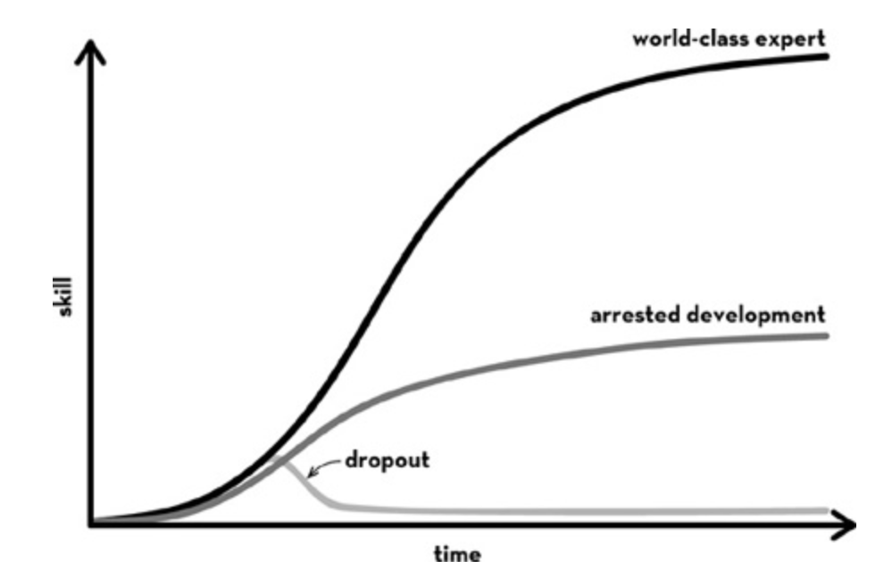

grit的读书笔记

「I won’t just have a job; I’ll have a calling. I’ll challenge myself every day. When I get knocked down, I’ll get back up. I may not be the smartest person in the room, but I’ll strive to be the grittiest. In the long run, Dad, grit may matter more than talent.」-- 作者想对父亲说的话
1. GRIT的定义和作用

1.1 西点军校的故事-challenges that exceeded current skills-研究的开始

「At first, they spent hundreds of hours showing cadets cards printed with pictures and asking the young men to make up stories to fit them. The stories the cadets told were colorful and fun to listen to, but they had absolutely nothing to do with decisions the cadets made in their actual lives.」

- 西点军校每年的申请-入学率（提前2年筹备）：
  - 整体候选人分数：SAT/ACT的加权平均值、申请人在毕业班的排名（根据毕业班总人数调整）、领导力潜力的评估、客观的身体健康指标。
  - 本质上，评分是为了找出更有可能完成4年学习的学生。但高分者和低分者的退学率似乎没什么差别。
申请

符合推荐标准（获得美国国会议员、参议员或副总统的提名）
学术及体育能力达标
最终录取
14000
4000
2500
1200

- 西点军校退学率：20%，且绝大多数在第一个夏天就退学了
  - 「tired, lonely, frustrated, and ready to quit」
  - 「Those who dropped out of training rarely did so from lack of ability. Rather, what mattered, Mike said, was a “never give up” attitude.」
  - 「hang-in-there posture toward challenge」

- 西点军校的时间表：
    - 没有周末
    - 除了吃饭没有休息时间
    - 基本没有和学校以外的家人朋友联系的时间

1.2 面向各行各业的采访
采访问题：
- Who are the people at the very top of your field? 
- What are they like? 
- What do you think makes them special?
采访行业：leaders in business, art, athletics, journalism, academia, medicine, and law

专业的特质（例子）：
- Business: 金融风险偏好「an appetite for taking financial risks：“You’ve got to be able to make calculated decisions about millions of dollars and still go to sleep at night.”」
- Art: 创造的动力「a drive to create：“I like making stuff. I don’t know why, but I do.”」
- Athletic: 胜利快感的驱动「a motivation driven by the thrill of victory：“Winners love to go head-to-head with other people. Winners hate losing.”」

通用的特质：
- lucky and talented
- Ferocious determination【grit】：expectation of ever catching up to their ambitions
perseverance and enduring passion
- determination决心：unusually resilient and hardworking. 异常坚韧和勤奋
- direction方向：they knew in a very, very deep way what it was they wanted. 非常清楚自己要什么

chasing something of unparalleled interest and importance, and it was the chase that was gratifying.  即使必须要做的事情无聊、令人沮丧、甚至痛苦，他们也不会放弃梦想。只有追逐梦想使他们满意。
  
  - keep going after failure：“Some people are great when things are going well, but they fall apart when things aren’t.”
  - were constantly driven to improve：“In their own eyes, they were never good enough.”

1.3 Perseverance & Passion 量表

- Grit量表
  - 关于perseverance的部分问题：
    - “I have overcome setbacks to conquer an important challenge”
    - “I finish whatever I begin.”
  - 关于passion的部分问题：
    - “interests change from year to year” 
    - “have been obsessed with a certain idea or project for a short time but later lost interest.”

- 西点军校新生的Grit分数与入学分数完全无关--Grit与Talent完全无关
从Grit问卷在西点军校的测试结果来看：Grit判断的是「半途而废」的人；但能力仍然与最终的成绩有关。我们对于坚毅度的判断可能适合以【从能力符合条件的人中去掉坚毅度不足的人】为目标。
但另一方面，西点军校的评价时间窗口是4年；如果时间拉长，Grit对最终成绩的影响可能会变得非常大。这部分具体参考1.6里作者的成就心理学模型公式。
  - Grit分数很好地预测了哪些人会退学；而退学者和通过训练者的入学分数分布没有区别
  - 在最终通过考试的学员中，入学分数能很好地预测学员最终的学术成绩，以及军事和体能分数；

- 在其他极具挑战性的场景下，Grit也是很好的预测器
  - 销售场景：一个每天每小时都在遭受拒绝的职业。Grit问卷预测了半年后谁会离开销售公司，其他常用的人格特质如extroversion, emotional stability, and conscientiousness，都达不到Grit的效果
  - 陆军特种作战部队选拔课程
  - 拼字比赛（7岁-15岁的小孩参赛）
  - 高中生获得毕业文凭：按时毕业的学生Grit分值更高（芝加哥公立大学的样本）
  - 获得 MBA、PhD、MD、JD或其他研究生学位的成年人，比只从四年制大学毕业的人更坚韧；而那些只从四年制大学毕业的人又比那些积累了一些大学学分但没有学位的人更坚韧。（美国的样本）
  - SAT成绩

1.4 一些成功者的评价
- 达尔文：
  - 认为自己不是聪明人：“I have no great quickness of apprehension [that] is so remarkable in some clever men,” he admits. “My power to follow a long and purely abstract train of thought is very limited.” He would not have made a very good mathematician, he thinks, nor a philosopher, and his memory was subpar, too: “So poor in one sense is my memory that I have never been able to remember for more than a few days a single date or a line of poetry.”
  - 但认为自己非常勤奋和坚定：“I think I am superior to the common run of men in noticing things which easily escape attention, and in observing them carefully. My industry has been nearly as great as it could have been in the observation and collection of facts. What is far more important, my love of natural science has been steady and ardent.”
  - 一位传记作家对他的描述：who kept thinking about the same questions long after others would move on to different—and no doubt easier—problems
- a Harvard psychologist named William James：
  - 人的精神和体力上的潜力远远没有发挥出来：“We are making use of only a small part of our possible mental and physical resources. There is a gap, between potential and its actualization. ”
  - 人对自己能量的使用还远远没有达到上限：“the human individual lives usually far within his limits; he possesses powers of various sorts which he habitually fails to use. He energizes below his maximum, and he behaves below his optimum.”

1.5 在创业领域的观点测试-Talent or Grit
通常在创业领域中，勤奋与奋斗是更被褒扬的；
Chia尝试测出大家对创业者的真实评价。
测试结果：【天生偏见】
- 被描述为“天赋型”的创业家，更容易获得更高的评价--受试者觉得他们更可能成功/更愿意聘用。
- 只有当被描述为“奋斗型”的创业家，比“天赋型创业家”要多4年领导经验并多4w美金启动资金时，两者的评价才会处于同一水平线。

为什么偏爱“naturals”而非“strivers”是一件坏事？
- 偏爱天赋/聪明会助长一种自恋文化，人们既自鸣得意，又因深深的不安全感而不断炫耀自己的智力。这是一种鼓励短期绩效但不鼓励长期学习和成长的文化。（举了一个例子：麦肯锡的员工但凡喝了一两杯酒，就会开始在桌子上比SAT成绩 // 虚荣心）
- 我们无意中传达了这样的信息：包括毅力在内的各种其他后天因素，并没有那么重要（但实际却很重要）。
- 小孩在才能还没有被发掘的时候，可能会被认为是缺乏天赋的；崇尚talent的文化可能让他永远被埋没。
- 很多天赋测试本就是不完美的，他可能将一些有天赋的人归为没有天赋。

1.6 为什么Grit重要-卓越的来源

社会学家Dan Chambliss观察到：
- 卓越的表现，通常是由数十种小的技能/活动融合而成的，而每一项都是学习到的或偶然发现的，并被仔细培养成习惯。它们中任何一项都没有什么非凡的地方，只有持之以恒地、正确地完成这些工作，才会产生卓越的成果（可以理解为：卓越是一种涌现）。
- “when we can’t easily see how experience and training got someone to a level of excellence that is so clearly beyond the norm, we default to labeling that person a “natural.”

尼采的观点：
- 伟大的事情是如何发生的：“Great things are accomplished by those ‘people whose thinking is active in one direction, who employ everything as material, who always zealously observe their own inner life and that of others, who perceive everywhere models and incentives, who never tire of combining together the means available to them.’”
- 如何看待talent：“Do not talk about giftedness, inborn talents! One can name great men of all kinds who were very little gifted.”

作者Angela Duckworth关于“成就心理学”的理论模型：成就仅取决于talent和effort 
- talent x effort = skill；skill x effort = achievement
- talent是指当你投入努力时，你的skill提升的速度；（effort使天赋从潜力变为技能）
- achievement是当你获得skill并运用它们时发生的事情。（effort使技能变成成就）

- 当然，机会/运气也非常重要。

有很多talent不足的人，由于有过人的grit（比喻为跑步机上坚持最久的人），最终获得惊人的成就：
- “Grammy Award–winning musician and Oscar-nominated actor Will Smith”
- 小说家 John Irving
- 陶艺家 Warren MacKenzie
- 哈佛大学的【跑步机测试】可以用来衡量人的「耐力和意志力」。
  - 除了取决于有氧能力和肌肉力量，还取决于“the extent to which ‘a subject is willing to push himself or has a tendency to quit before the punishment becomes too severe.’”
  - 最后接手跑步机测试的研究者George Vaillant，在填字游戏上并不坚韧，很喜欢偷看答案；家里东西坏了也都是妻子修好。但唯独在【跑步机测试】上坚持不懈地工作，因为他痴迷于这项研究。另外他年轻时作为田径运动员，也比其他人练习更多的引体向上。
- 作者认为，在跑步机上停留更久确实与commitment有关；但一个人第二天愿意回到跑步机上再次尝试，这似乎更与grit相关。
  - “How many of us start something new, full of excitement and good intentions, and then give up—permanently—when we encounter the first real obstacle, the first long plateau in progress?”
  - 比第一天付出的努力更重要的，是第二天醒来时仍然做好付出努力的准备。

1.7 如何衡量你的Grit程度
“grit is more about stamina than intensity.” grit更多是耐力而非强度
从一家公司跳到另一家公司不影响Grit程度；但从一种追求跳到另一种追求、从一套技能跳到另一套完全不同的技能，这就不是Grit的人会做的事情了。
“Grit is about working on something you care about so much that you’re willing to stay loyal to it.” 忠诚
“It’s doing what you love, but not just falling in love—staying in love.” 保持热爱

- Passion 更重要的不是对目标的痴迷程度而是目标的长期一致性：Enthusiasm is common. Endurance is rare.
  - “the common metaphor of passion as fireworks doesn’t make sense when you think of what passion means to Jeff Gettleman. Fireworks erupt in a blaze of glory but quickly fizzle, leaving just wisps of smoke and a memory of what was once spectacular. What Jeff’s journey suggests instead is passion as a compass—that thing that takes you some time to build, tinker with, and finally get right, and that then guides you on your long and winding road to where, ultimately, you want to be.”
  - passion不是「烟花」：烟花绽放出绚丽的光芒，但很快就熄灭了，只留下缕缕烟雾和对曾经壮观的记忆。passion更像是「指南针」：它需要你花一些时间来构建、修补并最终找到正确的方向，然后引导你走上漫长而曲折的道路，最终到达你想要的地方。持久，忠诚，稳定；同时意味着对其他方向的放弃
- “A clear, well-defined philosophy gives you the guidelines and boundaries that keep you on track”
- 关于passion的提问：“Do you have a life philosophy?”。
- 它是一种驱动你所有行动的理念。
- 你每天都指向同一个方向，总是渴望向前迈出哪怕是最小的一步，而不是向旁边迈出一步，走向其他目的地。
- 你有自己明确的优先级顺序；中低层目标与终极目标的结构有明确的连贯性。

西点军校版Grit自测题--与大多数人比较
Grit has two components: passion and perseverance. 
如果您想更深入地挖掘，您可以计算每个部分的单独分数。passion分数，将奇数项目的分数相加，然后除以 5。perseverance分数，将偶数项目的分数相加，然后除以 5。
大部分情况下，perseverance得分高的人，passion得分也会高；反正亦然。而且通常perseverance得分会比passion高一点点。

1.8 cox对于过去成功者的杰出程度排序与性格分析
“Stanford psychologist named Catharine Cox”，根据301名杰出历史人物的传记进行分析
- 前十与后十的智力相差不远，牛顿处在中间（130）
- 有一组4个的指标真正将前十与后十区分开：“persistence of motive”。
  - 其中前两个指标与passion强相关
    - 事业与长远目标（而非勉强糊口）的相关度。是否朝着明确的、远方的目标努力
    - 不会轻易改变目标，不会因为有其他新鲜的选项就放弃当下的任务
  - 后两个指标与perseverance强相关
    - 意志或毅力的强度。一旦决定，就坚定不移地坚持下去
    - 面对障碍时倾向于不放弃。坚韧、顽强

1.9 Grit的先天与后天因素
grit不仅受到基因的影响，还受到经历的影响。
先天因素：
- 伦敦有学者用Grit量表对英国双胞胎进行研究，以考察遗传对grit的影响。
  - perseverance中有37%来源于先天，passion中有20%来源于先天。（但并不是单一基因影响）
- the Flynn effect. Named after Jim Flynn, the New Zealand social scientist
  - 过去一个世纪中，IQ的分数惊人增长。如果你根据现代标准对一个世纪前的人进行评分，他们的平均智商得分将为 70 分——处于弱智的边缘。
  - 【社会乘数效应 social multiplier effect】：人类的抽象推理能力越来越强。在过去的一个世纪里，我们的工作和日常生活越来越要求我们进行分析性、逻辑性思考。

后天因素：
- 【成熟原则】年龄与grit的关系：年龄越大，grit越强
- 从经验中学习
  - 我们可能通过反复试验和试错了解到，反复切换职业目标是没有用的；
  - “to do anything really well, you have to overextend yourself”
  - “in doing something over and over again, something that was never natural becomes almost second nature”
  - “the capacity to do work that diligently doesn’t come overnight.”
- 对环境的适应性：如进入社会、结婚、父母老去等事情发生，使我们发生改变并因难而上
  - Necessity is the mother of adaptation.

2. 如何培养GRIT-由内至外
人在放弃时的念头：
1. 好无聊。【problem：interest。对整体的兴趣与热情能对抗部分的无趣】
2. 我的付出不值得。【problem：the capacity to practice。坚持不懈地每天练习，才能达到精通。“Whatever it takes, I want to improve!”】
3. 这对我来说没有那么重要。【problem：purpose。使命感 使你坚信你的工作是重要的。没有目标就难以维持】
4. 我做不了这事儿，我最好还是放弃。【problem：hope。Hope is a rising-to-the-occasion kind of perseverance. 不要放弃，不要害怕困难，学会继续前进】

对于Grit品质的人来说，目标级别越高时，越会顽固地想要实现它。当目标是指南针级别时，他们往往不会放弃。

2.1 【early years】Interest - Passion
“The importance of doing something you love.”
“figure out what you enjoy doing most in life, and then try to do it full-time.”
“the “casting vote” for how well we can expect to do in any endeavor is “desire and passion, the strength of [our] interest. . . .”

1. 在成长过程中，并不会常常有人告诉我们“Follow your passion”，反而常常是“overly idealistic dreams of “finding something I loved” could in fact be a breadcrumb trail into poverty and disappointment.”
  - Jeff Bezos（Amazon 创始人）：
    - “After much consideration, I took the less safe path to follow my passion.”
    - “You’ll find in life that if you’re not passionate about what it is you’re working on, you won’t be able to stick with it.”
  - Hester Lacey（英国小说家）：
2011年以来每周采访一位成功人士，与 200 多名“超级成功”人士交谈
    - 提问：“What drives you on?” & “If you lost everything tomorrow, what would you do?”
    - 常见回答：“I love what I do.” & “I’m so lucky, I get up every morning looking forward to work, I can’t wait to get into the studio, I can’t wait to get on with the next project.”

2. “foster a passion” instead of “follow your passion”
这个观点和《斯坦福大学人生设计课》里的观点一样耶
  - Interests are, like everything else about us, partly heritable and partly a function of life experience
  - 大部分成功人士并不是突然就找到了自己的“God-given passion”
  - 大多数典型grid的人花费数年时间探索几种不同的兴趣，而那个最终占据他们整个大脑（无论醒着还是睡着）的兴趣，并不是他们最开始以为的命中注定。The reality is that our early interests are fragile, vaguely defined, and in need of energetic, years-long cultivation and refinement.
    - 童年还太早：即使是未来的grit典范——在他七年级学生的年龄段也不太可能拥有充分表达的passion。 一名七年级学生才刚刚开始弄清楚他普通的喜欢和不喜欢。
    - 兴趣源于探索（与外界的互动），而非内省introspection:兴趣发现的过程可能是混乱的、偶然的和低效的。 你无法真正准确地预测什么会吸引你的注意力，什么不会。如果不进行尝试，你就无法弄清楚哪些兴趣会持续下去，哪些不会。
    - 兴趣的初次出现常常被忽视：人们更容易意识到boring，但更难意识到your attention is attracted。刚开始一项新的尝试时，每隔几天紧张地问自己是否发现passion还为时过早。
    - 兴趣有一个发展期：“what follows the initial discovery of an interest is a much lengthier and increasingly proactive period of interest development. ”
    - 有支持者时兴趣会茁壮成长：interests thrive when there is a crew of encouraging supporters, including parents, teachers, coaches, and peers. 支持者会提供持续的信息和刺激，并给予积极的反馈。
  - 一个典型的反例：“All my life I’ve been one of those people who has been told how smart I am/how much potential I have. I’m interested in so much stuff that I’m paralyzed to try anything. It seems like every job requires a specialized certificate or designation that requires long-term time and financial investment—before you can even try the job, which is a bit of a drag.”
    - 正如求偶时抱有的那种对「完美、一见钟情」的不切实际的期望，阻止了年轻人培养serious的职业兴趣
    - 有很多事情，需要坚持一段时间、全身心投入，才会带来细微的令人兴奋的感觉。

3. 初学者动机：诚然，单纯的interest是不够的，还需要不断地投入practicing, studying, learning。但在这之前，they must goof around, triggering and retriggering interest.even the most accomplished of experts start out as unserious beginners.
  1. 早期的激励（热心、支持）是很重要的。Encouragement during the early years is crucial because beginners are still figuring out whether they want to commit or cut bait.
  2. 早期一定程度的自主权也非常重要。A degree of autonomy during the early years is also important. 
  3. 缩短这个尝试和玩耍的体验阶段，会带来糟糕的后果。shortcutting this stage of relaxed, playful interest, discovery, and development has dire consequences. 

4. 克服厌倦，深入：Don’t just discover something you enjoy and develop that interest—also learn to deepen it.
  1. The grittier an individual is, the fewer career changes they’re likely to make.
  2. 追求新鲜感是人的本质。本质上，做某件事一段时间后就会感到无聊，这种情绪是一种非常自然的反应。
  3. 专家和新手眼中新鲜感的形式不同。新手的新鲜感是没遇到过的东西；专家基于其拥有积累的知识和技能，他们能从更细微的细节中看到新鲜感。“Novelty for the beginner comes in one form, and novelty for the expert in another. For the beginner, novelty is anything that hasn’t been encountered before. For the expert, novelty is nuance.”

5. 从简单的问题开始寻找passion
  1. What do I like to think about? 
  2. Where does my mind wander? 
  3. What do I really care about? 
  4. What matters most to me? 
  5. How do I enjoy spending my time? 
  6. And, in contrast, what do I find absolutely unbearable? 

2.2 【the middle years】Practice - Perseverance
“continuous improvement.” 
“I want to do it as well as I possibly can.” & “I want every book I do to be better than the last.”
“It’s not looking backward with dissatisfaction. It’s looking forward and wanting to grow.”

1. 学习技能的速度是有曲线的

“the ten-thousand-hour rule” and “the ten-year-rule”：
精通一个技能需要1万小时/10年。

---
They give you a visceral sense of the scale of the required investment. Not a few hours, not dozens, not scores, not hundreds. Thousands and thousands of hours of practice over years and years and years.

“the ten-thousand-hour rule” and “the ten-year-rule”：
精通一个技能需要1万小时/10年。

---
They give you a visceral sense of the scale of the required investment. Not a few hours, not dozens, not scores, not hundreds. Thousands and thousands of hours of practice over years and years and years.

2. Grit不仅要大量时间投入，还得是高质量时间投入
Experience doesn’t always lead to excellence. 有的人工作20年，有的人工作20个1年。
  1. 进步，需要有目标有方向的刻意练习，解决特定的问题。Focus on improving specific weaknesses.
  2. 关注犯错的地方。experts are more interested in what they did wrong — so they can fix it — than what they did right.
  3. 即使是人类最复杂、最具创造力的能力也可以分解为各个组成技能，每一项技能都可以练习、练习、再练习。
  4. 刻意练习是非常无趣且疲惫的，毫无享受可言。全神贯注在能力边界进行练习，最多一个小时就需要休息。每天总共只能进行大约三到五个小时的刻意练习。

3. 心流状态，是另一个专家标志。（gritter 会体验到更多心流）
  1. Flow is performing at high levels of challenge and yet feeling “effortless,” like “you don’t have to think about it, you’re just doing it.”
  2. “It’s just such a rush, like you could feel it could go on and on and on, like you don’t want it to stop because it’s going so well. ”
  3. 由于挑战的级别正好符合您当前的技能水平，你感觉自己完全掌控一切。

4. 刻意练习 与 心流 的关系
  1. 心流状态通常是对【痛苦的刻意练习】的积极反馈。两者一个是练习状态下，一个是表现状态下。
  2. 心流的体验使人能够更多地承受刻意练习，而刻意练习带来更多心流。
  3. “When it’s not fun, you do what you need to do anyway. Because when you achieve results, it’s incredibly fun. ”
  4. 先天与后天：Gritter可能在常年累月这样的回路中，逐渐养成了刻意练习的爱好：“learn to love the burn”。也可能是Gritter本就是更喜欢挑战（刻意练习）的人群： “some people enjoy a challenge”。

5. 如何进行【刻意练习】
  1. Know the science.  刻意练习的基本要求：
    1. A clearly defined stretch goal
    2. Full concentration and effort
    3. Immediate and informative feedback
    4. Repetition with reflection and refinement
  2. Make it a habit.  养成习惯（日常仪式）：
    1. “Routines are a godsend when it comes to doing something hard.” 
    2. 如果你在同一时间和地点不断练习，曾经需要有意识才能启动的事情就会变得自动。（降低决策成本）
  3. Change the way you experience it.  
    1. 体验其中的快乐，拥抱并享受挑战
    2. 正确看待失败和错误，它们是探索和练习的必备品。不要习惯于从错误获取负反馈

2.3 【later years】Purpose - Passion
“The more common sequence is to start out with a relatively self-oriented interest, then learn self-disciplined practice, and, finally, integrate that work with an other-centered purpose.”
“Purpose is the intention to contribute to the well-being of others.”
“The idea of purpose is the idea that what we do matters to people other than ourselves.”

1. purpose的利他性
  1. “They’re not just goal-oriented; the nature of their goals is special.”
  2. “the long days and evenings of toil, the setbacks and disappointments and struggle, the sacrifice—all this is worth it because, ultimately, their efforts pay dividends to other people.” 利他带来使命感

2. purpose是强大的动力源泉
  1. 亚里士多德最早认识到人有两种追求幸福的方法：寻求快乐pleasure vs 寻求意义purpose
采用新的问题探寻grit背后的动机。

---
“What I do matters to society”
“For me, the good life is the pleasurable life.” 等题目，
并根据回答，对答题者的pleasure和purpose进行打分。

---
结果发现，grit的人群与其他人群追求pleasure的程度并无差异，但他们有更多动力去寻求purpose。
  2. “The desire to connect with and help others is also crucial to sustaining passion over the long-term.”
采用新的问题探寻grit背后的动机。

---
“What I do matters to society”
“For me, the good life is the pleasurable life.” 等题目，
并根据回答，对答题者的pleasure和purpose进行打分。

---
结果发现，grit的人群与其他人群追求pleasure的程度并无差异，但他们有更多动力去寻求purpose。

3. 如何寻找使命：兴趣作为种子，从你从事的事情里找到与他人的联系（make the world a better place）
  1. “A calling is not some fully formed thing that you find,” she tells advice seekers. “It’s much more dynamic. Whatever you do—whether you’re a janitor or the CEO—you can continually look at what you do and ask how it connects to other people, how it connects to the bigger picture, how it can be an expression of your deepest values.”
  2. 这个寻找联系的过程可能很长，可能要持续很多年
    1. “discovers a problem in the world that needs solving.”（从他人或自己的损失/逆境中获得）
    2. “I personally can make a difference.” （有决心和信念，并有采取行动的意图）
    3. 以上两条，通常榜样的力量会非常大

4. 怎么可能一边以自己的目标导向又一边以利他为目标导向呢？
  1. “Most people think self-oriented and other-oriented motivations are opposite ends of a continuum,” says my colleague and Wharton professor Adam Grant. “Yet, I’ve consistently found that they’re completely independent. You can have neither, and you can have both.” 
  2. 同时具备self-oriented and other-oriented motivations的人，能够更好地成功。
  3. 如果一个人享受自己的工作（interest），同时想要用自己的事业利他（purpose）（超越自我），那么他能够在自己的事业上达到更高的grit。

2.4 Hope - Perseverance
Fall seven, rise eight.
“Our own efforts can improve our future.” & “I won’t quit!”
“The hope that gritty people have has nothing to do with luck and everything to do with getting up again.”
“I’m going to fail!” This, of course, was a self-fulfilling prophecy.
【growth mindset --> optimistic self-talk --> perseverance over adversity】

1. 无助感的由来：习得性无助
  1. “It isn’t suffering that leads to hopelessness. It’s suffering you think you can’t control.”
  2. 过去的失败经历会让人认定下次也会失败，由此得出“努力是徒劳的”
由心理学家马丁·塞利格曼进行的小狗电击实验,目的是探索学习和无助感的关系。
实验过程如下:
- 将一群小狗放在一个装置里,它们的腿会受到周期性的轻微电击。
- 实验分为两组:一组小狗可以通过按一个机关来停止电击,另一组小狗则无法控制电击。
- 第一组小狗很快学会了如何通过按开关来停止电击,表现出主动性和控制感。
- 而第二组小狗在多次无法停止电击后,最终表现出了一种被动无助的状态,即使后来给予控制机会,它们也不再尝试去操作开关。

实验表明：当个体感觉到自己无法控制痛苦来源时,就会产生无助感,即使后来获得了控制权也难以改变。

2. 坚韧resilient：习得性乐观
  1. 在上面的故事里面，第二组无法控制电击的小狗里面，仍然有1/3的小狗在获得控制机会的之后进行了尝试。他们在反复的受伤和失败之后，仍然愿意尝试。我们将这种品质定义为“坚韧”，这也是Grit的一种重要品质。

3. 乐观主义者 vs 悲观主义者
Optimists are just as likely to encounter bad events as pessimists. Where they diverge is in their explanations: optimists habitually search for temporary and specific causes of their suffering, whereas pessimists assume permanent and pervasive causes are to blame.
  1. 乐观主义者遭遇坏事后的态度：习惯性地寻找造成他们痛苦的「暂时的和具体的」原因。【反复尝试的动力】
  2. 悲观主义者遭遇坏事后的态度：归咎于「永久的和普遍的」原因。【一蹶不振的压力】
  
4. Gritter看待挫折的方式：更加乐观
“How do grit paragons think about setbacks? Overwhelmingly, I’ve found that they explain events optimistically.”
  1. 问题：“What has been your greatest disappointment?”
    1. Gritter的回答：“Well, I don’t really think in terms of disappointment. I tend to think that everything that happens is something I can learn from. I tend to think, ‘Well okay, that didn’t go so well, but I guess I will just carry on.’ ”
  2. 以乐观的方式解释逆境：“Having an optimistic way of interpreting adversity”
  3. 对“乐观”的解释：对坏事更多思考「暂时的具体的原因」，而对好事更多思考「永久的普遍的原因」。“To the extent they thought of temporary and specific causes for bad events, and permanent and pervasive causes of good events, we coded their responses as optimistic.”
  4. 同时，具备这种乐观态度的人，也有更高的幸福感。

5. 为什么会成为这样的人？
  1. 悲观主义者的成因：这些孩子认为，是智力缺陷导致了错误，而不是缺乏努力。 换句话说，可能不仅仅是一连串的失败让这些孩子变得悲观，而是他们对成功和学习的核心信念。
Carol关于习得性无助来源的实验过程：
- 孩子们被分成两组，在几周内解决数学问题；
- 第一组小孩每次无论做得如何，都会被表扬做得很好；
- 第二组小孩偶尔会被告知在某节课没有很好地解决问题，并告诉他“should have tried harder.”
- 最终会让两组小孩做一些数学题，题目有难有易；
- 结果发现，第一组小孩仍然很容易放弃；但第二组小孩在遇到困难后会更努力。（学会了面对困难的方式）
  2. 以上实验结果说明，习得性无助的原因并不仅仅是害怕失败；而是习惯性将失败解释为自己缺乏成功能力的证明。反之，乐观主义者更多地将失败解释为需要更加努力的暗示。 
  3. Carol认为人们这种【看待世界运作规律的观点】与【人对于智力的观点】有关
Your intelligence is something very basic about you that you can’t change very much.
You can learn new things, but you can’t really change how intelligent you are.
No matter how much intelligence you have, you can always change it quite a bit.
You can always substantially change how intelligent you are.
    1. 以上四个问题，如果前两个点头后两个摇头，那么这个人更多拥有a fixed mindset固定型思维；反之则更多拥有a growth mindset成长型思维。
    2. 乐观主义者更多认为：“people really can change.”；固定型思维的人在遇到挫折时，更容易打败自己。

6. 这种growth mindset的塑造来源
“people develop theories about themselves and the world, and it determines what they do.”
相信智商的人（无论自己是高智商还是低智商）更多是fixed mindset，容易在挫折中一蹶不振（对「挫折/不如人愿的事情」的过度反应）。
经历过真正挑战（注意，有些成长型思维的人不会认为这是挫折，所以要称之为挑战）并最终完成的人，更容易具备growth mindset。
  
  1. 语言上的塑造
Undermines Growth Mindset
and Grit
"You're a natural! I love that."
"Well, at least you tried！"
"Great job! You're so talented！"
"This is hard. Don't feel bad if you
can't do it."
"Maybe this just isn' your strength.
Don't worry-yov have other things
to contribute."l
Promotes Growth Mindset and
Grit
"You're a learner! I love that."
"That didn' work. Ler's talk about
how you approached it and what
might work better."
"Great job! What's one thing that
could have been even better？"
"This is hard. Don'f feel bad if you
can't do it yet."
1 have high standards. I'm holding
yov to them because I know we can
reach them together."
        1. “people’s personal histories of success and failure 
        2. and how the people around them, particularly those in a position of authority, have responded to these outcomes.”
  2. 行动上的塑造：对待犯错的态度
    1. 对表现好的学生给予优待和特权，并反复强调他们的优秀。这无意中会给孩子塑造fixed mindset。
    2. 当父母对犯错表现出“这是有害的、是有问题的”，孩子更容易变成fixed mindset。
    3. 公司环境上也是一样。
      1. Fixed mindset 模式的公司，员工大多认为只有极少数表现优秀的人才会受到重视，公司并不会为了其他员工的成长给出多少投资。人们为了取得成功而保守秘密、偷工减料和作弊。
      2. Growth mindset 模式的公司，员工会更信赖自己的同事、更认可公司是真的鼓励创新，更觉得公司支持冒险和试错。
  3. 自己如何培养growth mindset？
“The reality is that most people have an inner fixed-mindset pessimist in them right alongside their inner growth-mindset optimist. ”
    1. 言行一致：承认并面对自己fixed mindset的行为
    2. 相信成长：“people get better at things—they grow”
    3. 一个fixed mindset的反例：‘I can’t learn anymore. I am what I am. This is how I do things.’ 
  
  4. 如何培养hope？
    1. “update your beliefs about intelligence and talent.”
    2. “practice optimistic self-talk.”
    3. “Ask for a helping hand.” 对有的人来说站起来很难，但是学会寻求值得信任的人的帮助和支持很有效。
1. “people’s personal histories of success and failure 
2. and how the people around them, particularly those in a position of authority, have responded to these outcomes.”

7. 挫折会磨练人还是打败人
  1. 在青春期经历挫折并打败它的人，会拥有对【习得性无助】的免疫力，即更多的growth mindset
对处于青春期的老鼠用同样的电击实验。
- 实验分为两组:第一组老鼠可以通过按一个机关来停止电击,第二组老鼠则无法控制电击。
- 五周后，老鼠进入成年期。对两组老鼠都使用无法控制的电击。
- 第二组老鼠似乎对“习得性无助”免疫了，无法控制的电击不会让他们放弃抵抗。
  2. 如果你在青春期经历过逆境——一种相当强大的逆境——并且你自己克服了逆境，那么你以后会发展出一种不同的方式来应对逆境。重要的是逆境需要非常强大，它会激活/改变你大脑的某些控制回路。
  3. 而如果在青春期的挑战/逆境中感受到的更多是「无助」，例如一些贫困儿童，意志会变得更加衰弱。
  4. 但从未经历过挫折的人，在遇到挫折的时候也容易一蹶不振，不知道如何面对失败。（需要注意的是，一个人的简历所表现的，到底是他没有受过挫折，还是他并不觉得那算是挫折。通常 embrace the challenge 会是一个好的特征）