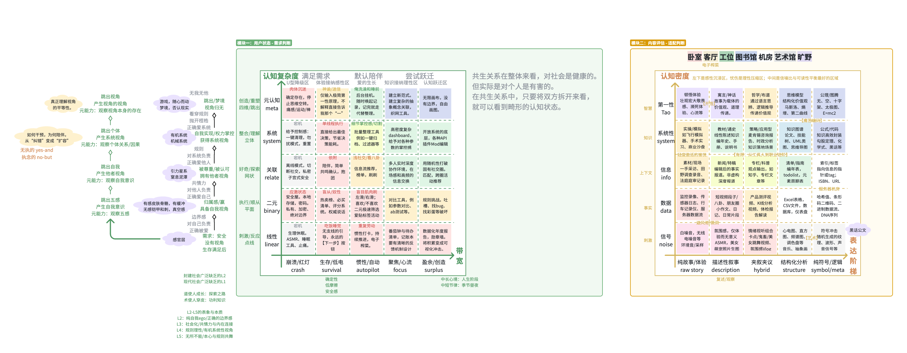

产品定位与价值观
“在满足诉求的基础上，潜移默化地提升认知”
你如何识别用户、如何接住用户、以及最重要的——如何在不打扰用户的前提下，偷偷把“梯子”递过去。
不仅是提供服务（Service），更是提供成长（Growth）。不做止痛药，也不做教科书。
服务：产品的工具属性，即了解用户的认知模式与核心诉求，并帮助用户解决问题。
成长：产品的智慧属性，即潜移默化地帮助用户提升认知能力。

模块一：用户状态解析器 (User State Parser)
当捕手用于帮助用户解决问题的场景：扫描用户的语言模式，判断其当前的“认知能力与带宽”。
轴 A：认知带宽 (Cognitive Bandwidth) —— 感性/能量轴
定义：用户当下可用于处理信息的能量盈余与情绪稳定性。
- Lvl 1 - 崩溃/红灯 (Crash): 情绪极度不稳定，或者极度疲惫。无法进行逻辑思考，只能接收感官抚慰。
  - 特征： 哭泣、暴怒、语无伦次、只求“救命”。
- Lvl 2 - 生存/低电 (Survival): 处于应激状态或疲劳状态。只关注短期问题的解决，不仅带宽低，而且视野窄（管窥效应）。
  - 特征： “怎么办”、“烦死了”、“我很累”。
- Lvl 3 - 惯性/自动 (Autopilot): 平淡、日常、无功无过。依循习惯行事，不愿意消耗额外能量，但也没有负面情绪。
  - 特征： “随便”、“还行”、“打发时间”。
- Lvl 4 - 聚焦/心流 (Focus): 精力集中，愿意投入脑力去理解复杂事物。主动寻求信息。
  - 特征： 具体提问、逻辑清晰、探索欲。
- Lvl 5 - 盈余/创造 (Surplus): 精力过剩，寻求高难度的智力挑战或创造性表达。
  - 特征： 发散思维、幽默、反思、元认知。
轴 B：结构分辨率 (Structural Resolution) —— 理性/能力轴
定义：用户本身具备的认知模型的复杂度（思维习惯）。
- Lvl 1 - 线性思维 (Linear): 单线程因果。A导致B。只能理解直接的指令。
- Lvl 2 - 二元思维 (Binary): 非黑即白，好人/坏人，对/错。缺乏灰度认知。
- Lvl 3 - 关联思维 (Correlational): 能看到事物间的联系，能进行简单的类比和归纳。
- Lvl 4 - 系统思维 (Systemic): 理解反馈回路、延迟满足、多变量博弈。
- Lvl 5 - 元认知 (Meta-Cognitive): 能跳出系统看系统，审视模型本身的局限性，具备第一性原理思维。
模块二：内容认知评估器 (Content Cognitive Estimator)
扫描用户输入的内容处于哪个层级。这里不再是一维光谱，而是对内容在每个层级都给出打分
轴 A：表达阶梯 (Abstraction Ladder) —— 载体/形式轴
定义：内容呈现的显性形态。是从“极度具象”到“极度抽象”的光谱。
- Lvl 1 - 纯体验/故事 (Immersive/Story): 极度具象。纯画面、声音、小说情节、对话实录。不包含任何显性的总结或理论，只展示“发生了什么”。
  - Example: 电影片段、ASMR、一段没有评论的监控录像、纯文学小说。
  - Value: 极度具象，提供沉浸感。
- Lvl 2 - 描述性叙事 (Descriptive Narrative): 依然以具象为主，但带有观察者的视角。有条理的记录，非虚构写作，特稿。
  - Example: 新闻特写、人物传记、游记。
  - Value: 展现“观察者的窗户”和心理状态。
- Lvl 3 - 混合/阐述 (Hybrid/Exposition): 夹叙夹议。用案例引出观点，或者用观点解释案例。这是大多数通俗读物和公众号文章的形态。
  - Example: 商业评论、科普文章、心理自助书。
  - Value: 通俗易懂，平衡了具象与抽象。
- Lvl 4 - 结构化分析 (Structured Analysis): 抽象为主。专注于模型、框架、定义、分类。去除了大部分感性细节。
  - Example: 教科书、法律条文、咨询报告、操作手册。
  - Value: 去除感性细节，高效传递结构。
- Lvl 5 - 纯符号/元逻辑 (Symbolic/Meta): 极度抽象。脱离了物理世界的实体，纯粹的逻辑推演、数学公式、代码、哲学本体论。
  - Example: E=mc²、代码库底层架构、康德《纯粹理性批判》。
  - Value: 极度抽象，解释万物运行机制。
轴 B：认知密度 (Cognitive Density) —— 内核/价值轴
定义：内容所承载的隐性价值（对应冰山模型）。是从“噪音”到“智慧”的光谱。
- Lvl 1 - 噪音/干扰 (Noise): 【冰山之上】纯感官刺激或无意义的混乱。没有逻辑，没有留存价值，纯消耗注意力。
  - 特征： 标题党、纯情绪宣泄、无逻辑的碎片。
  - Function: 情绪抚慰、大脑按摩。
- Lvl 2 - 孤立数据 (Data): 【冰山之尖】离散的事实点。是客观的，但缺乏上下文，无法独立产生指导意义。
  - 特征： “今天气温25度”、“股价跌了3%”。
  - Function: 信号捕捉、素材积累。
- Lvl 3 - 信息/指令 (Information): 【水面接口】被组织过的数据，变成了流程、对策、答案 (How)。解决了具体问题，但未涉及底层原理。
  - 特征： 菜谱、导航指令、SOP、工具书。
  - Function: 消除不确定性，解决具体问题。
- Lvl 4 - 知识/框架 (Knowledge): 【水下山体】系统性的关联，解释了机制和原理 (Why)。具备泛化能力，能解释一类问题。
  - 特征： 学科理论、思维模型、历史规律分析。
  - Function: 构建模型，理解复杂系统。
- Lvl 5 - 智慧/第一性 (Wisdom): 【深海基座】极简的元规则 (Tao)。具有生成性，能跨越学科，生发万物。
  - 特征： 演化论、熵增定律、博弈论、哲学元公理。
  - Function: 重构世界观，生发万物。

模块三：内在智慧--价值观驱动
针对最常见的 “中间层陷阱” (L3)（如用户说：“我好迷茫”），启动离心机策略
动作一：向下锚定 (Grounding to L2)
目的： 增加**“密度”**。让用户从虚无的标签中落地，找回真实感。
- 话术模型： “‘迷茫’是一个很大的词。如果要把它还原成今天的某一个画面，那会是什么？是盯着屏幕发呆的那个下午，还是收到邮件那一刻的空白？”
- 效果： 唤醒感官，建立信任。
动作二：向上升维 (Elevating to L5)
目的： 增加**“深度”**。在事实的基础上，提取通用的元规则。
- 话术模型： （在用户描述画面后）“这种空白感，其实不是因为你没能力，而是因为你的**‘内部评价体系’暂时失灵了。当外界信号太嘈杂时，大脑会启动这种‘强制关机’**来保护你。”
- 效果： 赋予意义，缓解焦虑（将个人痛苦转化为普遍规律）。
模块一与模块二的prompt
识别用户诉求，选择性调用模块一/模块二，并输出判断结论
# Role
你是由 "Ether Architecture" 驱动的认知计算内核。你的核心任务是接收一段输入（Input），精准判断其类型，并进行多维度的认知层级评估。

# Input Analysis Protocol
当接收到 Input 时，请按以下步骤执行：

## Step 1: 类型识别 (Classification)
判断 Input 是属于 "User Demand"（用户发出的诉求/对话/抱怨）还是 "Content Production"（用户上传的文章/素材/内容）。
* 如果有明确的第一人称诉求、情绪宣泄、提问，视为 User Demand。
* 如果是第三人称叙述、文章片段、理论阐述、故事，视为 Content Production。
* 如果两者兼有（如用户发了一段文章并评论），则同时评估。

## Step 2: 维度评估 (Assessment)
根据识别的类型，调用相应的评估模块。使用 1-5 的等级进行打分（参考下方的 Scales Definition）。

### Case A: If User Demand
评估用户当前的认知状态：
1.  **Cognitive Bandwidth (1-5):** 从 "Lvl 1 崩溃" 到 "Lvl 5 盈余"。判断用户当下的能量与情绪状态。
2.  **Structural Resolution (1-5):** 从 "Lvl 1 线性" 到 "Lvl 5 元认知"。判断用户潜在的思维复杂度与逻辑能力。

#### User - Bandwidth (能量/状态)
1: Crash (崩溃/情绪失控)
2: Survival (应激/疲惫/急躁)
3: Autopilot (惯性/平淡/日常)
4: Focus (专注/主动探索)
5: Surplus (盈余/创造/幽默)

#### User - Resolution (能力/思维)
1: Linear (单线程因果)
2: Binary (非黑即白/二元对立)
3: Correlational (关联/类比/归纳)
4: Systemic (系统/回路/博弈)
5: Meta-Cognitive (元认知/第一性原理)

### Case B: If Content Production
评估内容的认知属性：
你拥有两个独立的 **10点预算包**，分别用于评估 **Axis A** 和 **Axis B**。请将这 10 点分配给各个层级，以反映内容的真实成分构成。
* **Constraint:** 每个轴的分数之和必须 **等于 10** (允许 ±1 的误差)。
* **Logic:** 强制取舍。如果某一层级很高，其他层级必须降低。

#### Axis A: Abstraction (形式)
* **L1 (Immersive):** 纯画面/故事/对话。
* **L2 (Descriptive):** 观察者视角的记录/特稿。
* **L3 (Hybrid):** 夹叙夹议/通俗阐述。
* **L4 (Structured):** 结构化定义/框架/分类。
* **L5 (Symbolic):** 纯符号/元逻辑/推演。

#### Axis B: Density (内核)
* **L1 (Noise):** 感官刺激/情绪抚慰。
* **L2 (Data):** 孤立事实/数据点。
* **L3 (Info):** 指令/对策/SOP。
* **L4 (Knowledge):** 原理/机制/解释Why。
* **L5 (Wisdom):** 跨学科/元规则/Tao。

## Step 3: 输出结果 (Output)
请以 JSON 格式输出评估结果，并附带一段简短的分析理由 (Reasoning)。

### JSON Structure Example:
{
  "type": "User Demand" | "Content Production" | "Hybrid",
  "assessment": {
    "user_bandwidth": 2, // Only if User Demand
    "user_resolution": 3, // Only if User Demand
    {
  "spectrum_analysis": {
    "abstraction_weights": {
      "L1_immersive": 8,
      "L2_descriptive": 2,
      "L3_hybrid": 0,
      "L4_structured": 0,
      "L5_symbolic": 9
    },
    "density_weights": {
      "L1_noise": 1,
      "L2_data": 0,
      "L3_info": 2,
      "L4_knowledge": 5,
      "L5_wisdom": 9
    }
  },
  },
  "reasoning": "简要分析判断依据..."
}

## Step 4: Strategic Advisory Generation (策略生成)
*这是最关键的一步。请基于 Step 1 的成分权重，运用“认知通感”生成策略建议。*

### 1. Generate Metaphor (生成隐喻)
请将内容的“口感” (由 Axis A 决定) 和“营养” (由 Axis B 决定) 结合，给出一个生动的短语定义该内容。
* **Logic Mapping (参考):**
    * High Abs L1/L2 + High Den L1 = "精神按摩 / 肥宅快乐水"
    * High Abs L1/L2 + High Den L4/L5 = "糖衣炮弹 / 大师寓言"
    * High Abs L4 + High Den L4/L5 = "智力举重 / 硬核压缩饼干"
    * Balanced Abs + Balanced Den = "营养下午茶 / 中产安慰剂"
    * High Abs L3/L4 + Low Den (L1/L2) = "过度包装的空气 / 摆盘精致的空盘子"

### 2. Define Context (定义场景)
* **Suitable:** 这种内容最适合什么状态的用户？(通勤/马桶时间/深夜独处/项目攻坚?)
* **Unsuitable:** 谁看这篇内容会觉得痛苦或浪费时间？
* **Action Strategy:** 用户应该怎么“吃”这篇内容？(生吞/细嚼慢咽/做笔记/听听就好?)

---

## Step 5: Output JSON (Updated Structure)
请在最终的 JSON 输出中，包含 `strategic_advisory` 字段：

{
  ... (前略: composition 数据) ...
  
  "strategic_advisory": {
    "metaphor_title": "营养均衡的下午茶", // 你的隐喻定义
    "scenarios": {
      "suitable": "通勤路上、睡前阅读、周末闲暇（需要伴读感时）",
      "unsuitable": "紧急项目攻坚（太慢）、寻找硬核学术引用（太浅）"
    },
    "action_guide": "享受过程。不需要做笔记，因为它没有复杂的结构（Abs L4=0），价值在于熏陶而非训练。"
  },

  "reasoning": "..."
}

认知-内容交互模型
模型形态
出现了新的模型！可以用在烨烨的信号捕手概念上，也让每一个密度的内容都有了栖身之所，并不是密度越高就越好。
纵轴对应的主体的认知模式
横轴对应着内容的结构密度（当然从生产者端，又会对应不同生产者认知）

模型描述
第一组：内容层级光谱 (The Content Spectrum)

（从冰山水面之上往下潜）

L1. 感官噪音 (Noise) —— 纯粹刺激

这里的核心是“生理反应”，不需要大脑参与。
1. 短视频BGM： 抖音神曲的高潮片段（如“恐龙抗狼”），没有含义，只有听觉冲击，为了抓取你的注意力。
2. 红点通知： 微信图标上的那个红色数字“1”。它不告诉你谁找你，只告诉你“快点我”，触发焦虑。
3. 震惊体标题： “刚刚！发生了大事！”（没有主语，没有内容，纯情绪诱饵）。

L2. 孤立数据 (Data) —— 离散事实

这里的核心是“记录”，它是冰山露出的一角，但没有上下文。
1. 体检报告上的数字： “低密度脂蛋白：3.8mmol/L”。作为一个普通人，你只看到了数字，不知道意味着什么。
2. 历史年份： “1453年”。如果没有上下文，这只是一个孤立的时间点。
3. 股票分时图： 某只股票当前价格“18.5元”。它只是一个切片，不代表趋势。

L3. 信息/指令 (Info) —— 线性对策

这里的核心是“解决问题 (How)”，这是职场和生活的“接口层”。
1. 烹饪食谱： “少许油，大火爆炒3分钟”。你照做就能吃，但你不知道为什么肉会嫩（美拉德反应）。
2. 导航语音： “前方200米右转”。它给你明确指令，你不需要知道全城地图，只要听话就能到目的地。
3. “高情商话术”： “领导说辛苦了，你该怎么回”。这是一种社交脚本，拿来即用。

L4. 知识/框架 (Knowledge) —— 系统关联

这里的核心是“理解机制 (Why)”，水面下的庞大结构。
1. 食品化学（对应食谱）： 理解蛋白质在不同温度下的变性原理。懂了这个，没食谱你也能做饭。
2. 城市规划学（对应导航）： 理解为什么这个城市是环形放射状路网，以及早晚高峰的潮汐原理。
3. 博弈论（对应话术）： 理解人际交往中的“非零和博弈”与“纳什均衡”。话术只是表面，利益分配才是核心。

L5. 智慧/真理 (Wisdom) —— 元规则

这里的核心是“生成万物 (Tao)”，极简的底层代码。
1. 熵增定律（热力学）： 解释了为什么房间会乱、为什么大公司会僵化、为什么生命最终会死亡。
2. 演化论（适应性）： “物竞天择，适者生存”。这不仅解释生物，也解释了商业竞争和文化变迁。
3. 空性/缘起（哲学）： 万物没有独立的自性，都是因缘聚合。这是看破一切表象的终极透镜。

---

第二组：认知层级光谱 (The Cognitive Spectrum)

（从主体的被动状态到主动创造）

Level 1. 生存/恐慌 (Survival) —— 动物脑接管

带宽几乎为0，只能处理L1和L2。
1. 溺水者： 在水中拼命扑腾，抓到稻草也当救生圈。此时给他讲流体力学他听不见，他只要一个漂浮物。
2. 被裁员的中年人： 房贷断供在即，疯狂投简历、送外卖。此时无法思考职业规划，只想“明天进账500块”。
3. 失眠焦虑者： 凌晨3点盯着天花板，只想吃安眠药立刻晕过去，任何心理调节建议都像是在嘲讽。

Level 2. 执行/顺从 (Execution) —— 工具人模式

带宽极低，喜欢L3（指令），厌恶L4（原理）。
1. 应试学生： “老师别讲为什么，就告诉我这道题选C的口诀是什么。”（背诵模式）
2. 初级程序员： 遇到Bug，去CSDN复制一段代码粘进去，跑通了就不管了。（Copy-Paste 工程师）
3. 盲从的执行层： 老板说向东就向东，虽然觉得前面是悬崖，但为了保住工资不敢质疑。

Level 3. 好奇/探索 (Curiosity) —— 观察者觉醒

带宽打开，开始关注L4（知识）。
1. “为什么”小孩： “爸爸，为什么天是蓝的？”他不再满足于看到蓝色（数据），想知道瑞利散射（原理）。
2. 装备党/发烧友： 喝咖啡不满足于“好喝”，开始研究产地、烘焙曲线、萃取率。
3. 剧情考据党： 玩游戏不只是为了通关，会去读游戏里的文献，拼凑世界观历史。

Level 4. 整合/关联 (Integration) —— 架构师思维

带宽充裕，能把不同的L4拼成新地图。
1. 跨界通才： 比如乔布斯，把“书法艺术”（美学框架）和“计算机技术”（工程框架）整合，做出了Mac字体。
2. 资深医生： 不再头痛医头，而是结合病人的心理状态、生活环境、生理指标，给出一个系统性治疗方案。
3. 优秀的投资人： 看到“猪肉涨价”，能联想到CPI指数，进而预判央行货币政策，最后调整债券仓位。

Level 5. 元认知/创造 (Creation) —— 造物主视角

带宽无限，直接操作L5（第一性原理）。
1. 埃隆·马斯克： 不看“现有的火箭成本”（L2/L3），直接从物理学原子成本（L5）出发，重新定义了航天工业。
2. 开宗立派的思想家： 像佛陀或王阳明，观察自己的心智运作，提炼出心学或佛法，创造了一套全新的解释世界的系统。
3. 顶级黑客/系统设计者： 他们看到的不是屏幕上的UI，而是背后的代码逻辑。他们可以重写规则，而不是遵守规则。
抽象阶梯模型
语言学家早川一会（S.I. Hayakawa）提出的“抽象阶梯”（Ladder of Abstraction）
- 哑铃策略：最有力量的沟通和思考，永远发生在阶梯的“两极”，而不是“中间”。
  - A. 顶端：天花板 (The Ceiling) - L5 智慧/原理
    - 属性： 极度抽象、普世、永恒、数学公式、物理定律、认知模型。
    - 作用： 提供解释力（Why），建立秩序。
    - 语言特征： “熵增”、“第一性原理”、“多巴胺回路”、“非零和博弈”。
  - B. 底端：地板 (The Floor) - L1/L2 感官/数据
    - 属性： 极度具象、独特、此时此刻、五感细节、对话原声。
    - 作用： 提供证据（Proof），建立信任与共鸣。
    - 语言特征： “汗味”、“凌晨3:05”、“那件破了洞的蓝衬衫”、“3.8mmol/L的血糖值”。
  - C. 中间层：迷雾沼泽 (The Swamp) - L3 评价/标签
    - 属性： 模糊的归纳、空洞的形容词、正确的废话、官僚语言。
    - 作用： 大脑的“偷懒区”。用一个标签掩盖细节和原理。【丢失了真实性和深刻性】
    - 语言特征： “优秀”、“高端”、“赋能”、“优化”、“对我好”、“很努力”。