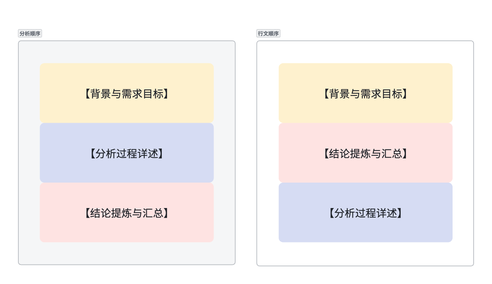

可参考内容：
- https://statswithcats.net/2016/07/10/how-to-write-data-analysis-reports-in-six-easy-lessons/
- 金字塔原理
- toC数据指标体系模型

数据分析文档的目的，是在「有数据支撑」的基础上，阐述自己从中获得的对业务有价值的见解。无论「描述性统计」、「相关性分析」还是「文本分析」，都只是手段，而不是分析价值本身。同样，无论分析「申请表」还是「渠道」，也都只是手段，不是分析价值本身。
准确区分目标与手段，是保证自己在做正确的、有价值的事情的一个有效方法。

整体结构
整体文档建议包含【背景与需求目标】、【结论提炼与汇总】、【分析过程详述】三个部分。
- 对写作者和管理者/mentor来说，【分析过程详述】是最核心的部分；
- 对分析报告需求方来说，【结论提炼与汇总】是他们最关心的部分；
- 对其他协作者以及文档未来的沉淀价值而言，【背景与需求目标】是最重要的部分。

【背景与需求目标】
背景与目标是最重要的。基于目标，才能拆解出走向目标的路径--分析方法、分析对象。
「如何保证工作不要陷入：用战术上的勤奋掩盖战略上的懒惰」

1. 帮助分析者自己重新澄清一遍分析的核心目的和需求方用这个结果的主要价值，从需求提出者的立场上理解需求的目标，并为整体分析框架划分优先级。在这个过程中可能会发现需求与目标不匹配或者其他逻辑问题，与需求方重新澄清需求，以保证产出不偏离价值。
2. 关键需求人在阅读中，能够验证你对于背景和目标的理解程度与他是否一致。
3. 其他干系人（包括管理者和其他想了解相关分析结果的人）能够知道分析发生的背景，快速判断这份数据对自己是否有借鉴的价值。

【分析过程详述】
分析过程要记录「数据源、基础数据的业务概念、数据结果图表、基于图表的结论」四个部分。具体分析方法可以按下面的步骤进行。

步骤1：基于背景和需求目标，产出整体分析的基本框架。
  - 在飞书文档中，可以直接以目录的形式写出大纲。根据每个模块的业务形态确定分析目标，定义每个模块的分析方法以及使用的图表类型。

步骤2：数据源整理与理解。对原始数据的存储位置和数据质量有基本的掌握，知道数据可分析的边界在哪里。
  - 在不同的数据质量背景下，不同分析的ROI（产出价值/投入成本）是不同的；
  - 如果产出核心价值所需要的数据源质量明显不够好，会同时提升分析成本和降低产出可信度。这时候需要了解数据源头质量问题的成因，推动数据源治理。或者至少把问题沉淀下来让大家都知道。
  - 对重要性/数据质量进行分层之后，按框架解决问题，也可以降低焦虑。
步骤3：数据清洗与抽样。
  - 是否进行抽样，与业务的体量或者业务的性质有关。有些情况下可以直接全量进行统计；而有些质量不够好的数据，抽样就是最好的清洗。
  - 基于分析框架，梳理并连通所有相关数据源，通过sql或者python形成清洗好的、方便统计分析的虚拟宽表。
 步骤4：统计、分析与可视化
  - 通过统计、分析手段，从数据中得到可以获得洞察的结果，并用易于理解和阅读的方式进行可视化。
  - 可视化可以借助superset/excel/jupyter等工具进行，图表是对于业务来说最好的数据资产。
 步骤5：总结数据结果
  - 基于前面的统计、分析和可视化，我们会获得一些「数据现象」作为分析的结果，用文字记录下来。
  - 「数据现象」是文档中非常关键的部分。一方面，它是绝对客观的，给了业务方自己判断业务的空间；另一方面，在未来它也可能作为数据资产，帮助其他业务在新的视角获得新的洞察。
步骤6：归纳/演绎获得业务结论
  - 综合各种数据现象，结合我们对于业务的理解和判断，得出对业务的主观结论。
  - 这部分非常依赖分析师的业务直觉和软技能，不同的视角会得出不同的结论。所以除了提供我们自己的视角，也要把结论与数据现象的逻辑关系清晰呈现出来，给需求方自己判断的空间。甚至可以提前和需求方讨论。
二战飞机的「幸存者偏差」
1941年，第二次世界大战中，美国哥伦比亚大学统计学瓦尔德教授(Abraham Wald)应军方要求，利用其在统计方面的专业知识来提供关于《飞机应该如何加强防护，才能降低被炮火击落的几率》的相关建议。
沃德教授针对联军的轰炸机遭受攻击后返回营地的轰炸机数据，进行研究后发现：机翼是最容易被击中的位置，机尾则是最少被击中的位置。沃德教授的结论是“我们应该强化机尾的防护”，而军方指挥官认为“应该加强机翼的防护，因为这是最容易被击中的位置”。
弹孔最稀疏处，恰恰是要害处，因为没怎么被击中要害的飞机才能够成功返航、进入统计样本。

【结论提炼与汇总】
这个部分的阅读顺序和写作顺序是不一致的。
- 分析顺序：结论当然是在最后一个部分，完成所有分析之后，基于各模块的主要结论，抽象汇总得出关键结论。
- 阅读顺序：阅读时，结论要放在【分析过程】的前面，让阅读者能够最快获取关键信息。当他对某个具体模块的数据表现产生进一步兴趣时，才会去看详细的分析过程。

我们在第二部分，按分析框架填充了对每个数据结果的关键认知。
在这第三部分的重点，是：如何让阅读者最快找到他要的信息，并轻松理解信息之间的逻辑关系。
重新组织文档顺序，对各类关键认知进行排列组合，按最优的分类和顺序阐述关键结论，并为每组关键结论提供对应的数据支持和要点论述。
整个【结论提炼与汇总】的过程，就是反复地抓住读者的疑问，并在给出回答时抛给他下一个好奇点。
这里推荐《金字塔原理》作为工具书。

阅读者会带着自己最初的问题打开文档，所以【结论】要开门见山地回答阅读者的问题。
这时，阅读者会好奇：你这个结论是如何得到的呢？他会开始去找能够支持这个结论的「数据现象」，所以你要接着提供数据支持。
如果「数据现象」对阅读者来说逻辑自洽，他可能还会问：那还有其他相关的洞察吗？
就以这样【疑问-回答】的结构，帮助阅读者以更低的认知负荷完成文档阅读。