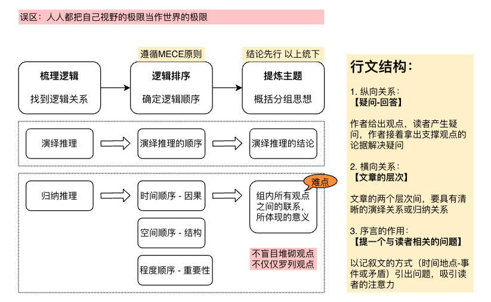

# 金字塔原理-读书笔记
> 最容易理解的文章都是以这样的顺序谋篇布局的：最重要的、最核心的观点放在最前面，次要的、支撑主要观点的内容放在后面。核心观点往往只有一个，但是作为支撑的次要观点会有多个。【结论--原因--现象】

逻辑的名词解释与拓展
- 演绎推理：从一般到特殊，前提和结论的关系是必然的，作为前提的基本原理需要是准确的
  - 三段论
    - 已知的普遍原理+研究的特殊情况=根据普遍原理对特殊情况作出判断
  - 假言推理
    - 充分条件假言推理：【如果A，那么B】。当A，那么B；当非B，那么非A
    - 必要条件假言推理：【只有A，才会B】。当B，那么A；当非A，那么非B
  - 选言推理
    - 相容的选言推理：【只可能是A或B】。非A，那么B
    - 不相容的选言推理：【只可能是A或B或C的一种】。当A，那么非BC；当非AB，那么C
  - 关系推理
    - 对称性关系推理：如1升=1000毫升，所以1000毫升=1升
    - 反对称性关系推理：3大于2，所以2小于3
    - 传递性关系推理：3>2，2>1，所以3>1
- 归纳推理：从特殊到一般，除严谨的数据归纳法外，一般很难称得上是真理；一般只要在统计和概率方面站得住脚，或在某个划定范围内成立，就可以承认是有意义的
  - 比较：在同一量纲下进行比较，比较的标准要精确、稳定，比较要在对象的实质方面进行
  - 归类：依据对象的共同点和差异点，将对象按照类别区分；需要在比较的基础上进行
  - 分析与综合：两者紧密联系、相辅相成
    - 分析，是将事物化整为零，将研究对象拆分成基本要素
    - 综合，是将事物化零为整，将研究明白的基本要素再拼合起来
  - 抽象与概括：
    - 抽象，是排除非主要的、非本质的成分，提炼出主要的、本质的成分，认识事物的本质
    - 概括，是得出对事物本质的、规律性的认识后，推广到具有同类性质的其他事物上去

MECE原则
- 各组之间相互独立，具有排他性，不存在重叠；所有组能够完全穷尽，不存在遗漏
- 步骤：确定对象边界，找到适当切入点，检查继续细分可能性，检查是否遗漏/交叉
- 常用方法：
  - 二分法：非此即彼分类法
  - 流程法：按流程进行的顺序，进行分类
  - 要素法：将一个对象拆分成几个不同要素
  - 象限法：划分四象限

难点展开：如何从归纳推理中概括分组思想
- 概括思想切忌空泛：空泛的总结句无法体现真实的逻辑关系，无法引导有逻辑地思考也无法促使创造性地思考
- 明确指出行动目标：建议、举措、步骤、变革、流程、目标等；
  - 一组归拢在一起的行动，唯一必然的联系是它们组合在一起造成的结果；单独拿出任何一条，都无法和其他做法产生必然联系；所以表述做法前要先指出目标/结果
  - 总结目标/结果的操作步骤
    - 语言明确：每组思想符合MECE原则，对目的的表述要清晰明确
    - 层次清晰：看到步骤、流程时，要有意识地划分层次，每个层次控制在5个以下
      - 采取A之前要先采取B，那么AB两个相关联的行动在同一层
      - 采取C就会出现D行动，那么C行动比D行动低一个层次
    - 预见结果：每组内的行动无重叠无遗漏，关键总结句明确表述完成行动的结果
- 结论之间须有共性：
  - 找出具有共性的部分
  - 找到问题的共同点，判断是否可以分为一类
  - 找出它们具有的共性有什么现实的、普遍的意义，提出新思想、新观点

TOPS原则
T：说话要从受众的需求点和关注点出发（target to ouraudiences），可以概括为有的放矢原则。俗话说磨刀不误砍柴工，多方面思考，想方设法站在对方的角度来考虑问题、阐述问题，才可以实现有效沟通的目的。
O：内容完整、结构清晰（over arching），可以概括为贯穿整体原则。层层推进、娓娓道来、贯穿整体，既是表达逻辑的要求，又是照顾受众心理的方式。
P：言论有力度，能够打动人（powerful），可以概括为掷地有声原则。长篇大论、面面俱到不如一语中的、切中要害。我们要培养自己的分析能力，要对自己将表述的问题进行深入的思考，产生清晰的认识。
S：证据充分，每个观点都有据可循（supportable），可以概括为言之有理原则。表达观点的时候切忌生搬硬套、牵强附会，那会给人留下很不专业、很没有底气的印象。正确的做法是做好充足的准备，为自己的观点准备恰当的支持证据，如果一时想不到合适的支撑论据，宁可少说一点也不要拉来风马牛不相及的事例救场。

FABE法
F：代表特征（features），本意指的是产品的特点、特性之类的基本功能，以及这些功能能够满足客户的哪些需求。
A：代表优点（advantages），指的是特征（features）衍生出的优点。
B：代表利益（benefits），我们的产品或观点有那么多优点，那么它们能给客户带来什么利益呢？
E：代表证据（evidence），如果是为了证明一个产品很优秀，可以使用的证据有技术报告、用户来信、媒体报道、当场演示等。

SPIN法
S：关于现状的提问（situation questions）。这类问题旨在了解客户的背景信息，也就是为了实现我们常说的“知己知彼，百战不殆”。情景
P：关于问题的提问（problem questions）。这里所说的问题，是指困扰客户的问题，例如公司是否存在组织架构冗杂的情况、是否有效率低下的困扰、员工是否缺乏积极性等。探究
I：关于影响的提问（implication questions）。如果上个提问里的问题不解决，将会产生哪些影响、造成什么后果，就是这一问要表达的内容。利用提问让客户自己意识到如果不解决问题将会存在的影响，比直接由他人告知更有说服力。暗示
N：关于需求与回报的提问（need-payoff questions）。这一问旨在获知客户在问题解决后的看法，例如调动员工积极性将带来什么回报、解决公司组织架构冗杂的问题对节约开支和提升利润有哪些影响。解决

重塑思维方法 之 5W2H分析法
- what：是什么？需要做什么？目标是什么？
- why：为什么？为什么这么做？能不能不做？有没有其他做法？
- who：谁？是为谁做的？找谁来做？
- when：何时？什么时候做？
- where：何处？在什么地方做？
- how：怎么做？如何解决问题？如何提升能力？如何执行计划？
- how much：多少？数量是多少？质量怎么样？花费多少钱？

麦肯锡解决问题七步法
- 陈述问题：把需要解决的问题清晰、具体地表述出来，避免笼统概括或罗列一堆事实
- 分析问题：通过画逻辑图表，更直观地剖析问题，罗列出相关的条件和疑问
- 去掉非关键问题：把焦点放到最核心的问题上，避免浪费精力
- 制定工作计划：采取可行的手段解决问题，一边做一边完善或修改
- 进行关键分析：以假设和目标为导向，尽量简化分析，不必拘泥于数字
- 得到结论：综合分析调查的结果，建立结论
- 陈述过程：将解决问题的来龙去脉整理清楚，形成一个逻辑清晰的体系

原笔记-第二章
认识金字塔原理
- 金字塔结构的四个特点
  - 分类归纳，构建金字塔（最初进行清晰的分组）：中心思想+支撑这个思想的次级思想
  - 抽象概括，体现逻辑关系（考察分组是否恰当）：体现上下层级间的抽象概括关系、体现同层思想间的联系
  - 突出中心思想，自上而下表述（写下内容）：先给出核心思想，再给出支撑的次级思想
    - 读者会花一部分脑力去识别文字，另一部分脑力去寻找文字间关系，其他脑力消化吸收信息
  - 逐级概括总结，自上而下思考（整理表达）：一级一级按【分组归纳、抽象概括、自上而下表达】构建清晰的金字塔，最后形成的文章的中心思想必然能概括全文内容，全文所有论点也必然支撑我们的中心思想

- 金字塔原理的四项基本规则
  - 结论先行：一次只阐述一个中心思想，并且在一开始就明确地提出来
  - 以上统下：表明结论后，接下来遵循以上统下的规则，即上级思想统帅下级思想，下级支撑上级
  - 归类分组：将具有相同特征的信息分为一组，每次阐述一组
  - 逻辑递进：依照逻辑关系组织思想和语言【演绎推理、归纳推理、时间顺序、空间顺序、重要性顺序】

- 金字塔结构的细分（如何将零碎的思想整理成形）
  - 纵向关系：【疑问-回答】作者给出观点，读者产生疑问，作者接着拿出支撑观点的论据解决疑问
    - 读者未必同意作者所有观点；但使用金字塔原理，读者可以理解作者的想法，明白作者的思路
  - 横向关系：【文章的层次】文章的下一个层次与上一个层次，要具有清晰的演绎关系或归纳关系
  - 序言的作用：【提一个与读者相关的问题】吸引读者的注意力，让他们来读文章
    - 任何问题都有其起源和发展，对这两个方面进行追溯
    - 序言先交代背景（时间、地点）；再说清楚这个背景下发生什么事件（矛盾冲突），引出疑问